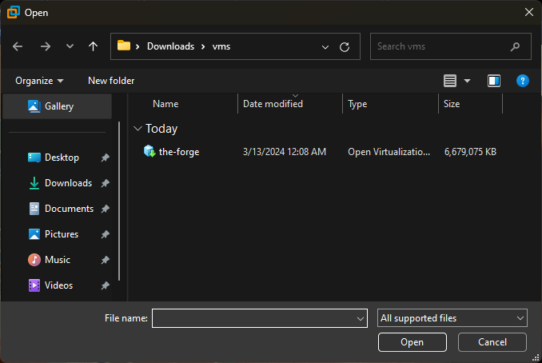
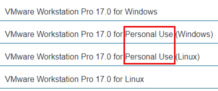

# Lab Template - [Tool Name]

This template defines the standard structure and formatting conventions for all OTO lab walkthroughs. **All labs must follow this format exactly** to ensure consistency across the course.

---

## Required Structure

```markdown
# Lab - [Tool Name]

???+ warning "Prerequisites"
    [List all requirements: VMs needed, prior labs, software dependencies, etc.]

## Intro

[Brief introduction to the tool/technique. 2-3 paragraphs explaining what it is, why it matters, and what students will learn.]

## Walkthrough

[Main lab content organized into logical sections using H3 headings]

### [Section Name]

[Step-by-step instructions with commands and explanations]

```bash
[command here]
```

???- note "Command Options/Arguments Explained"
    - `option`: Explanation of what this option does
    - `option`: Explanation of what this option does

[Additional walkthrough sections as needed...]

## [Optional Sections]

???+ info "Optional"
    [Any bonus content, challenges, or optional explorations]

## Key Takeaways

[Summary of what was learned - 3-5 bullet points]
```

---

## Formatting Standards

### 1. Heading Hierarchy

- **H1 (`#`)**: Lab title only (format: `# Lab - Tool Name`)
- **H2 (`##`)**: Major sections (Intro, Walkthrough, Key Takeaways, etc.)
- **H3 (`###`)**: Subsections within major sections
- **H4 (`####`)**: Sub-subsections (use sparingly)

**Example:**
```markdown
# Lab - Tool Name        ← H1 (title only)
## Intro                 ← H2 (major section)
## Walkthrough           ← H2 (major section)
### Step 1: Setup        ← H3 (subsection)
#### Detailed Config     ← H4 (sub-subsection, if needed)
```

### 2. Prerequisites Block

**Every lab MUST include** a Prerequisites block immediately after the title:

```markdown
# Lab - Tool Name

???+ warning "Prerequisites"
    - Requirement 1 (e.g., "GOAD-DC02 VM running")
    - Requirement 2 (e.g., "Completed Responder lab")
    - Requirement 3 (e.g., "OWASP Juice Shop installed")
```

**Key points:**
- Use `???+` (expanded by default) not `???-` (collapsed)
- Title must be exactly `"Prerequisites"`
- List all VM requirements, prior lab dependencies, and special software needs

### 3. Admonition Blocks (Callouts)

Use the following admonition types consistently:

#### Prerequisites Warning (Required)
```markdown
???+ warning "Prerequisites"
    [VM requirements, dependencies, prior labs needed]
```

#### Command Explanations (Highly Recommended)
```markdown
???- note "Command Options/Arguments Explained"
    - `-option`: What it does
    - `--flag value`: What it does
```

#### Optional/Bonus Content
```markdown
???+ info "Optional"
    [Bonus challenges, extra explorations, advanced techniques]
```

#### Important Warnings
```markdown
???+ warning
    [Critical information about timing, errors, or potential issues]
```

#### Helpful Notes
```markdown
???+ note
    [Additional context, tips, or explanations]
```

#### Danger/Critical Warnings
```markdown
???+ danger
    [Critical warnings about destructive actions or irreversible changes]
```

### 4. Code Blocks

#### Bash Commands
Always specify the language and use proper formatting:

```markdown
\```bash
command --option value
\```
```

**Every non-trivial command should be followed by an explanation block:**

```markdown
\```bash
nmap -sV -p 389,636 192.168.56.11
\```

???- note "Command Options/Arguments Explained"
    - `-sV`: Version detection on open ports
    - `-p 389,636`: Scan specific LDAP ports
    - `192.168.56.11`: Target IP address
```

#### Other Languages
Use appropriate language identifiers:
- `yaml` for YAML files
- `python` for Python code
- `powershell` for PowerShell commands
- `text` or `console` for output

### 5. Images

**Every image MUST follow this exact format:**

```markdown
{ width="70%" }
///caption
Caption Text (Brief Description)
///
```

**Standards:**
- All images must have descriptive alt-text (not "Untitled" or "alt text")
- All images must have `{ width="70%" }` specification
- All images must have a caption using `///caption ... ///` syntax
- Image filenames should be descriptive: `labname-description.png` (not `Untitled.png`)
- Use hyphens in filenames, not spaces or underscores

**Good Example:**
```markdown
{ width="70%" }
///caption
Neo4j Database Authentication
///
```

**Bad Examples:**
```markdown
                    ← No width, bad alt-text, bad filename
{ width="70%" }       ← Generic alt-text, generic filename
{ width="80%" }  ← Space in filename, wrong width
```

### 6. Directory and File Naming

**Lab directories:**
- Use hyphens for multi-word lab names: `bloodhound-plumhound/`, `netexec-w-creds/`
- NOT underscores: ~~`nmap_check/`~~ → `nmap-check/`

**Image files:**
- Use descriptive names: `burp-proxy-settings.png`
- Use hyphens, not spaces or underscores: `nuclei-http-scan.png`
- Include lab name prefix for clarity: `hashcat-cracked-password.png`

### 7. Links and References

#### Internal Links (to other labs)
```markdown
See the [Responder & Impacket](../responder-impacket/index.md) lab for details.
```

#### External Links
```markdown
See [BloodHound documentation](https://bloodhound.readthedocs.io/) for more information.
```

#### Command References
When mentioning command line tools or parameters inline, use backticks:
```markdown
Use the `--ntds` flag to extract NTDS.dit from the domain controller.
```

### 8. Lists

**Unordered lists:**
```markdown
- Item one
- Item two
  - Nested item
  - Nested item
- Item three
```

**Ordered lists:**
```markdown
1. First step
2. Second step
3. Third step
```

**Task lists:**
```markdown
- [x] Completed item
- [ ] Incomplete item
```

### 9. Emphasis and Formatting

- **Bold**: Use `**text**` for emphasis on important terms or UI elements
- *Italic*: Use `*text*` for subtle emphasis (use sparingly)
- `Code`: Use `backticks` for commands, filenames, options, and technical terms
- UI Elements: Use **bold** for buttons, menu items, and tabs: **Settings** → **Proxy**

**Example:**
```markdown
1. Navigate to **Proxy** → **HTTP history**
2. Right-click the request and select **Send to Repeater**
3. Use the `-sV` flag for version detection
```

---

## Complete Example Lab

```markdown
# Lab - Example Tool

???+ warning "Prerequisites"
    - GOAD-DC02 VM (`192.168.56.11`) must be running
    - The Forge VM must be running
    - Completed the Nmap Check lab

## Intro

Example Tool is a powerful utility for testing network security. It allows security professionals to identify vulnerabilities and misconfigurations in Active Directory environments.

This lab will teach you how to use Example Tool for reconnaissance, enumeration, and exploitation. By the end of this lab, you'll understand how to gather critical information about target systems and use it for further attacks.

## Walkthrough

### Step 1: Initial Scan

First, let's perform a basic scan to identify live hosts:

\```bash
exampletool scan --range 192.168.56.0/24
\```

???- note "Command Options/Arguments Explained"
    - `scan`: Initiates a network scan
    - `--range`: Specifies the IP range to scan
    - `192.168.56.0/24`: CIDR notation for the lab network

The output should show all discovered hosts:

{ width="70%" }
///caption
Network Scan Results
///

### Step 2: Enumeration

Now that we've identified targets, let's enumerate users:

\```bash
exampletool enum --target 192.168.56.11 --users
\```

???- note "Command Options/Arguments Explained"
    - `enum`: Enumeration mode
    - `--target`: Specifies the target IP
    - `--users`: Enumerate user accounts

{ width="70%" }
///caption
User Enumeration Results
///

### Step 3: Exploitation

???+ warning
    This step requires valid credentials. If you don't have them yet, complete the Responder lab first.

Use the discovered information to attempt authentication:

\```bash
exampletool auth --target 192.168.56.11 --user administrator --password P@ssw0rd
\```

???- note "Command Options/Arguments Explained"
    - `auth`: Authentication attempt
    - `--user`: Username to authenticate with
    - `--password`: Password to try

## Bonus Challenges

???+ info "Optional"
    - Try scanning the entire GOAD environment with all 5 VMs running
    - Experiment with the `--stealth` mode to avoid detection
    - Create a custom wordlist and use it with the brute-force module

## Key Takeaways

- Example Tool provides comprehensive network reconnaissance capabilities
- User enumeration can reveal valuable information about the target environment
- Combining multiple techniques (scan → enum → exploit) creates an effective attack chain
- Always ensure you have proper authorization before conducting security testing
```

---

## Checklist for New Labs

Before submitting a new lab or updating an existing one, verify:

- [ ] Lab title follows format: `# Lab - Tool Name`
- [ ] Prerequisites block present immediately after title
- [ ] Prerequisites block uses `???+ warning "Prerequisites"`
- [ ] All H2/H3/H4 headings follow proper hierarchy
- [ ] All bash code blocks have `bash` language specified
- [ ] Non-trivial commands have explanation blocks using `???- note "Command Options/Arguments Explained"`
- [ ] All images have descriptive alt-text (not "Untitled" or "alt text")
- [ ] All images have `{ width="70%" }` specification
- [ ] All images have caption using `///caption ... ///` syntax
- [ ] Image filenames are descriptive (not `Untitled.png`, `image.png`)
- [ ] Image filenames use hyphens, not spaces or underscores
- [ ] Lab directory name uses hyphens for multi-word names
- [ ] Optional/bonus content uses `???+ info "Optional"`
- [ ] Internal links use relative paths: `../lab-name/index.md`
- [ ] UI elements use **bold** formatting
- [ ] Commands and options use `backticks`
- [ ] No typos or grammatical errors
- [ ] Lab has been tested end-to-end

---

## Quick Reference

### Admonition Quick Copy

```markdown
# Prerequisites
???+ warning "Prerequisites"
    Requirement here

# Command Explanation
???- note "Command Options/Arguments Explained"
    - `option`: Explanation

# Optional Content
???+ info "Optional"
    Content here

# Warning
???+ warning
    Warning text

# Note
???+ note
    Note text
```

### Image Quick Copy

```markdown
{ width="70%" }
///caption
Brief Caption
///
```

### Code Block Quick Copy

```markdown
\```bash
command --option value
\```

???- note "Command Options/Arguments Explained"
    - `--option`: What it does
```

---

## Questions?

If you're unsure about any formatting decision, refer to the existing standardized labs:
- `docs/labs/cerno/index.md` - Well-structured with clear steps
- `docs/labs/netexec/index.md` - Good example of command explanations
- `docs/labs/bloodhound-plumhound/index.md` - Good use of admonitions

For technical questions about MkDocs syntax, see: https://squidfunk.github.io/mkdocs-material/
