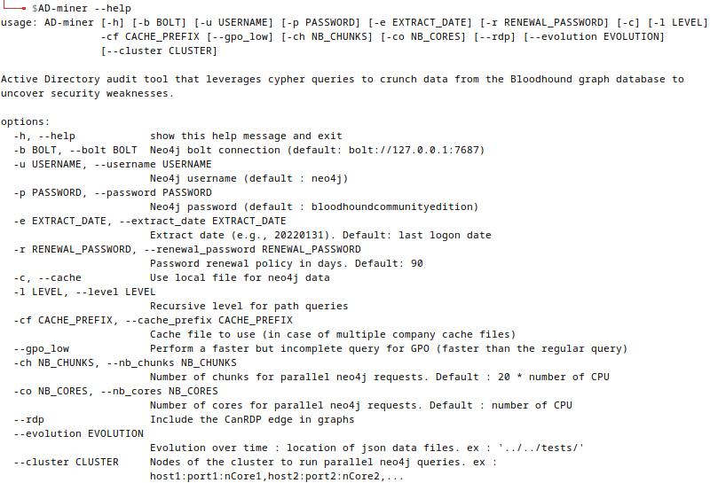
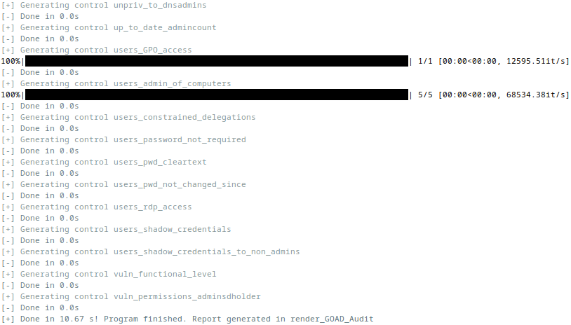
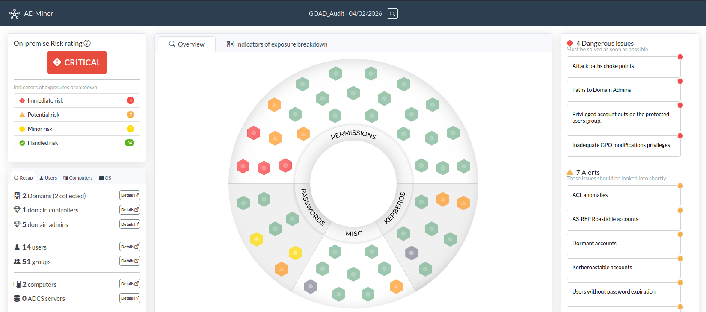
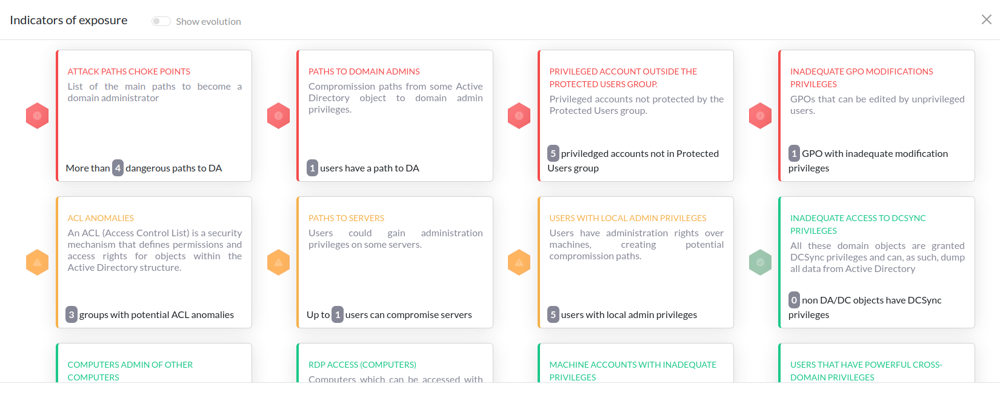
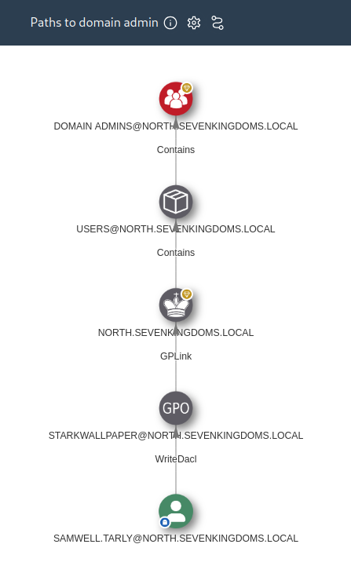

# Lab - AD Miner

???+ warning "Prerequisites"
    - Completed the [BloodHound & PlumHound](../bloodhound-plumhound/index.md) lab
    - Neo4j database running with BloodHound data already loaded
    - The Forge VM

## Intro

While BloodHound excels at visualizing Active Directory attack paths and PlumHound automates query-based reporting, there's often a need for a more comprehensive security audit perspective. Enter **AD Miner**—a tool designed specifically for AD vulnerability assessment and remediation tracking.

AD Miner runs 60+ specialized Cypher queries against your BloodHound Neo4j database, analyzing everything from Kerberos misconfigurations to dangerous permission delegations. What sets it apart is its **risk-based rating system** and **control-focused categorization**, making it easier to prioritize remediation efforts and communicate findings to stakeholders.

Think of AD Miner as the audit layer on top of BloodHound. While BloodHound answers "how can an attacker reach Domain Admin?", AD Miner answers "what are all the security issues in this AD environment, and which ones should we fix first?" The interactive HTML reports it generates are polished enough to include directly in client deliverables.

## Walkthrough

### Step 1: Verify AD Miner Installation

AD Miner was installed via `pipx` when you ran `get-tools` at the beginning of the course. Let's verify it's available:

```bash
AD-miner --help
```

???- note "Command Options/Arguments Explained"
    - `AD-miner`: The main executable for AD Miner (note the capital letters and hyphen)
    - `--help`: Displays all available command-line options and usage information

{ width="70%" }
/// caption
AD Miner Help Output
///

You should see a list of available options including connection parameters (`-b`, `-u`, `-p`), cache settings (`-c`, `-cf`), and various analysis options.

### Step 2: Ensure Neo4j is Running

AD Miner needs to connect to the same Neo4j database you populated during the BloodHound lab. If Neo4j isn't already running, start it:

```bash
sudo neo4j console
```

???- note "Command Options/Arguments Explained"
    - `sudo`: Runs with root privileges for Neo4j to bind to network ports
    - `neo4j`: The graph database that stores BloodHound data
    - `console`: Runs in foreground mode for easy monitoring and shutdown

???+ note
    If you still have Neo4j running from the BloodHound lab, you can skip this step. AD Miner will connect to the existing database instance.

The Neo4j database should be accessible at `bolt://127.0.0.1:7687` with the credentials you set earlier (username: `neo4j`, password: `ridgeback`).

### Step 3: Generate an AD Miner Report

Now let's run AD Miner against our BloodHound data. Open a new terminal and run:

```bash
AD-miner -cf ~/GOAD_Audit -u neo4j -p ridgeback
```

???- note "Command Options/Arguments Explained"
    - `-cf GOAD_Audit`: Sets the cache file prefix and report name. This creates a report folder called "GOAD_Audit"
    - `-u neo4j`: Neo4j username for database authentication
    - `-p ridgeback`: Neo4j password (the one we set in the BloodHound lab)
    - Default connection: `bolt://127.0.0.1:7687` (use `-b` to specify a different endpoint if needed)

{ width="70%" }
/// caption
AD Miner Analysis in Progress
///

AD Miner will begin running its suite of security checks against the Neo4j database. You'll see progress output as it executes queries across different control categories:

- **Kerberos**: Kerberoasting targets, AS-REP roasting, delegation issues
- **Passwords**: Password policy, never-expire accounts, old passwords
- **Permissions**: Dangerous ACLs, DCSync rights, writeable paths
- **Miscellaneous**: Stale accounts, group nesting, trust relationships

The analysis may take a few minutes depending on the size of your AD data. Once complete, AD Miner generates an interactive HTML report.

### Step 4: Exploring the HTML Report

After the analysis completes, open the generated report in your browser:

```bash
firefox ~/render_GOAD_Audit/index.html
```

???- note "Command Options/Arguments Explained"
    - `firefox`: Opens the Firefox web browser
    - `GOAD_Audit/index.html`: Path to the main report dashboard (folder name matches your `-cf` parameter)

{ width="70%" }
/// caption
AD Miner Report Dashboard
///

The main dashboard provides an overview of:

- **Overall Security Rating**: A risk-based score for the AD environment
- **Control Categories**: Organized findings by security domain
- **Statistics**: Count of findings by severity level

Click into any control category to see detailed findings:

{ width="70%" }
/// caption
Control Category Details
///

Each finding includes:

- **Risk Rating**: Helps prioritize remediation (Critical, High, Medium, Low)
- **Description**: What the issue is and why it matters
- **Affected Objects**: Specific AD objects that have the vulnerability
- **Attack Path Visualization**: Interactive graphs showing exploitation potential

{ width="70%" }
/// caption
Finding Detail with Attack Path
///

???+ note
    The interactive graphs in AD Miner use a similar visualization style to BloodHound but are embedded directly in the HTML report—making them easy to share without requiring recipients to have BloodHound installed.

### Step 5: Comparing with PlumHound

You now have two different automated analysis tools that consume BloodHound data. Here's how they compare:

| Feature | PlumHound | AD Miner |
|---------|-----------|----------|
| **Output Format** | HTML + CSV files | Single interactive HTML report |
| **Organization** | Task-based queries | Control-based categories |
| **Risk Rating** | Basic pass/fail | Multi-level severity ratings |
| **Visualizations** | Links back to BloodHound | Embedded interactive graphs |
| **Best For** | Quick checks, specific queries | Comprehensive audits, client reports |

**When to use each:**

- **PlumHound**: Great for quick sanity checks (`--easy`) and running specific task-based queries. Outputs are more granular and can be customized via task files.

- **AD Miner**: Better for comprehensive security assessments where you need polished, client-ready reports with risk ratings and embedded visualizations.

In practice, many pentesters use both—PlumHound for quick operator-focused analysis during an engagement, and AD Miner for generating the final deliverable report.

## Lab Cleanup

Once you're done exploring the AD Miner report:

### Close the Report
Close the Firefox browser window or tab displaying the report.

### Remove Generated Reports (Optional)
If you want to clean up the generated report files:

```bash
rm -rf ~/GOAD_Audit/
```

???- note "Command Options/Arguments Explained"
    - `rm`: Remove files/directories
    - `-r`: Recursive deletion (needed for directories)
    - `-f`: Force deletion without confirmation prompts
    - `GOAD_Audit/`: The report directory created by AD Miner

### Stop Neo4j (If No Longer Needed)
If you're done with all BloodHound-related labs, press `CTRL+C` in the Neo4j terminal to stop the database.

## Key Takeaways

- **AD Miner complements BloodHound** by providing automated security auditing with 60+ specialized queries against the same Neo4j database
- **Risk-based ratings** help prioritize remediation efforts—focus on Critical and High findings first
- **Control categories** (Kerberos, Passwords, Permissions, Misc) organize findings by security domain for easier analysis
- **Interactive HTML reports** are client-ready and don't require recipients to have BloodHound installed
- **Use AD Miner alongside PlumHound**—PlumHound for quick operational checks, AD Miner for comprehensive audit reports
