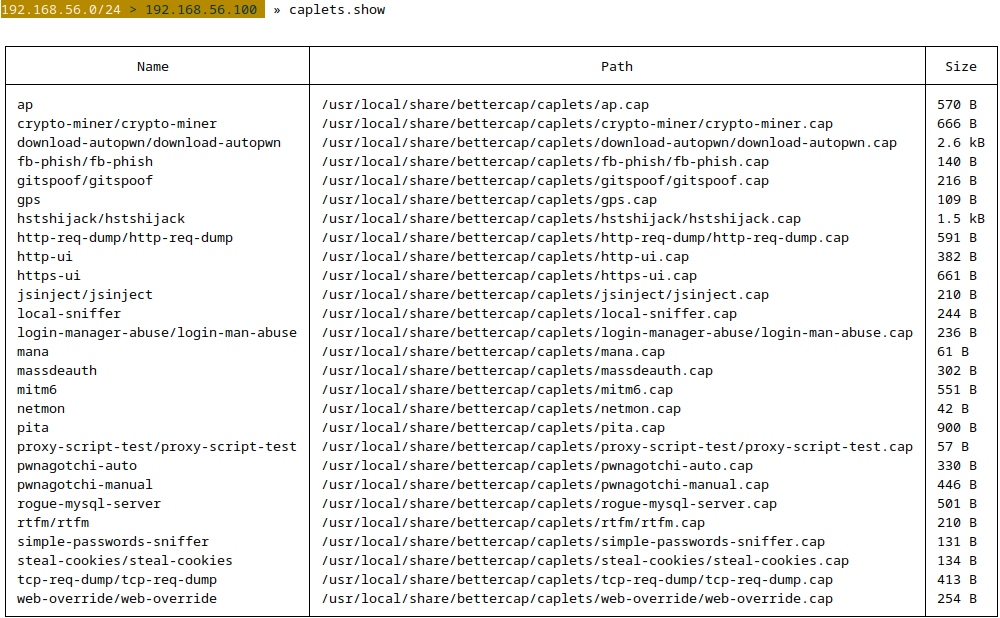
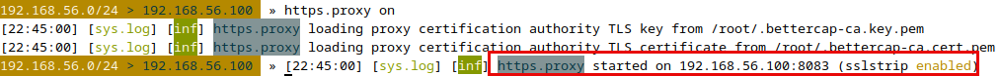

# Lab - BETTERCAP

???+ warning "Prerequisites"
    You will need The Forge VM and at least one of the GOAD VMs turned on for this Lab.

???+ note
    You can stop bettercap by entering `exit` in the terminal when you're done.

## Intro

Bettercap is a powerful, flexible, and portable tool designed for network attacks and monitoring. It's suitable for various cybersecurity tasks such as network sniffing, man-in-the-middle attacks, real-time packet manipulation, network reconnaissance, and more. Bettercap is often praised for its ease of use and the wide array of features it offers.

## Learning Objectives

By the end of this lab, you will be able to:

- Launch Bettercap and navigate its interactive console
- Perform network discovery using `net.probe` and `net.show`
- Capture network traffic with the `net.sniff` module
- Execute ARP spoofing attacks to position yourself as man-in-the-middle
- Use caplets to automate multi-step attack configurations
- Understand SSL stripping and HSTS bypass techniques (conceptually)

## Walkthrough

```bash
sudo bettercap --help
```

{ width="70%" }
/// caption
Help Dialog
///

### Launching Bettercap

To start Bettercap with superuser privileges, simply run:

???+ warning
    Remember your interface name might be different. Be sure to change `ens36` from the below command to match the interface you set a static IP on at the beginning of class.

```bash
sudo bettercap -iface ens36
```

???- note "Command Options/Arguments Explained"
    - `sudo`: Runs bettercap with root privileges, required for network interface manipulation and packet sniffing
    - `bettercap`: Network attack and monitoring framework for performing man-in-the-middle attacks, network reconnaissance, and protocol analysis
    - `-iface ens36`: Specifies which network interface to use. Bettercap will listen on and manipulate traffic through this interface. Using the wrong interface means you won't see any network traffic.

This launches the Bettercap interactive session. From here, you can execute commands directly.

```bash
?
```

{ width="70%" }
/// caption
Help Dialog
///

When bettercap starts up, similarly to Responder, it lists out the various services it has enabled. A list of the default start up services is shown below.

{ width="70%" }
/// caption
Modules
///

### Network Discovery

One of the first steps in using Bettercap is to perform network discovery. This can be done with the `net.probe` module:

```bash
net.probe on
```

???- note "Command Options/Arguments Explained"
    - `net.probe on`: Enables active host discovery using ARP requests to find all live hosts on the subnet
    - Why needed: Passive scanning (net.recon) only sees hosts that are actively transmitting. Active probing discovers all live hosts including idle systems, giving you a complete network map.
    - The module sends ARP "who-has" requests to every IP in the subnet and records which ones respond.

{ width="70%" }
/// caption
net.probe
///

This command scans the network for active hosts. Use `net.show` to list the discovered devices:

```bash
net.show
```

???- note "Command Options/Arguments Explained"
    - `net.show`: Displays all discovered hosts with their IP addresses, MAC addresses, hostnames, and manufacturers
    - Output includes: gateway identification, host count, and network topology at a glance
    - This is your primary command for viewing reconnaissance results and selecting MITM attack targets

{ width="70%" }
/// caption
net.show
///

### Sniffing Traffic

To start sniffing network traffic, you can enable the `net.sniff` module:

```bash
net.sniff on
```

???- note "Command Options/Arguments Explained"
    - `net.sniff on`: Enables bettercap's packet sniffing module to capture and display network traffic in real-time
    - What it captures: HTTP requests, DNS queries, HTTPS metadata, credentials in cleartext protocols (FTP, Telnet, HTTP Basic Auth)
    - Requires ARP spoofing: Traffic sniffing works best when combined with `arp.spoof on` to redirect traffic through your machine
    - Output format: Displays captured packets in the bettercap console with source/destination IPs, protocols, and payload data
    - Why useful: Identifies unencrypted credentials, API keys, session tokens, and maps application behavior during MITM attacks
    - Comparison to tcpdump: Unlike tcpdump's raw packet capture, bettercap presents human-readable protocol-specific data extraction

{ width="70%" }
/// caption
net.sniff
///

This command captures and displays network traffic passing through the host machine. It's particularly useful for capturing unencrypted data or analyzing network protocols.

### HTTP server

It's also possible from within bettercap to start up your own HTTP server on the network without ever having to leave your bettercap interface. You can start this up by simply typing the command below.

```bash
https.server on
```

???- note "Command Options/Arguments Explained"
    - `https.server on`: Starts a local HTTPS web server that bettercap controls
    - Purpose: Serves malicious payloads, phishing pages, or acts as a relay point for SSL stripping attacks
    - The server uses a self-signed certificate, which browsers will warn about (part of the attack surface)

{ width="70%" }
/// caption
https.server
///

### Advanced Usage

#### Caplets

A "caplet" is a script or automation file used by Bettercap to execute a series of commands within the tool. Caplets allow users to automate tasks, configure Bettercap in specific ways, or sequence various attacks and monitoring activities without having to enter each command manually in the interactive console. They are written in a straightforward syntax that closely mirrors the command-line instructions you would normally input into Bettercap's interactive shell.

```bash
caplets.update
```

???- note "Command Options/Arguments Explained"
    - `caplets.update`: Downloads the latest caplet scripts from the official bettercap repository
    - Caplets = automation scripts that configure multiple modules and settings with one command
    - Why update: Gets you the newest attack techniques, bug fixes, and additional functionality from the community
    - Location after update: `/usr/local/share/bettercap/caplets/`

{ width="70%" }
/// caption
caplets.update
///

The caplets will be installed at `/usr/local/share/bettercap/caplets` on your attacker VM. In another terminal window, let’s take a quick look at a module designed to help speed up host enumeration.

```bash
cat /usr/local/share/bettercap/caplets/mitm6.cap
```

{ width="70%" }
/// caption
Caplet Format
///

As you can see from the image above the caplets are just a series of Bettercap commands collected in a `.cap` file for ease of execution. 

We can also simply list all the installed caplets from within Bettercap using the below command.

```bash
caplets.show
```

???- note "Command Options/Arguments Explained"
    - `caplets.show`: Lists all available caplet scripts with descriptions
    - Shows: caplet name, file path, and brief description of what each one does
    - Use this to discover pre-built attack scenarios like DNS spoofing, credential sniffing, or browser exploitation (BeEF integration)

{ width="70%" }
/// caption
Caplet List
///

Running a caplet is as easy as starting Bettercap normally then executing the `include [CAPLET NAME]` command like below.

```bash
include mitm6
```

???- note "Command Options/Arguments Explained"
    - `include mitm6`: Executes the mitm6 caplet script, which automates a comprehensive man-in-the-middle attack configuration
    - What mitm6 caplet does: Enables ARP spoofing, packet sniffing, and SSL stripping in a single command
    - Automation benefit: Instead of manually running `arp.spoof on`, `net.sniff on`, and configuring proxies, the caplet handles all setup
    - Caplet location: Stored in `/usr/local/share/bettercap/caplets/` - you can examine the script with `cat` to understand what it automates
    - Why use caplets: Saves time on repetitive attack configurations and ensures consistent setup across engagements
    - Custom caplets: You can create your own caplet scripts to automate complex multi-step attacks specific to your testing methodology

After which you can run the below command to see what the caplet activated via its script.

```bash
active
```

???- note "Command Options/Arguments Explained"
    - `active`: Shows which modules are currently running in the bettercap session
    - Displays: module name and current state (running/stopped)
    - Why useful: Confirms your attack configuration is active and helps troubleshoot when things aren't working. If a module isn't listed, it's not running.

{ width="70%" }
/// caption
Checking What's Active
///

#### Man-In-The-Middle (MITM) Attacks

Bettercap provides powerful capabilities for performing MITM attacks. The `arp.spoof` module can be used to intercept traffic between devices on the network:

```bash
set arp.spoof.targets [target IP address(es)]
arp.spoof on
```

???- note "Command Options/Arguments Explained"
    - `set arp.spoof.targets [IP]`: Defines which host(s) to target for ARP poisoning. You can specify single IPs, ranges, or comma-separated lists.
    - `arp.spoof on`: Activates the ARP spoofing attack, sending fake ARP responses to poison the target's ARP cache
    - How it works: Tells the target that your MAC address corresponds to the gateway's IP, redirecting all their traffic through your system before forwarding it to the real gateway (man-in-the-middle position)
    - Why powerful: Once positioned, you can intercept, modify, or block any traffic from the target

{ width="70%" }
/// caption
Spoofing
///

Specify the target(s) you want to intercept traffic from. This command tricks the target devices into sending their traffic through your machine, allowing you to capture and manipulate it.

#### Capturing HTTPS Traffic

???+ warning
    This requires some additional setup, including configuring Bettercap to use a self-signed SSL certificate and ensuring the target device trusts this certificate. 

    This is included for informational purposes and **may not be possible in the Lab**.

Bettercap can also capture HTTPS traffic by using the `https.proxy.sslstrip` module, which exploits HSTS (HTTP Strict Transport Security) to perform SSL stripping attacks:

```bash
set https.proxy.sslstrip true
https.proxy on
```

???- note "Command Options/Arguments Explained"
    - `set https.proxy.sslstrip true`: Enables SSL stripping, which downgrades HTTPS connections to HTTP
    - `https.proxy on`: Activates the HTTPS proxy to intercept SSL/TLS traffic
    - Attack mechanism: When a victim requests HTTPS, bettercap maintains the HTTPS connection to the real server but serves HTTP to the victim, allowing you to see plaintext traffic
    - Limitation: HSTS (HTTP Strict Transport Security) can prevent this attack on sites the victim has previously visited

{ width="70%" }
/// caption
Proxying
///

```bash
include hstshijack/hstshijack
```

???- note "Command Options/Arguments Explained"
    - `include hstshijack/hstshijack`: Loads the HSTS hijacking caplet to bypass HTTP Strict Transport Security protections
    - What HSTS is: Browser security mechanism that forces HTTPS connections to specific domains, preventing SSL stripping attacks
    - How hstshijack works: Intercepts HSTS headers before they reach the victim's browser, preventing the browser from enforcing HTTPS-only connections
    - Attack flow: Strips HSTS headers from server responses → victim browser doesn't learn about HSTS requirement → SSL stripping becomes possible even on HSTS-protected sites
    - Requirements: Must be combined with `https.proxy.sslstrip true` and ARP spoofing to position yourself as MITM
    - Real-world effectiveness: Modern browsers with HSTS preload lists (hardcoded HSTS for major sites like Google, Facebook) cannot be bypassed this way
    - Why powerful: Defeats one of the most common SSL stripping defenses, allowing interception of traffic to sites that implemented HSTS post-deployment

{ width="70%" }
/// caption
HSTS Hijack
///

## What You Learned

In this lab, you explored Bettercap's core capabilities for network reconnaissance and man-in-the-middle attacks:

- **Network Discovery**: Used `net.probe` and `net.show` to map all hosts on the network segment
- **Traffic Sniffing**: Captured live network traffic with `net.sniff` to identify protocols and potential credentials
- **ARP Spoofing**: Positioned yourself between targets and the gateway to intercept traffic
- **Caplets**: Automated complex attack configurations using pre-built scripts
- **HTTPS Interception**: Understood how SSL stripping and HSTS bypass work (even if not fully executable in the lab)

These techniques form the foundation of network-based attacks and are critical for understanding both offensive security testing and defensive monitoring.