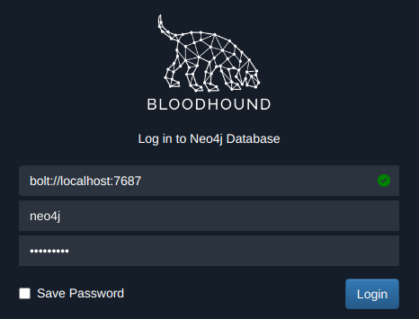

# Lab - BloodHound & PlumHound

???+ warning "Setup" 
    You will need at least the `GOAD-DC02` (`192.168.56.11`) target VM and The Forge VM up and running for this Lab. If you can have **both** GOAD VMs on, that would yeild even better results since we are trying to map out a whole Domain.

## Intro

Active Directory (AD) remains a prime target for attackers due to its complexity and inherent misconfigurations. In this lab, we’ll use BloodHound to map relationships within AD and identify potential attack paths. We'll then integrate PlumHound to assess risk proactively, prioritizing misconfigurations before exploitation.

By the end of this exercise, you’ll understand how adversaries leverage BloodHound for planning lateral movement and privilege escalation. Let’s dive in.

## Walkthrough
*Uncovering Active Directory Attack Paths Like a Pro*  

Alright, let’s walk through setting up BloodHound and PlumHound for Active Directory (AD) analysis. Think of this as a hacker’s reconnaissance mission—you’re gathering intelligence, analyzing attack paths, and identifying weak spots in an AD environment.  

### Step 1: Kickstarting Neo4j
First things first, BloodHound needs a backend database, and that’s where Neo4j comes in. Fire up a terminal and run:  

```bash
sudo neo4j console
```

{ width="70%" }
///caption
DB setup
///
  
Neo4j is like BloodHound’s brain—it stores all the juicy AD relationships we’re about to collect. The `console` flag keeps it running in the foreground, so we can monitor logs and catch any errors right away. Without this, BloodHound has nowhere to dump the data, so this step is non-negotiable.

{ width="70%" }
///caption
Default DB Creds
///

{ width="70%" }
///caption
Set New DB Password
///

### Step 2: Launching BloodHound 
Next, we need the interface that’ll let us visualize everything. Open another terminal and navigate to your BloodHound directory:  

```bash
cd BloodHound-linux-x64
./BloodHound --no-sandbox
```


///caption
Start BloodHound
///
  
The `--no-sandbox` flag helps avoid permission issues when running the Electron-based app. Once it launches, BloodHound will be waiting for data—so let’s give it something to work with.  

{ width="70%" }
///caption
DB Authentication
///

### Step 3: Collecting AD Data 
Now comes the fun part: data collection. This is where we act like an attacker or pentester mapping out an AD environment. `bloodhound-python` is a tool used to collect Active Directory (AD) data for analysis in BloodHound, aiding in security assessments. In a new terminal, run:  

```bash
bloodhound-python --zip -c all -d north.sevenkingdoms.local -u brandon.stark -p iseedeadpeople -dc winterfell.north.sevenkingdoms.local -ns 127.0.0.1 --dns-timeout 60 --dns-tcp
```  

{ width="70%" }
///caption
Data Collection
///

Breaking it down:  
- `-c all` → Grabs everything: users, groups, ACLs, sessions—you name it.  
- `-d north.sevenkingdoms.local` → That’s our target AD domain.  
- `-u brandon.stark -p iseedeadpeople` → Our credentials (hopefully, Bran has domain admin access 😉).  
- `-dc winterfell.north.sevenkingdoms.local` → The specific domain controller we’re hitting.  
- `-ns 127.0.0.1` → Using our local machine for DNS resolution.  
- `--dns-timeout 60 --dns-tcp` → Tweaks DNS settings for better reliability.  

???+ note
    By default, `bloodhound-python` uses Python’s `dns.resolver`, which may bypass `/etc/hosts`. If the DC hostname is manually mapped in `/etc/hosts`, `bloodhound-python` might fail to resolve it properly. Specifying `-ns 127.0.0.1` ensures that the system's built-in resolver is used, allowing the tool to recognize the correct IP mappings.

After running this, you’ll get a ZIP file full of BloodHound-compatible JSON data. This is the blueprint of AD relationships, which we’re about to analyze.  

### Step 4: Uploading Data Into Neo4j

{ width="70%" }
///caption
Upload Data
///

### Step 5: BloodHound Data Visualization

{ width="70%" }
///caption
Menu
///

{ width="70%" }
///caption
Domain Admins
///

### Step 6: Running PlumHound for Automated Analysis  
BloodHound is great, but manually sifting through data can be a pain. That’s where PlumHound comes in—it automates the analysis for us. PlumHound is an offensive security tool that processes BloodHound JSON data to identify security risks, privilege escalation paths, and lateral movement opportunities in Active Directory environments. This guide explains how to extract, analyze, and interpret BloodHound data using PlumHound.

Open a new terminal and run these commands.

First, navigate to the PlumHound directory and activate the virtual environment:

```sh
cd ~/git-tools/PlumHound/
source venv/bin/activate
```

Breakdown:  
- `cd ~/git-tools/PlumHound/` → Moves into the PlumHound directory.  
- `source venv/bin/activate` → Activates the Python virtual environment, ensuring we use the correct dependencies. 

Now we can execute the PlumHound commands below.

```bash
python PlumHound.py -p ridgeback --easy
```

This first command (`--easy`) does a quick, out-of-the-box analysis.

{ width="70%" }
///caption
--easy
///

```bash
python PlumHound.py -p ridgeback -x tasks/default.tasks
```
  
{ width="70%" }
///caption
Default Tasks
///

- The second command (`-x tasks/default.tasks`) runs a more detailed assessment based on predefined task rules.  

This step essentially translates raw BloodHound data into meaningful findings—helping us spot privilege escalation paths and misconfigurations without manually clicking around.   

### Step 7: Reviewing the Report 
Now let’s check out what PlumHound found. Navigate to the reports folder and open the HTML report:  

```bash
cd reports/
ll
```

{ width="70%" }
///caption
Report List
///

```bash
firefox ~/git-tools/PlumHound/reports/index.html
```

{ width="70%" }
///caption
Report
///

This is where all our work pays off. The report will highlight attack paths, misconfigured permissions, and other AD weaknesses—like spotting an overprivileged account that could lead to domain dominance.  

## The Big Picture 
By the time you finish this process, you’ll have a **full map of Active Directory attack paths**, showing how an adversary could pivot and escalate privileges. The workflow flows like this:  

1. **Start Neo4j** → Gives BloodHound a database.  
2. **Run BloodHound** → Opens the GUI.  
3. **Use bloodhound-python** → Collects real-world AD data.  
4. **Run PlumHound** → Automates the analysis.  
5. **View the Report** → See the results in a clear, actionable format.  

With this setup, you’re well on your way to mastering AD security—whether you’re defending an environment or finding attack paths before the bad guys do.  

Want to dig deeper? Try tweaking collection parameters or using custom tasks in PlumHound for even more targeted asnalysis. Happy hunting! 🐺