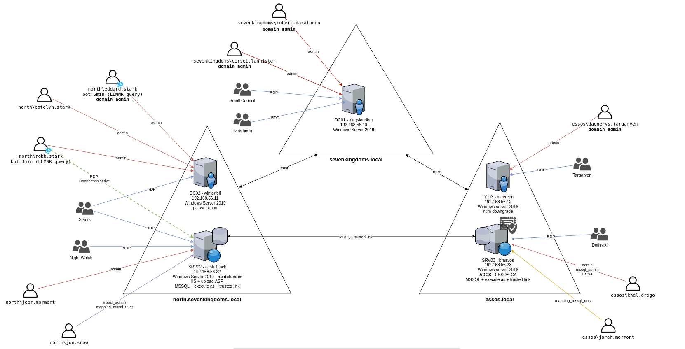

# Bonus Target VMs
???+ info "Optional"

The full GOAD target environment is comprised of 5 systems. This class only utilizes 2 of those target systems.

There are 3 additional “bonus” VMs (2 Domain Controllers and 1 Server) available for you to download. These target VMs (coupled with your class VMs) will complete the full GOAD environment should you want a larger target practice range.

You can download the extra 3 pre-built and configured target systems from [this link](https://oto.sfo2.cdn.digitaloceanspaces.com/live/extra_vms.zip). The VM setup steps are the same as your class VMs.

???+ note
    ***There are no specific class Lab walkthroughs covering these extra VMs. They are meant for you to explore/attack on your own if you wish. These are not required for the class but are offered to help extend what you have learned here.***

{ width="70%" }
/// caption
Full GOAD Environment
///