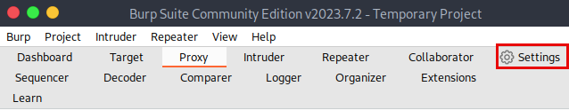
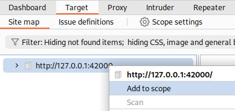
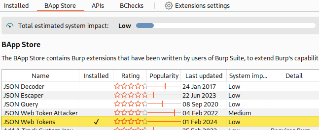
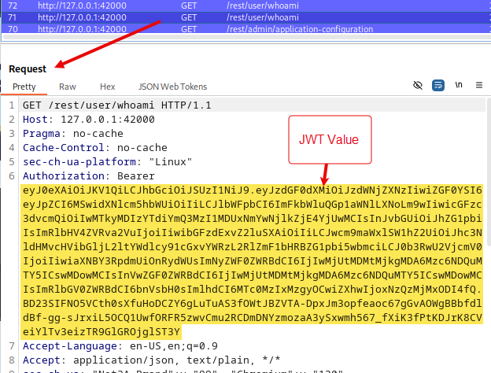
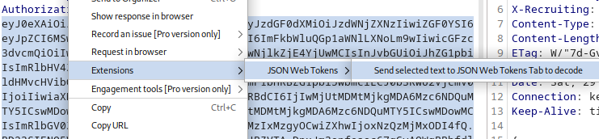
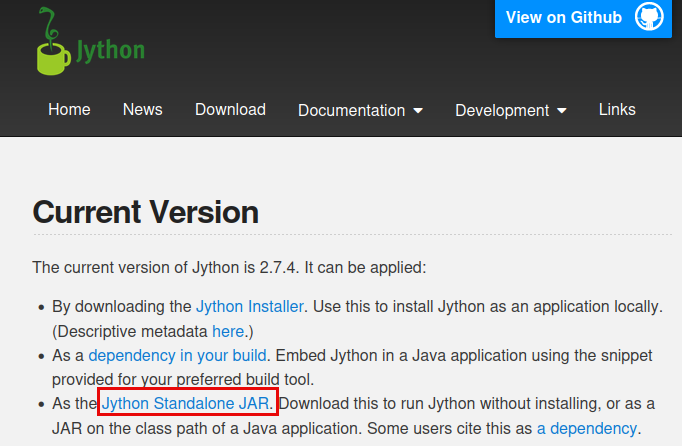
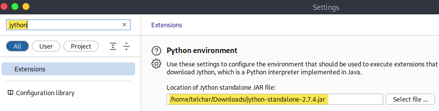
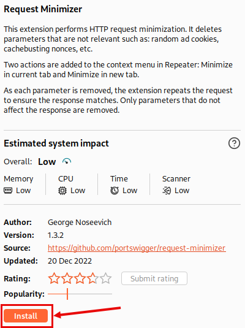
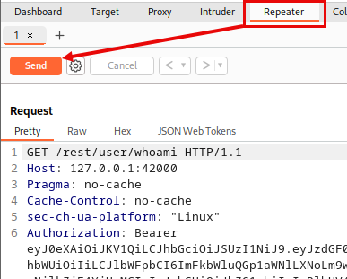
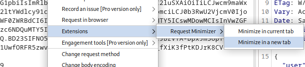

# Lab - Burp Suite

???+ warning "Prerequisites"
    You will need OWASP Juice Shop running for this lab. See the Juice Shop note in the Walkthrough section for startup instructions.

???- warning "First Time Opening Burp?"
    You can launch Burp using the below command…

    ```bash
    burpsuite
    ```

    …or through the VM’s menu…

    { width="70%" }
    /// caption
    Menu
    ///

    If this is your first time opening Burp, there are some extra clicks for you to do…

    { width="70%" }
    /// caption
    JRE Warning
    ///

    { width="70%" }
    /// caption
    T&C
    ///

## Intro

Burp Suite is a powerful web testing tool that functions as an interception proxy. It allows users to intercept, inspect, modify, and replay web traffic. This helps users understand how data is transmitted and received between the client and the server, making it a valuable tool for finding and exploiting vulnerabilities in web applications.

## Walkthrough

### Create A Project

First things first. Let’s create a new temporary Burp project by following the screenshots below.

{ width="70%" }
/// caption
Temporary Project
///

{ width="70%" }
/// caption
Burp Defaults
///

1. Burp has an awesome embedded browser so we can skip the hassle of importing CA certificates and get right to hacking!
    
    Click on the “Proxy” tab → “Intercept” sub-tab → “Open Browser” button
    
    { width="70%" }
    /// caption
    Open Browser
    ///
    
2. Open `http://127.0.0.1:42000` in the browser window.
3. Make sure “Intercept” is off
    
    { width="70%" }
    /// caption
    Disable Intercept
    ///
    
### The Tour de Tabs

Let’s explore some of the functionality within Burp’s tabs.

{ width="70%" }
/// caption
Feature Tabs
///

#### Settings

You can access most of Burp Suite's settings via the **Settings** dialog. To access this dialog, click **Settings** on the top menu.

{ width="70%" }
/// caption
Settings
///

There are two categories of settings “User” and “Project” level.

{ width="70%" }
/// caption
Expanded Settings Pane
///

There are WAY too many settings to discuss in the class but some of the key ones are shown below. Starting with the Proxy settings.

{ width="70%" }

Everything from Proxy listeners, Interception, and Match & Replace rules can be set here.

Find the “Default Proxy Interception State” setting to get rid of the pesky auto-intercept when you first start Burp.

{ width="70%" }
/// caption
Stop the auto-intercepting
///

Also explore the different options available on the proxy listeners.

{ width="70%" }
/// caption
Listener Editing
///

{ width="70%" }
/// caption
Interface Binding
///

This controls which interface and port the Burp interception proxy is available on.

#### Proxy

Burp Proxy operates as a web proxy server between the browser and target applications. It enables you to intercept, inspect, and modify traffic that passes in both directions. You can even use this to test using HTTPS.

This is where you can see all the traffic flowing through Burp.

{ width="70%" }
/// caption
Proxy Traffic
///

It can become overwhelming at first, but don’t worry. It has robust filter settings to help focus your attention. Like the “Show only in-scope items” option.

{ width="70%" }
/// caption
Filtering In-Scope Only
///

We haven’t set a scope yet. So don’t worry about that just now, but REMEMBER where it is.

#### Repeater

Burp Repeater is a tool that enables you to modify and send an interesting HTTP or WebSocket message over and over.

You can use Repeater for all kinds of purposes, for example to:

  - Send a request with varying parameter values to test for input-based vulnerabilities.

  - Send a series of HTTP requests in a specific sequence to test for vulnerabilities in multi-step processes, or vulnerabilities that rely on manipulating the connection state.

  - Manually verify issues reported by Burp Scanner.

You can send any request from the Proxy tab to the Repeater by right clicking on that request and selecting “Send to Repeater”.

{ width="70%" }
/// caption
Send To Repeater
///

Then select the “Repeater” tab in the GUI. From there you can replay requests by clicking the “Send” button

{ width="70%" }
/// caption
Repeat Request
///

AND you can make manual modifications to the requests to see how that changes the web server’s responses. Like adding or removing headers, and manipulating request body parameters

#### Intruder

Burp Intruder is a tool for automating customized attacks against web applications. It enables you to configure attacks that send the same HTTP request over and over again, inserting different payloads into predefined positions each time.

This is where the fun begins…

Wherever there’s a request in Burp, you can also right click and select “Send to Intruder”.

{ width="70%" }
/// caption
Send To Intruder
///

From the Intruder tab, you can define injection points or “payload markers”, as well as the “Attack Type”.

{ width="70%" }
/// caption
Sniper
///

Choose a request from the Proxy tab, send it to Intruder and click the “Auto” payload position button shown above.

This will select all available payload positions for you.

{ width="70%" }
/// caption
Payload Positions
///

Some explanations for these various settings are listed below.

- [Payload positions](https://portswigger.net/burp/documentation/desktop/tools/intruder/configure-attack/positions) - The locations in the base request where payloads are placed.
- [Attack type](https://portswigger.net/burp/documentation/desktop/tools/intruder/configure-attack/attack-types) - The algorithm for placing payloads into your defined payload positions.
- [Payload type](https://portswigger.net/burp/documentation/desktop/tools/intruder/configure-attack/payload-types) - The type of payload that you want to inject into the base request. You can use a simple wordlist, but Burp Suite also provides a range of options for auto-generating payloads. Burp Suite Professional includes a range of [predefined payload lists](https://portswigger.net/burp/documentation/desktop/tools/intruder/configure-attack/payload-lists) for use with compatible payload types.
- [Payload processing](https://portswigger.net/burp/documentation/desktop/tools/intruder/configure-attack/processing) - Rules to manipulate each payload before it is used.
- [Resource pool](https://portswigger.net/burp/documentation/desktop/tools/intruder/configure-attack/resource-pool) - The allocation of resources to the attack.
- [Attack settings](https://portswigger.net/burp/documentation/desktop/tools/intruder/configure-attack/settings) - Burp Intruder attack settings.

Your choice of “Attack Type” will have the biggest impact on you target. There are four to choose from.

{ width="70%" }
/// caption
Attack Types
///

Once your finished defining your payload positions and selected an attack type, it’s time to choose you specific payloads.

{ width="70%" }
/// caption
Payloads
///

???+ warning
    This is, unfortunately, where the free Community Edition starts to fail us. It doesn’t include Burp’s payload lists so you have to find your own. 

    Also, the free version exponentially throttles Intruder attacks once you click the “Start attack” button. This is meant to give you a taste so you buy the Pro license.

#### Target

The Target tool enables you to define which targets are in scope for your current work. It also contains the site map and **Crawl paths** tab, which show you detailed information about your target applications. You can use the information about your target application's content and functionality to drive the workflow for your penetration testing.

You can do a lot from the but the most important is to set your scope. You can do this by right clicking on a “target” and selecting “Add to scope”.

{ width="70%" }
/// caption
Add To Scope
///

Now you can use that filter option we talked about in the Proxy tab to focus your attention! You did remember about that right??

#### Inspector

The Inspector enables you to quickly view and edit interesting features of HTTP and WebSocket messages without having to switch between different tabs. You can access the Inspector from a collapsible panel next to the message editor throughout Burp Suite. You can use it to:

  - View the fully decoded values of parameters or cookies, or a substring that you've selected in the editor.
  - Add, remove, and reorder items at the click of a button so you don't have to work with the raw HTTP syntax.
  - Edit data in its decoded form. When you update the request, the sequence is automatically re-encoded.
  - Toggle the protocol used to send individual requests. Burp automatically performs the transformations to generate an equivalent request for the new protocol.
  - Work with HTTP headers and pseudo-headers without being tied to the message editor's HTTP/1-style syntax. This enables you to use a number of advanced techniques for HTTP/2-specific tests.

You can open Inspector from the collapsed right pane next to any request/response pane.

{ width="70%" }
/// caption
Inspector
///

This will show the below dialog which “inspects” the request/response headers and various details.

{ width="70%" }
/// caption
Contents
///

#### Collaborator (Pro Version Only)

You can manually use Burp Collaborator to induce your target application to interact with the external Collaborator server, and then identify that the interaction has occurred. This enables you to search for invisible vulnerabilities, which don't otherwise send a noticeably different response to a successful test attack.

#### Logger

Burp Logger records all the HTTP traffic that Burp Suite generates in real-time. You can use Logger to:
 
  - Study the requests sent by any of Burp's tools or extensions.
  - See the requests sent by Burp Scanner in real-time.
  - Examine the behavior of extensions.
  - Study the requests sent with a session handling rule modification.

#### Sequencer

Burp Sequencer enables you to analyze the quality of randomness in a sample of tokens. You can use Sequencer to test any tokens that are intended to be unpredictable, such as:
 
  - Session tokens.
  - Anti-CSRF tokens.
  - Password reset tokens.

#### Clickbandit

Burp Clickbandit makes it quicker and easier to test for clickjacking vulnerabilities. This is when an attack overlays a frame on a decoy website to trick a user into clicking on actionable content. Clickbandit enables you to create an attack to confirm that this vulnerability can be successfully exploited. You use your browser to perform actions on a website, then Clickbandit creates an HTML file with a clickjacking overlay.

{ width="70%" }
/// caption
Clickbanbit
///

Burp Clickbandit runs in your browser using JavaScript. It works on all modern browsers except for Microsoft IE and Edge. To run Burp Clickbandit, use the following steps:

1. Click the "Copy Clickbandit to clipboard" button below. This will copy the Clickbandit script to your clipboard.
2. In your browser, visit the web page that you want to test, in the usual way.
3. In your browser, open the web developer console. This might also be called "developer tools" or "JavaScript console".
4. Paste the Clickbandit script into the web developer console, and press enter.

#### Comparer

Burp Comparer enables you to compare any two items of data. You can use Comparer to quickly and easily identify subtle differences between requests or responses. For example:
 
  - To compare responses to failed logins that use valid and invalid usernames, for username enumeration.
  - To compare large responses with different lengths that you have identified in an Intruder attack.
  - To compare similar requests that give rise to different application behavior.
  - To compare responses when testing for blind SQL injection bugs using Boolean condition injection, to see whether injecting different conditions results in a relevant difference in responses.

{ width="70%" }
/// caption
Comparer
///

#### Decoder

Burp Decoder enables you to transform data using common encoding and decoding formats. You can use Decoder to:
 
  - Manually decode data.
  - Automatically identify and decode recognizable encoding formats, such as URL-encoding.
  - Transform raw data into various encoded and hashed formats.

#### Extensions

Burp extensions enable you to customize how Burp Suite behaves. You can use Burp extensions created by the community, or you can write your own.
 
You can use Burp extensions to change Burp Suite's behavior in many ways, including:
 
  - Modifying HTTP requests and responses.
  - Sending additional HTTP requests.
  - Customizing Burp Suite's interface with new features or tabs.
  - Adding extra checks to Burp Scanner.
  - Accessing information from Burp Suite.

### Identify Authentication Tokens

???+ note "OWASP Juice Shop"
    Start Juice Shop First:

    Start up a the OWASP Juice Shop vulnerable web application. It will be available at `http://127.0.0.1:42000`.

    ```bash
    sudo juice-shop -h
    ```

    After you’re done, make sure you shut down OWASP Juice Shop by running the below command.

    ```bash
    sudo juice-shop-stop -h
    ```

In this part of the lab, you will use first use "the **Request Minimizer** extension in Burp Suite to strip unnecessary parts of HTTP requests and analyze their impact on server responses.

This extension performs HTTP request minimization. It deletes parameters that are not relevant such as: random ad cookies, cachebusting nonces, etc.

Two actions are added to the context menu in Repeater: Minimize in current tab and Minimize in new tab.

As each parameter is removed, the extension repeats the request to ensure the response matches. Only parameters that do not affect the response are removed.

#### Finding & Decoding JWTs

The JSON Web Tokens (JWT4B) extension lets you decode and manipulate JSON web tokens on the fly, check their validity and automate common attacks.

1. Open **Burp Suite**.
2. Navigate to **Extensions** → **BApp Store**.
3. Search for the **JSON Web Tokens** extension

{ width="70%" }
/// caption
JWTs
///

4. Click "Install"

{ width="70%" }
/// caption
Install JSON Web Tokens
///

Many web applications use JWTs. Including OWASP Juice Shop included with your VM. Explore how this extension can make identifying and decoding JWTs easier.

#### Configure Burp to Capture Requests

1. Open **Proxy** → **Intercept**.
2. Use the built in Burp browser

{ width="70%" }
/// caption
Burp Browser
///

???+ warning "Make sure that "Intercept" toggle is off."

3. With OWASP Juice Shop running, navigate to [http://127.0.0.1:42000/#/login](http://127.0.0.1:42000/#/login) from Burp's browser.
4. Enter the user `admin@juice-sh.op` and password `admin123` to login.

#### Identify an authenticated HTTP request

Now go to Burp **HTTP history** sub-tab under **Proxy** tab and see all the highlighted JWTs. It's that easy to make your life easier using Extenstions!

{ width="70%" }
/// caption
JWTs Discovered
///

Now that we've found JWTs, let's go one step further by decoding them. Click on any of the blue highlighted rows in the HTTP history tab. This wil bring up the request and response for that row. 

{ width="70%" }
/// caption
Inspect The Request
///

See the highlighted JWT value in the "Authorization" header of the request? Good. Use your left click to select that ***entire*** value.

Then, with the JWT selected, right click on it to get additional menu options.

{ width="70%" }
/// caption
Request Menu Options
///

Select **Extensions** > **JSON Web Tokens** > **Send selected text to JSON Web Tokens Tab to decode**.

You'll be automatically switched to the JSON Web Tokens tab. And there we have it. Your captured JWT is now decoded for you.

{ width="70%" }
/// caption
Decoded JWT
///

#### Minimizing Requests

Once we have an authenticated request, it's often helpful to reduce the request to the minimum viable request. This helps narrow down ***exactly*** which values are managing a user's session within a web application.

Enter the "Request Minimizer" Burp extension!

This extension performs HTTP request minimization. It deletes parameters that are not relevant such as: random ad cookies, cachebusting nonces, etc.

Two actions are added to the context menu in Repeater: Minimize in current tab and Minimize in new tab.

As each parameter is removed, the extension repeats the request to ensure the response matches. Only parameters that do not affect the response are removed.

1. Navigate back to **Extensions** → **BApp Store**.
2. Search for **Request Minimizer**.

{ width="70%" }
/// caption
Extension Info
///

3. Looks like we need to install Jython before the extension.

  - Click the **Download Jython** button and download the **Jython Standalone JAR** file

  { width="70%" }
  /// caption
  Jython
  ///

4. Now back in Burp, Open Settings -> search for "Jython" -> select the Jython file you just downloaded

  { width="70%" }
  /// caption
  Select Jython File
  ///

5. Now go back to the Extensions tab and click **Install** for Request Minimizer 

{ width="70%" }
/// caption
Request Minimizer Install
///

6. Confirm it appears under the **Installed** sub tab with the "Loaded" column checked

#### Finding the Minimum Viable Request (MVP)

1. Right-click that same captured request we used to decode the JWT, but this time don't have the JWT value selected.

{ width="70%" }
/// caption
Send To Repeater
///

2. Select the **Send to Repeater** option; Burp's Repeater tab will turn orange

3. Go to the Repeater tab and click the "Send" button to get a baseline of the request and response.

{ width="70%" }
/// caption
Repeater
///

4. From within the Repeater tab, right click on the request and select **Extensions** → **Request Minimizer** → **Minimize in a new tab**.

{ width="70%" }
/// caption
Minimize It!
///

After a short while, a new Repeater tab will open with the minimum viable request displayed. 

{ width="70%" }
/// caption
Minimum Viable Request
///

Observe changes:
  
  - Headers or parameters removed.
  
  - Unnecessary fields (e.g., `User-Agent`) stripped out.

Now imagine a web application that uses numerouse cookie values and request headers. This extension will sort through all the cruft and help you focus on session tokens for investigations and attacks.

This is the most direct and no nonsense request that can be sent to the server and get an expected complete response. Pointing you in the direction of only the most crucial decision driving values for the web server. Like whether a request is part of a valid/active session or not.

???+ note
    You have done nothing malicious to the target site here. All you've done is strip out unnecessary request values (like tracking cookies, etc.) to determine what manages a session for that web application.

### Build an Extension

Want to get creative and learn how to make your own Burp Extensions? Check out this [BHIS webcast](https://www.youtube.com/watch?v=lyJihH8FYkI).