# Lab - CERNO

???+ warning "Prerequisites"
    - Cerno is installed and available on your PATH (`cerno --help` should work)
    - Two Nessus output files have been provided for this lab:
        - `~/OTO-labs/supp/nessus/class_goad/OTO-class_GOAD.nessus`
        - `~/OTO-labs/supp/nessus/full_goad/OTO-full_GOAD.nessus`

## Intro

In this lab, we'll be working with `Cerno`, a custom-built tool designed to make vulnerability scan reviews faster, more organized, and more actionable. Instead of manually digging through a clunky UI or lengthy HTML exports, `Cerno` gives us a database-backed interactive interface to navigate by scan, severity, and finding. Along the way, it highlights unreviewed findings, shows grouped host/port information, surfaces CVE data and Metasploit modules, and provides quick ways to compare or analyze coverage across scans.

The goal of `Cerno` isn't just to speed up review—it's to connect vulnerability data to offensive workflows. From within the tool, you'll be able to preview targets, copy lists to your clipboard, look up CVEs, search for Metasploit modules, and launch tools like Nmap or NetExec against hosts directly from the interface. By the end of this exercise, you'll see how `Cerno` helps move from raw scan results to hands-on validation and exploitation in a streamlined way.

???+ tip "Video Walkthrough"
    For a live demonstration of Cerno's capabilities, check out this webcast: [https://www.youtube.com/watch?v=aGmRenQ28Ro](https://www.youtube.com/watch?v=aGmRenQ28Ro)

## Walkthrough

### Step 0 — Read the Help and Map the Terrain

Start by discovering what the tool can do.

```bash
cerno --help
```

???- note "Command Options/Arguments Explained"
    - `--help`: Displays usage information, available subcommands, and options
    - Why start with help: Understanding the tool's capabilities and subcommands before diving in helps you choose the right workflow for your task
    - What you'll see: List of all subcommands with brief descriptions of when to use each one

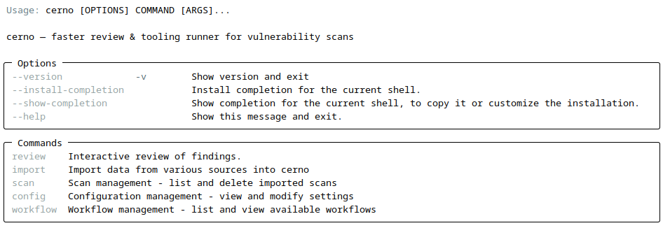{ width="70%" }
///caption
Help Dialog
///

You'll see the top-level description and subcommands. Here's what each does (you'll use them all in this lab):

* **import** — Import `.nessus` scan files into the Cerno database. No external tools or helper repos needed—Cerno handles parsing natively.
* **review** — Interactive reviewer: select a scan, drill into severities, view findings (grouped/raw/hosts-only), run tools (Nmap/NetExec/Metasploit/Custom), and mark findings reviewed.
* **scan** — Manage imported scans: list all scans with statistics, delete scans, compare findings between two scans, and view host vulnerability history across scans.
* **config** — View and modify Cerno configuration (results directory, default tool, page size, etc.).
* **workflow** — List available verification workflows that map specific plugin IDs to step-by-step validation procedures.

---

### Step 1 — Import Nessus Scans

Use `cerno import nessus` to parse the `.nessus` files and store findings in the Cerno database.

```bash
cerno import nessus \
  ~/OTO-labs/supp/nessus/class_goad/OTO-class_GOAD.nessus
```

???- note "Command Options/Arguments Explained"
    - `import nessus`: Subcommand that parses a `.nessus` XML file and stores all findings, plugins, hosts, and ports in the Cerno SQLite database (`~/.cerno/cerno.db`)
    - `~/OTO-labs/supp/nessus/class_goad/OTO-class_GOAD.nessus`: Path to the Nessus scan export file (XML format)
    - No `--out-dir` parameter needed—data is stored in the database automatically
    - What import does: Parses the XML, creates database records for each plugin, finding, host, and port, then displays a severity breakdown table
    - Why use import: Transforms Nessus's verbose XML into a structured, queryable database enabling interactive review, cross-scan comparison, and tool orchestration

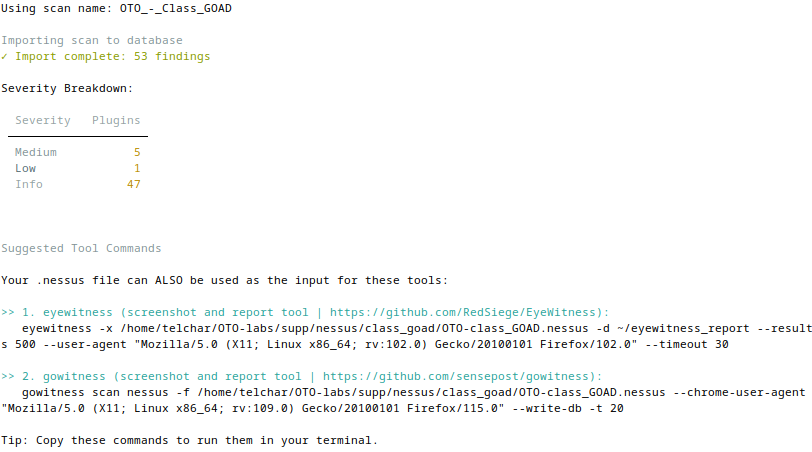{ width="70%" }
///caption
Importing a .nessus File
///

What happens:

* The `.nessus` file is parsed directly by Cerno (no external helper repos needed).
* Findings are stored in the SQLite database at `~/.cerno/cerno.db`.
* A severity breakdown table is displayed showing plugin counts per severity level.
* Suggested tool commands (EyeWitness, gowitness) are shown for reference.

Now import the second scan as well—you'll use both scans later when comparing findings.

```bash
cerno import nessus \
  ~/OTO-labs/supp/nessus/full_goad/OTO-full_GOAD.nessus
```

Verify both scans were imported successfully:

```bash
cerno scan list
```

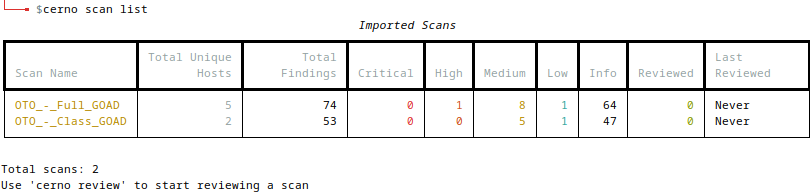{ width="70%" }
///caption
Listing Imported Scans
///

You should see both scans listed with their severity breakdowns, total findings, unique host counts, and review progress. Note whether any Critical or High findings are present. Remember, one of these is from an **intentionally** vulnerable target environment—so why don't we see more impactful findings off the bat?

???+ note "Remember for later..."
    After import completes, note the scan names shown (e.g., "OTO-class_GOAD" and "OTO-full_GOAD"). These names are used automatically when you run `cerno review`—you'll select them from a menu. You'll also use them with `cerno scan compare` later.

---

### Step 2 — Interactive Review with `review`

Start the interactive reviewer:

```bash
cerno review
```

???- note "Command Options/Arguments Explained"
    - `review`: Launches the interactive TUI for reviewing findings stored in the database
    - No arguments needed—Cerno presents a menu of all imported scans to choose from
    - Optional flags: `--custom-workflows PATH` (supplement bundled workflows), `--no-tools` (disable tool prompts), `--quiet` (suppress banner)
    - What review provides: Scan selection menu, severity table with review progress, finding browser with filtering/sorting/pagination, tool execution, session tracking
    - Workflow: Choose scan → View scan summary → Choose severity level → Browse findings → Select finding → View details / Run tools / Mark reviewed

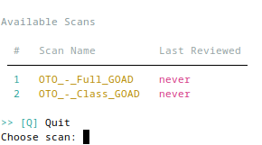{ width="70%" }
///caption
Scan Selection
///

What you'll do in the reviewer:

* Choose a **scan** (from the database—imported in Step 1).
* See the **scan summary** (total findings, unique hosts, top ports, severity breakdown).
* Choose a **severity** level (Critical/High/Medium/Low/Info, plus virtual groups like "Metasploit Modules" and "Workflow-Mapped Findings" if present).
* Browse the **finding list** (paginated, filterable, sortable).

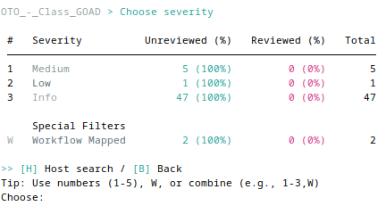{ width="70%" }
///caption
Severity Selection and Review Progress
///

The severity table shows review progress—how many findings in each severity level have been reviewed vs. how many remain. Additional virtual groups may appear:

* **Metasploit Modules** — Findings that have associated Metasploit modules detected during import.
* **Workflow-Mapped Findings** — Findings that have verification workflows defined.

When you select a finding, you see a preview panel and an action menu:

* **[I]** Finding Info — Redisplay the preview panel (plugin ID, name, severity, CVSS, CVE count, affected hosts).
* **[D]** Finding Details — View plugin output per host (paged).
* **[V]** View Hosts — Grouped format (`host:port1,port2,...`) by default, with option to switch to Raw or Hosts-only.
* **[E]** CVE Info — Display associated CVEs with descriptions and links.
* **[W]** Workflow — View verification steps (if a workflow is mapped for this plugin).
* **[T]** Run Tool — Launch Nmap, NetExec, Metasploit search, or a custom command against the affected hosts.
* **[M]** Mark Reviewed — Mark the finding as completed in the database.
* **[B]** Back — Return to the finding list.

From the finding list itself, you also have:

* **[F]** Filter — Filter findings by keyword.
* **[S]** Sort — Cycle sort modes (by plugin ID, name, host count, severity).
* **[H]** Host Search — Find findings affecting a specific host.
* **[V]** Severity Filter — Filter the list to specific severity levels.
* **[O]** Overlapping — Analyze findings with identical host:port combinations.

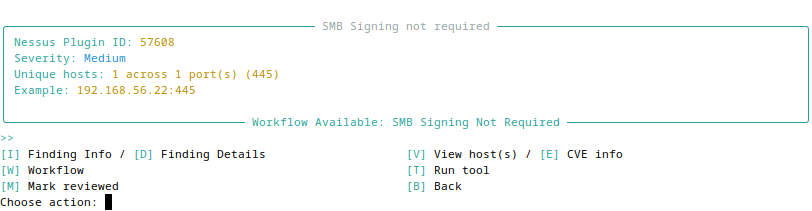{ width="70%" }
///caption
Finding Preview and Action Menu
///

**Exercise:**

* Select the `OTO-class_GOAD` scan. Note the scan summary information (total findings, unique hosts, top ports).
* Enter the **Medium** severity level. Use **[F]** to filter findings by a keyword (e.g., "SMB"). Use **[S]** to cycle through sort modes.
* Select a finding and view it in **grouped** mode using **[V]**, then switch to **hosts-only** mode.

---

### Step 3 — Run Tools from Inside `review`

While in the interactive reviewer with a finding selected, press **[T]** to see the tool menu:

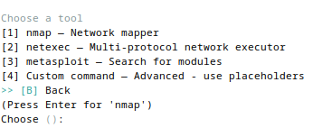{ width="70%" }
///caption
Tool Selection
///

* **Nmap**
    * TCP or UDP.
    * Optional NSE profiles: *Crypto*, *SSH*, *SMB*, *SNMP*, *IPMI*.
    * You can add extra NSE scripts by name (comma-separated, no spaces).
* **NetExec**
    * Multi-protocol (e.g., `smb`, `rdp`, `ldap`, `ftp`, `ssh`, `mssql`, `nfs`, `vnc`, `winrm`, `wmi`).
    * SMB scan produces a "relay list" (signing-not-required targets) alongside logs.
* **Metasploit**
    * Searches for associated Metasploit modules stored in the database.
    * Displays module names with ready-to-copy `msfconsole` commands.
    * No web scraping—module data is extracted during import.
* **Custom Command**
    * Build any command using placeholders:
        * `{TCP_IPS}` — path to a file of hosts (one per line)
        * `{UDP_IPS}` — same for UDP context
        * `{TCP_HOST_PORTS}` — path to `host:port,port,...` lines
        * `{PORTS}` — a comma-separated ports string if the file had ports
        * `{WORKDIR}` — ephemeral workspace dir containing the generated lists
        * `{RESULTS_DIR}` — persistent results directory for this finding
        * `{OABASE}` — a base path for tool output files (organized under `~/.cerno/artifacts/...`)

Every command is shown in a **review menu** first so you can **Run**, **Copy**, or **Cancel**.

**Exercise:**

* Pick a finding with *SMB-relevant* issues. Press **[T]** to open the tool menu. Choose **Nmap** TCP with the **SMB** NSE profile. Review the command and run it. After it completes, note where the results were written (the tool prints the artifact paths under `~/.cerno/artifacts/`).

???+ warning "Target VM Required"
    You will need to have the `GOAD-SRV02` VM running for the above exercise to get results.

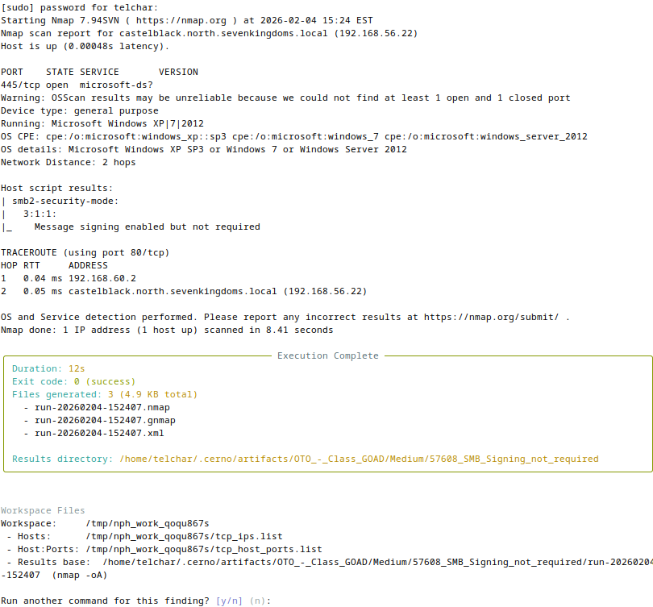{ width="70%" }
///caption
Tool Execution and Results
///

You can:

* Copy findings to your clipboard in any format (grouped, raw, hosts-only).
* Mark findings as reviewed in the database (review state tracked per finding—no file renaming).
* Launch a **tool** (Nmap, NetExec, Metasploit, or a custom command) against parsed hosts, with a review/confirm step before execution.

---

### Step 4 — Track Progress and Review State

As you work through findings, mark them as reviewed using **[M]** from the finding action menu.

Cerno tracks review state in the database with four states:

* **pending** — Not yet reviewed (default).
* **reviewed** — Viewed but not marked complete.
* **completed** — Marked as reviewed/complete.
* **skipped** — Skipped (e.g., empty findings).

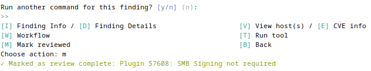{ width="70%" }
///caption
Marking a Finding as Reviewed
///

No file renaming occurs—review state is tracked purely in the database. This means:

* You can undo a review state at any time—press **[U]** from the finding list to restore a completed finding back to pending.
* Review progress persists across sessions automatically.
* From the finding list, press **[R]** to toggle viewing completed findings (read-only, with undo available).

When you exit the reviewer, you'll see a session summary showing:

* Session duration
* Findings marked complete (per severity)
* Findings reviewed (not marked)
* Findings skipped

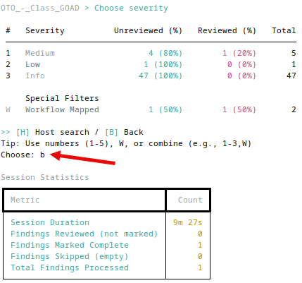{ width="70%" }
///caption
Session Summary
///

Sessions are **auto-saved** to the database. If you close the terminal and reopen Cerno later, you'll be prompted to resume your previous session.

**Exercise:**

* Mark at least one finding complete in each available severity level for your scan.
* From the finding list, press **[R]** to view completed findings. Press **[U]** to undo one of them.
* Exit the reviewer and record: session duration, how many findings were marked complete, reviewed (not renamed), and skipped.

---

### Step 5 — Scan Management and Comparison

You don't always need the interactive reviewer. Cerno provides CLI commands for quick analysis and scan management.

#### A) List Scans

```bash
cerno scan list
```

???- note "Command Options/Arguments Explained"
    - `scan list`: Displays all imported scans with statistics
    - Shows: scan name, total unique hosts, total findings, severity counts (Critical/High/Medium/Low/Info), reviewed count, last reviewed date
    - When to use: Quick overview of all scans in the database, checking review progress, verifying imports

Shows all imported scans with severity breakdowns, review progress, and last reviewed dates.

#### B) Compare Scans

Now that you've imported two scans, you can compare them to identify differences:

```bash
cerno scan compare OTO_-_Class_GOAD OTO_-_Full_GOAD
```

???- note "Command Options/Arguments Explained"
    - `scan compare <scan1> <scan2>`: Compares findings between two scans
    - `scan1`: Baseline scan name
    - `scan2`: Comparison scan name
    - `--severity, -s <0-4>`: Optional minimum severity filter (0=Info, 1=Low, 2=Medium, 3=High, 4=Critical)
    - What it shows: New vulnerabilities (in scan2 but not scan1), resolved vulnerabilities (in scan1 but not scan2), persistent vulnerabilities (in both), and host changes
    - When to use: Tracking remediation progress, comparing scan scope, identifying new attack surface between scan cycles

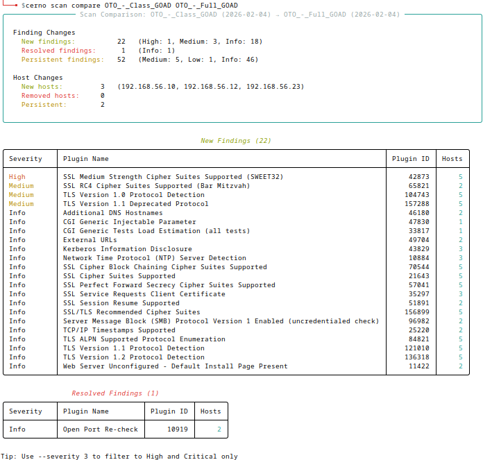{ width="70%" }
///caption
Cross-Scan Comparison
///

This shows which findings are **new** (only in the second scan), **resolved** (only in the first scan), and **persistent** (in both scans), along with host changes.

#### C) Host History

View the vulnerability timeline for a specific host across all imported scans:

```bash
cerno scan history <host_ip>
```

???- note "Command Options/Arguments Explained"
    - `scan history <host_ip>`: Shows all findings for a specific host across every imported scan
    - Displays: Timeline of scans where the host appeared, severity breakdown per scan, finding count trends
    - When to use: Investigating a specific host's vulnerability profile, tracking remediation for a particular system

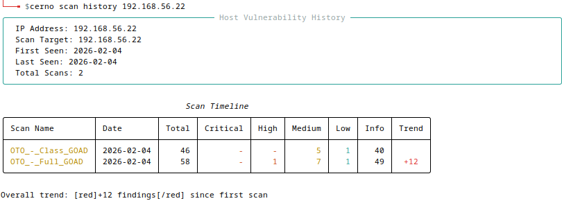{ width="70%" }
///caption
Host Vulnerability History
///

Replace `<host_ip>` with an IP address from your scan (you can find IPs by reviewing findings in Step 2).

#### D) Configuration

```bash
cerno config show
```

???- note "Command Options/Arguments Explained"
    - `config show`: Displays all configuration settings with current values and descriptions
    - Configuration file location: `~/.cerno/config.yaml`
    - Key settings: `results_root` (artifact storage), `default_tool`, `default_page_size`, `nmap_default_profile`
    - Other config commands: `config set <key> <value>`, `config get <key>`, `config reset`

Shows all Cerno configuration settings. Note where artifacts are stored (`results_root`) and what defaults are configured for tools.

**Exercise:**

* Run `cerno scan list` and record: total findings, unique hosts, and severity breakdown for each imported scan.
* Run `cerno scan compare` between the two scans. Record how many findings are new, resolved, and persistent.
* Pick a host IP from one of your scans and run `cerno scan history` on it.
* Run `cerno config show` and note where artifacts are stored.

---

### Step 6 — Explore Verification Workflows

Cerno includes a workflow system that maps specific Nessus plugin IDs to step-by-step verification procedures. These workflows guide you through validating findings with specific commands, notes, and references.

#### A) List Available Workflows

```bash
cerno workflow list
```

???- note "Command Options/Arguments Explained"
    - `workflow list`: Displays all available verification workflows (bundled with Cerno)
    - `--custom-workflows, -w <PATH>`: Optional path to a custom workflow YAML file to supplement defaults
    - Shows: Plugin ID(s), workflow name, and description for each workflow
    - When to use: Understanding what guided verification procedures are available before starting review

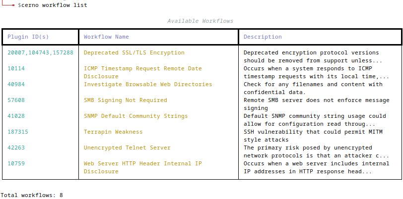{ width="70%" }
///caption
Available Verification Workflows
///

This shows all bundled workflows with their associated plugin IDs, names, and descriptions.

#### B) Use Workflows During Review

During interactive review, findings that have a mapped workflow display an indicator. When viewing such a finding, press **[W]** to see the verification steps:

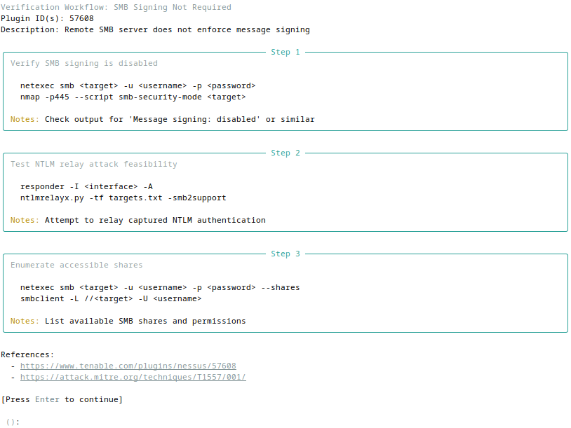{ width="70%" }
///caption
Workflow Verification Steps
///

Each workflow includes:

* **Step-by-step commands** — Specific commands to run for validation.
* **Notes** — Context about what to look for and how to interpret results.
* **References** — Links to documentation or further reading.

Workflows are **display-only** (not automatically executed)—they serve as guided checklists for manual verification.

#### C) Custom Workflows

You can supplement or replace the bundled workflows with your own:

```bash
# Supplement bundled workflows with custom ones
cerno review --custom-workflows ~/my_workflows.yaml

# Use ONLY custom workflows (ignore bundled ones)
cerno review --custom-workflows-only ~/my_workflows.yaml
```

**Exercise:**

* Run `cerno workflow list`. How many default workflows are bundled with Cerno?
* Start a review session and find a finding that has a workflow indicator. Press **[W]** to view its verification steps. What commands does it suggest?

---

## Key Takeaways

* `cerno import nessus` — imports `.nessus` files into the SQLite database. No external tools or helper repos needed.
* `cerno review` — your main interactive workspace for browsing findings, viewing details, running tools, and tracking progress. All state is database-driven.
* `cerno scan list/compare/history` — scan management and cross-scan analysis for trending and comparison.
* `cerno config` — customize tool defaults, page size, artifact storage, and more.
* `cerno workflow list` — view and use guided verification procedures mapped to specific plugins.
* Tool integration (Nmap/NetExec/Metasploit/Custom) — immediate pivot from vulnerability data to hands-on verification with controlled, reviewable command execution.
* Session persistence — resume where you left off. Cerno auto-saves your review progress to the database.

You're now set to move Nessus findings straight into an operator-friendly flow.
