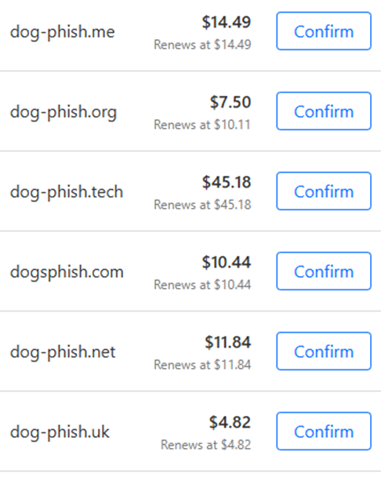
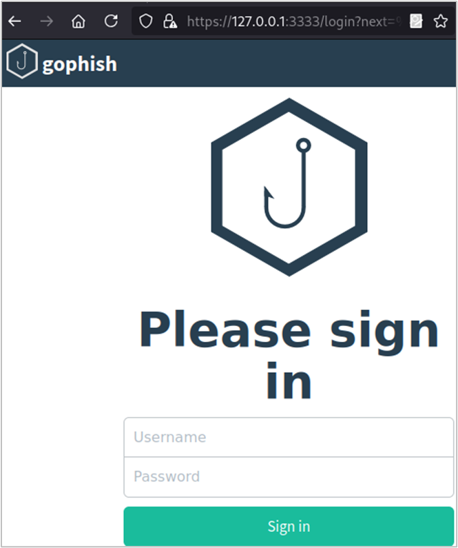
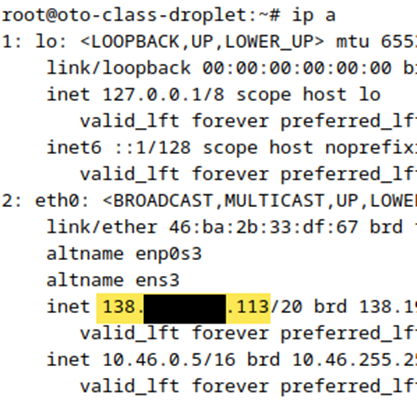
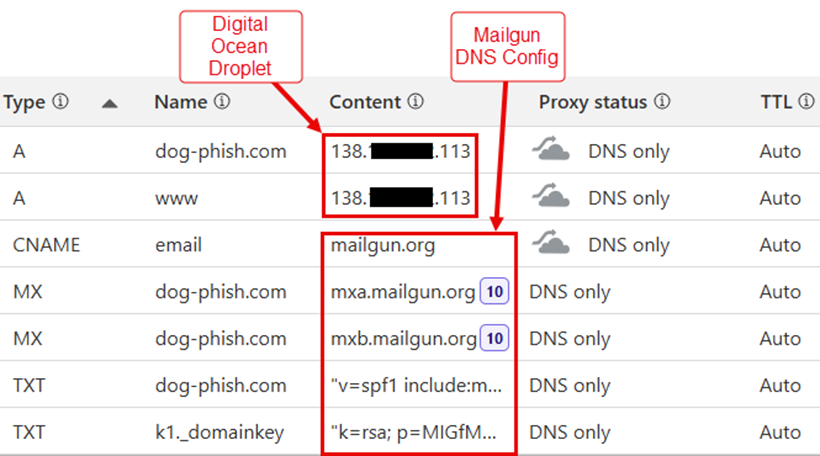
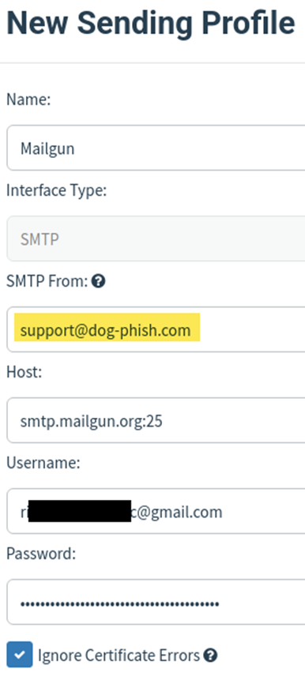
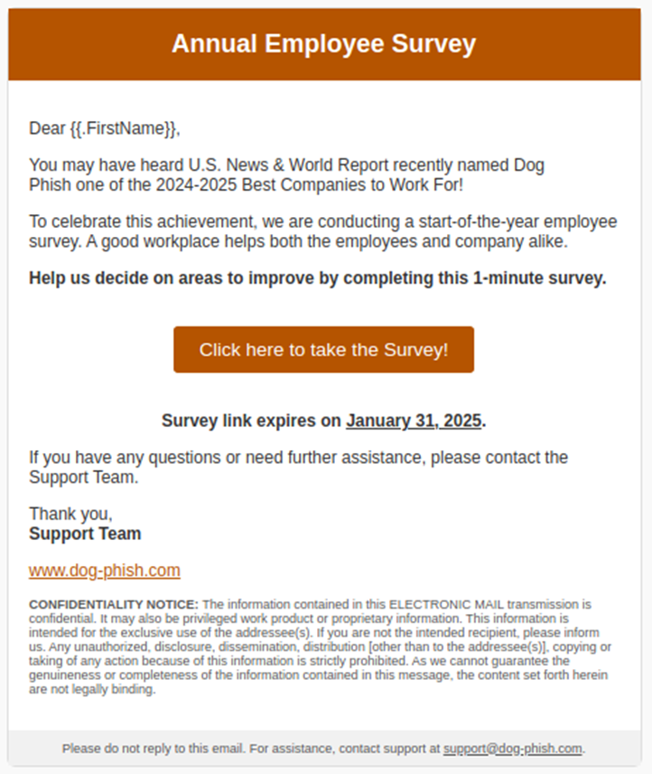
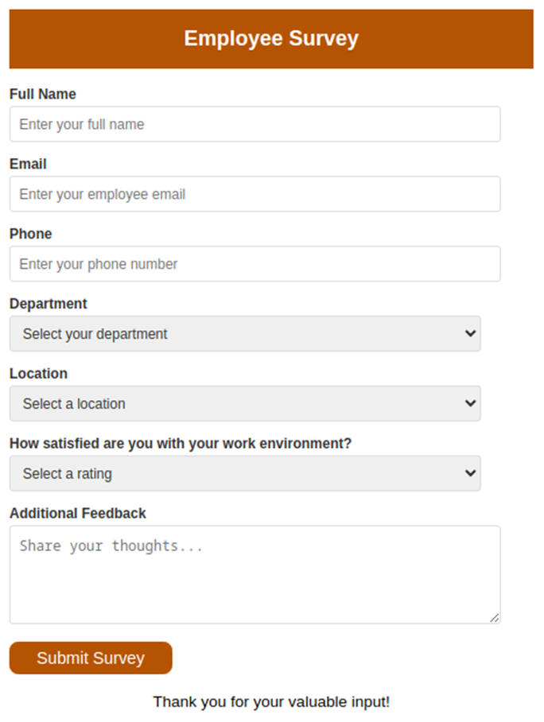
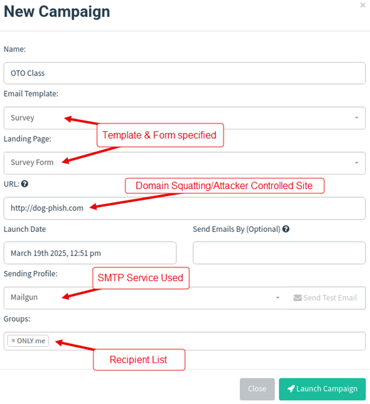
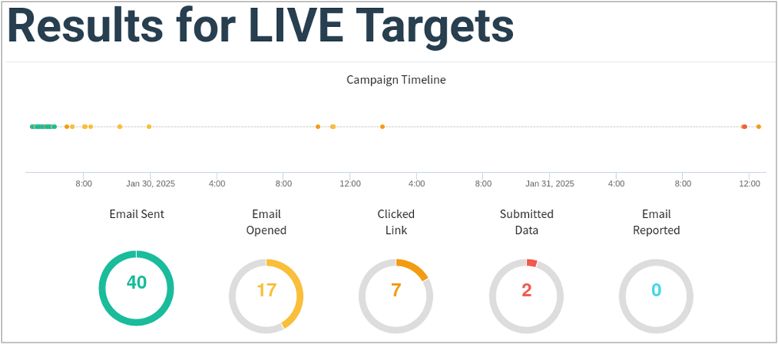

# Lab - GoPhish

## Tabletop Exercise: Planning a Phishing Campaign

First, lets discuss the following questions to understand the planning aspects of a phishing campaign:

1. **Target Selection**
   - Who is the target audience for this phishing campaign?
   - What are their roles and responsibilities?
   - What information is valuable to an attacker?

2. **Pretext & Lure**
   - What is a convincing pretext for your phishing email?
   - How would you make the email look legitimate?
   - What kind of attachment or link would entice the target to interact?

3. **Infrastructure & Payloads**
   - What domains or email addresses will be used for sending phishing emails?
   - Will you use an attachment, a credential harvesting site, or both?
   - How will you track engagements and collect responses?

4. **Detection & Response**
   - What security measures might detect this attack?
   - How can defenders mitigate the risk of this type of phishing campaign?
   - What logging and monitoring tools would be helpful in identifying phishing attempts?

## Campaign Walkthrough 

**(Written from the perspective of a Pentest report.)**

Ridgeback InfoSec performed one phishing ruse against for up to 25 Dog Fish Clothing employees.

!!! note
    The POC requested Ridgeback InfoSec send a sample of the phishing email prior to engaging with the target list. This was done to receive approval from Dog Fish Clothing for the ruse, as well as ensure the phishing message would successfully navigate any defensive measures in place.

### Organizational Reconnaissance
The tester investigated the Dog Fish Clothing landing page (dogfish.com) to identify authentication forms, design elements, relevant blog posts, company location, departments, and other information which could be used in the phishing ruse. 

<!-- ///caption
Dog Fish Clothing Landing Page
/// -->

### Infrastructure Setup
Next, Ridgeback InfoSec checked for potential domains that could be used for sending phishing emails as well as hosting spoofed login pages intended to capture credentials of targets. Ridgeback InfoSec observed a number of potentially interesting or possible domains that could be used:

{ width="70%" }
///caption
Available Domains (Sample)
///

Ridgeback InfoSec purchased the dog-phish.com domain to use as a form of domain squatting in the phishing attempts. Users who inspect link URLs often trust clicking if the root domain matches their organization's.

Ridgeback InfoSec used the tool GoPhish  as a framework for conducting this portion of the phishing campaign. This open-source tool allowed for metrics to be tracked, malicious links to be embedded in emails, and for granular IDs to be inserted into emails such as {{FirstName}} that directly correlate to individual targets.

{ width="70%" }
///caption 
GoPhish Login Page
///

GoPhish was installed and configured on a Digital Ocean droplet that was provisioned for this engagement. This system's public IP address was 138.NN.NN.113 as shown in the image below. 

{ width="70%" }
///caption
External System IP Address
///

For email sending purposes, Ridgeback InfoSec used the service Mailgun. This service allows for custom email sending solutions, including using user-defined domains.
The following screenshot shows an overview of the DNS records for the dog-phish.com domain:

{ width="70%" }
///caption 
DNS Records
///

After installing GoPhish, it was configured to use Mailgun for sending purposes. The following screenshot shows the GoPhish server configured to send email using Mailgun.

{ width="70%" }
///caption 
Mailgun Configuration
///

The sending email address of support@dog-phish.com was also used for testing purposes.

!!! note
    Setting an email address from the sending domain of "dog-phish.com" helps to bypass SPF-checks.

Next, the tester confirmed that SMTP settings were configured correctly by sending a test "It works!" email, which was successfully received in the tester's inbox.

<!-- ///caption
Successful Test Email from GoPhish Server
/// -->

### Ruse Development

Next, the tester developed the following ruse phishing campaign against Dog Fish Clothing.

#### Phishing Email

The tester drafted an initial phishing email template to send to the POC for approval.

{ width="70%" }
///caption 
Sample Phishing Email Template
///

The above image shows a ruse aimed at abusing the trust of employees by mimicking the design elements of the organization, typical email footer content, and capitalizing on awareness of a recent company award by referencing Dog Fish Clothing's own blog post.

The confidentiality verbiage was specifically highlighted in the email signature of the POC, which added support to theory that employees would be visually familiar with these items and expect their inclusion in communications.

The phishing email also included implied a sense of urgency for employees to respond to the survey before the end of the testing period by stating the survey link would expire.

#### Landing Page Form

Next, Ridgeback InfoSec crafted a landing page hosted on the dog-phish.com domain via the GoPhish server and is shown in the below image. Again, Dog Fish Clothing UI design elements we leveraged to make the form feel legitimate to users.

{ width="70%" }
///caption 
Landing Page Form
///

After a target user submitted the form, the browser would redirect to the main ridgebackinfosec.com landing page. All form fields were captured by the GoPhish server and stored for analysis.

<!-- ///caption
GoPhish Form Data Capture Sample
///caption -->

The attack path of this ruse is as follows:

1.	Attackers obtain a batch of emails and send out a phishing attack. 

2.	Employee suspicions might not be aroused due to mimicking the look/feel of Dog Fish Clothing's online presences and the use of a similar domain (dog-phish.com). 

3.	By not immediately prompting a user to authenticate, targets may be more trusting to offer up seemingly benign information. 

4.	The captured information (department, phone number, location, and name) would then be useful in a follow-up social engineering call.

5.	The possession of this identifiable information by an attacker would create a trusting relationship with a proven susceptible target over the phone and have a greater chance of success when requesting an employee to perform malicious actions.

6.	This could be abused by telling the target a follow-up email with a (malicious) attachment will be sent to them, or a link prompting them to now authenticate to take some further action.

### Campaign Execution

Ridgeback InfoSec was provided with a list of 40 targets from the Dog Fish Clothing team. As opposed to sending these emails all at once, it was decided to trickle them out between the hours of 4:19PM and 6:30PM ET on January 29th. This list was randomized upon sending.

<!-- ///caption
Target CSV Snippet
/// -->

The image below shows the GoPhish configuration used during live campaign execution.

{ width="70%" }
///caption 
GoPhish Campaign Configuration
///

The image below shows the results of the campaign.

{ width="70%" }
///caption 
Results of Emails
///

The overall click-rate of 17.5% indicates the level of susceptibility within the organization, while 0.5% of users entered identifiable information into the attacker provided form, highlighting potential risks associated with social engineering. Additionally, 0% of users (trackable by GoPhish) reported the phishing attempt, providing insight into the effectiveness of security training.