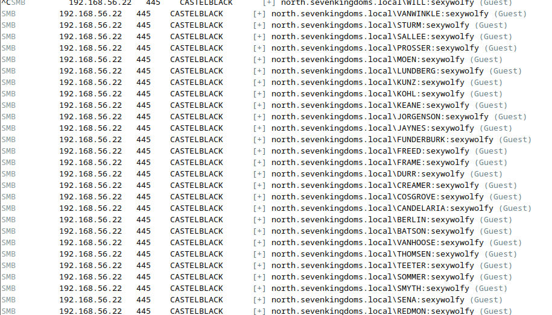
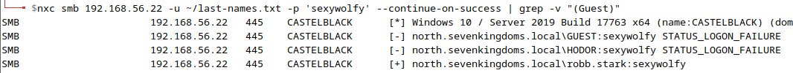

# Lab - HASHCAT

???+ warning "Prerequisites"
    You need the hashes from the Responder demo/lab.

## Intro

Hashcat is an advanced password recovery utility, capable of cracking encrypted password hashes on-demand. The tool is recognized for its versatility as it supports a multitude of hashing algorithms. With Hashcat, security professionals can perform a variety of cryptographic attacks such as brute force, combinatorial, dictionary, and hybrid, to uncover weak points in their security infrastructure and bolster their defenses accordingly.

## Walkthrough

???+ note
    You can reset hashcat so you can crack the passwords again by removing the `/home/telchar/.local/share/hashcat/hashcat.potfile` file with the below command.

    ```bash
    rm /home/telchar/.local/share/hashcat/hashcat.potfile
    ```

This Lab is fairly straightforward we're going to take the hashes we captured with responder from the previous labs and we're going to attempt to crack them using hashcat. It's always good practice to attempt to crack any hashes that you get on an engagement. This can help provide us with additional valid credentials to use throughout the environment in later stages.

Hashcat supports the cracking of a TON of different hash types by assigning a specific “hash-mode” value to each hash type. 

First things first we need the hashes from our responder lab in a file that we can reach. You did do that right? You didn’t skip that Lab step did you??

Well just in case you did or if you couldn't get that lab to work properly, here are the extracted hashes for you to put in a file yourself. Put these in a file called `responder.hashes` in your home directory (`/home/telchar`).

```
robb.stark::NORTH:1122334455667788:138B29A14C5A082F19F946BB3AFF537E:01010000000000000090C5E56494D801E5D2F5789054B95D0000000002000800480053003600340001001E00570049004E002D004C00420052004E0041004D0031005300540051005A0004003400570049004E002D004C00420052004E0041004D0031005300540051005A002E0048005300360034002E004C004F00430041004C000300140048005300360034002E004C004F00430041004C000500140048005300360034002E004C004F00430041004C00070008000090C5E56494D801060004000200000008003000300000000000000000000000003000002D4B5557B9EF589ECE5944B06785A55D686F279D120AC87BCBF6D0FEAA6663B90A001000000000000000000000000000000000000900160063006900660073002F0042007200610076006F0073000000000000000000
eddard.stark::NORTH:1122334455667788:76E26250ABF96A09E68ADC5A9B1A4C29:01010000000000000090C5E56494D801CA05EDDA86BE30280000000002000800480053003600340001001E00570049004E002D004C00420052004E0041004D0031005300540051005A0004003400570049004E002D004C00420052004E0041004D0031005300540051005A002E0048005300360034002E004C004F00430041004C000300140048005300360034002E004C004F00430041004C000500140048005300360034002E004C004F00430041004C00070008000090C5E56494D801060004000200000008003000300000000000000000000000003000002D4B5557B9EF589ECE5944B06785A55D686F279D120AC87BCBF6D0FEAA6663B90A001000000000000000000000000000000000000900140063006900660073002F004D006500720065006E000000000000000000
```

Now that we have our hashes in a file that we can reach, run the command below to start cracking.

```bash
hashcat -m 5600 --force -a 0 ~/responder.hashes /usr/share/eaphammer/wordlists/rockyou.txt
```

???- note "Command Options/Arguments Explained"
    - **`-m 5600`**: Specifies the hash type that Hashcat will attempt to crack. In this case, **`5600`** refers to NetNTLMv2 hashes, a type of hash used by Microsoft for password storage and network authentication in the NTLM (New Technology LAN Manager) protocol.
    - **`--force`**: This option forces Hashcat to start despite any warnings that might suggest it's not a good idea to proceed. It's important to use this option with caution, as it can bypass safety mechanisms designed to protect your hardware or data.
    - **`-a 0`**: Specifies the attack mode. **`0`** is for a straight attack, which means Hashcat will use a wordlist as-is, trying each entry as a potential password against the provided hashes.
    - **`responder.hashes`**: This is the file containing the hashes that you're attempting to crack. The name suggests these hashes were obtained using Responder, a tool commonly used for network security testing, specifically for capturing hashes by responding to different types of network requests.
    - **`/usr/share/eaphammer/wordlists/rockyou.txt`**: Specifies the path to the wordlist that Hashcat will use for the attack. The **`rockyou.txt`** wordlist is famous in password cracking and cybersecurity tests for its extensive collection of leaked passwords, making it a valuable resource for attempting to crack common or weak passwords.

???+ warning
    This process might take a while depending on your setup so get comfortable and watch for the output below. You should be able to crack Robb's password but not Eddard's.

{ width="70%" }
///caption
The King in the North!
///

Looks like the `robb.stark` user has the cleartext password of `sexywolfy`.

Like all good attackers, let's set these now valid clear text credentials aside somewhere in case we need them later on in our engagement. These can always be retrieved later by looking in the `hashcat.pot` file.

```bash
cat /home/telchar/.local/share/hashcat/hashcat.potfile
```

### Hashcat Common Configurations

Just for reference…

#### NT Hashes

```bash
hashcat -m 1000 hashes.txt /opt/wordlists/<file>.txt \
--rules-file /opt/rules/<file>.rule \
--runtime 321123
```

???- note "Command Options/Arguments Explained"
    - `-m 1000`: Specifies the hash mode for NTLM hashes (Windows NT LAN Manager password hashes)
    - `hashes.txt`: Input file containing NTLM hashes to crack (you'll replace this with your actual file)
    - `/opt/wordlists/<file>.txt`: Path to wordlist - common wordlists include rockyou.txt or custom dictionaries
    - `--rules-file /opt/rules/<file>.rule`: Applies transformation rules to wordlist entries (e.g., l33tspeak, capitalization, appending numbers) to generate password candidates
    - `--runtime 321123`: Limits the cracking session to specified seconds (~89 hours), useful for time-boxed assessments
    - Why NTLM mode: NTLM hashes are commonly extracted from Windows SAM databases, LSASS memory dumps, or captured via pass-the-hash attacks

#### Kerberos 5

```bash
hashcat -m 13100 hashes.txt /opt/wordlists/<file>.txt \
--rules-file /opt/rules/<file>.rule \
--runtime 321123
```

???- note "Command Options/Arguments Explained"
    - `-m 13100`: Specifies the hash mode for Kerberos 5 TGS-REP (Ticket Granting Service Response) hashes
    - `hashes.txt`: Input file containing Kerberoast hashes extracted from service account tickets
    - `/opt/wordlists/<file>.txt`: Wordlist for dictionary attack against service account passwords
    - `--rules-file /opt/rules/<file>.rule`: Mutation rules to expand wordlist coverage
    - `--runtime 321123`: Time limit for the cracking attempt
    - Why Kerberos mode: Used for "Kerberoasting" attacks where attackers request service tickets for accounts with SPNs (Service Principal Names) and crack them offline to recover service account passwords
    - Attack context: Kerberoast hashes are obtained using tools like Rubeus, Impacket's GetUserSPNs.py, or Invoke-Kerberoast

#### JWT

```bash
hashcat -m 16500 hashes.txt /opt/wordlists/<file>.txt \
--rules-file /opt/rules/<file>.rule \
--runtime 321123
```

???- note "Command Options/Arguments Explained"
    - `-m 16500`: Specifies the hash mode for JWT (JSON Web Token) signatures using HMAC-SHA256
    - `hashes.txt`: Input file containing JWT tokens or just their signature portions
    - `/opt/wordlists/<file>.txt`: Wordlist to attempt as the JWT secret key
    - `--rules-file /opt/rules/<file>.rule`: Rules to mutate wordlist entries when guessing the secret
    - `--runtime 321123`: Maximum time to spend attempting to crack the JWT secret
    - Why JWT cracking: JWTs are commonly used for authentication in web applications. Cracking the secret key allows attackers to forge valid tokens and impersonate any user
    - Attack scenario: Weak or leaked JWT secrets can be exploited to bypass authentication entirely, escalate privileges, or maintain persistent access

### Hash Types

[https://hashcat.net/wiki/doku.php?id=example_hashes](https://hashcat.net/wiki/doku.php?id=example_hashes)

{ width="70%" }
///caption
Sample Set
///

### SMB Password Spraying (w/ NetExec)

Now that we’ve cracked a password, let’s revisit NetExec and see how we can reuse the cleartext password in a spraying attack.

First let’s get a list of names and tack robb.stark on to the end of it for demonstration purposes.

```bash
wget -O ~/last-names.txt https://raw.githubusercontent.com/arineng/arincli/master/lib/last-names.txt
echo "robb.stark" >> ~/last-names.txt
```

???- note "Command Options/Arguments Explained"
    - `wget`: Command-line utility for downloading files from the web
    - `-O ~/last-names.txt`: Saves the downloaded file to the specified path/filename (instead of using the remote filename)
    - URL: Public repository containing a list of common last names (useful for username enumeration/generation)
    - `echo "robb.stark" >>`: Appends the text to a file (the `>>` operator adds to the end without overwriting)
    - `~/last-names.txt`: The target file to append to
    - Why create a username list: Password spraying requires a list of potential usernames. Using common surnames with known domain account patterns (first.last) increases the chance of finding valid accounts
    - Attack technique: This demonstrates creating a mixed username list for password spray testing

If you had collected a user list in your travels (like we just created above), a Password Spraying attack with NetExec can be accomplished via the below command syntax.

```bash
nxc smb 192.168.56.22 -u ~/last-names.txt -p 'sexywolfy'
```

???- note "Command Options/Arguments Explained"
    - `nxc smb`: NetExec targeting SMB protocol (port 445)
    - `192.168.56.22`: Target server IP address (GOAD-SRV02)
    - `-u ~/last-names.txt`: Username list file containing potential account names to test
    - `-p 'sexywolfy'`: The single password to spray across all usernames (cracked from Robb Stark's hash)
    - Password Spraying explained: Tests one password against many usernames, avoiding account lockouts that would occur from testing many passwords against one account
    - Why effective: Users often reuse passwords across accounts, or organizations use default/weak passwords for multiple service accounts
    - Lockout avoidance: Unlike brute force (many passwords per user), password spraying stays under typical lockout thresholds (e.g., 5 attempts)

{ width="70%" }
///caption
Password Spraying
///

Wait we weren't targeting the user "SMITH". What happened??

By default, `nxc` exits after finding a valid credential. Since "SMITH" appeared in the username list before "robb.stark", NetExec stopped there. Maybe SMITH also has the same password? Let's use the `--continue-on-success` flag to find ALL accounts that authenticate successfully.

```bash
nxc smb 192.168.56.22 -u ~/last-names.txt -p 'sexywolfy' --continue-on-success
```

???- note "Command Options/Arguments Explained"
    - `--continue-on-success`: Continues spraying even after finding valid credentials instead of exiting on first match
    - Why use it: Useful for spraying a single password against a large user list where multiple accounts may share the same weak password

{ width="70%" }
///caption
Continue on Success Results
///

Wait... *every* username is coming back as valid?? That seems suspicious. Let's verify one of these by trying to actually log in to SRV02 (192.168.56.22).

{ width="70%" }
///caption
Testing Login Directly
///

The login fails! So these aren't actually valid credentials. What's going on?

Look closely at the NetExec output - every result shows `(Guest)` at the end:

```
north.sevenkingdoms.local\VANWINKLE:sexywolfy (Guest)
north.sevenkingdoms.local\STURM:sexywolfy (Guest)
...
```

#### Guest Account False Positives

???+ info
    When the Guest account is enabled on a Windows system, SMB authentication will "succeed" for **any** username with **any** password - but you're just getting mapped to the Guest account with minimal privileges. NetExec helpfully marks these results with `(Guest)` to help you identify them.

    This is why:

    1. NetExec shows `[+]` (success) for every username
    2. But actual interactive login fails because the account doesn't really exist

To filter out these Guest account false positives and find only the **real** valid credentials, pipe the output through `grep`:

???+ warning
    This command will take a long time to complete due to the large user list. I do NOT recommend running it during class. If you do, just be very patient!

    Fair warning - it will flood your NetExec SMB creds table with every single credential (valid or not) that you try.

```bash
nxc smb 192.168.56.22 -u ~/last-names.txt -p 'sexywolfy' --continue-on-success | grep -v "(Guest)"
```

???- note "Command Options/Arguments Explained"
    - `| grep -v "(Guest)"`: Pipes output to grep, which filters out (`-v`) any lines containing `(Guest)`
    - Result: Only shows authentications that are NOT Guest account mappings - i.e., truly valid credentials

{ width="70%" }
///caption
Filtered Results - Real Credentials Only
///

Now we can see that `robb.stark` is the only user with a legitimately valid password of `sexywolfy`.

???+ tip "Verification Mindset"
    Always validate your findings before trusting them! Password spraying can produce false positives due to Guest accounts, misconfigured systems, or other environmental factors. When something seems too good to be true (like every username being valid), investigate further.