# Lab - MUNDANE

???+ warning "Setup" 
    A Nessus output file has been provided for this lab located at `~/OTO-labs/supp/nessus/class_goad/OTO-class_GOAD.nessus`.

## Intro

In this lab, we’ll be working with `mundane.py`, a custom-built auxiliary tool designed to make Nessus finding reviews faster, more organized, and more actionable. Instead of manually digging through a clunky UI or lenghty HTML exports, `mundane.py` gives us an interactive interface to navigate by scan, severity, and file. Along the way, it highlights unreviewed findings, shows grouped host/port information, and provides quick ways to compare or analyze coverage across files.

The goal of `mundane.py` isn’t just to speed up review—it’s to connect vulnerability data to offensive workflows. From within the tool, you’ll be able to preview targets, copy lists to your clipboard, and even launch tools like Nmap or NetExec against hosts directly from the interface. By the end of this exercise, you’ll see how `mundane.py` helps move from raw scan results to hands-on validation and exploitation in a streamlined way.

## Walkthrough

???+ warning "Activating the Python Virtual Environment (venv)"
    This tool, and many others discussed in this class, require you to first "activate" a python virtual environment before running it. The venv has already been setup for you during the tool installation process. You just have to activate it with the command below.

    ```bash
    source ~/git-tools/auxiliary/venv/bin/activate
    ```

    ***A [Python virtual environment](https://docs.python.org/3/tutorial/venv.html) is a self-contained workspace that keeps its own interpreter, libraries, and dependencies separate from the system Python. This isolation ensures that different projects can use different package versions without conflicts, making development and reproducibility more reliable.***

### Step 0 — Read the Help and Map the Terrain

Start by discovering what the tool can do.

```bash
python ~/git-tools/auxiliary/nessus/mundane.py --help
```

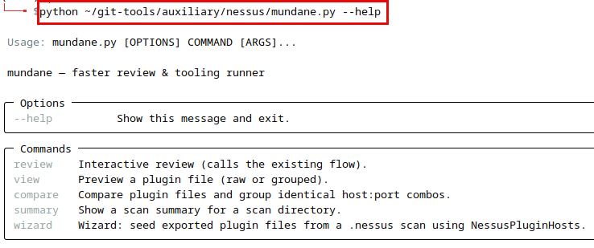{ width="70%" }
///caption
Help Dialog
///

You’ll see the top-level description and subcommands. Here’s what each does (you’ll use them all in this lab):

* **wizard** — Seeds exported plugin host files from a `.nessus` scan using the helper repo (NessusPluginHosts). Optionally drops you right into interactive review.
* **review** — Interactive reviewer: pick a scan, drill into severities, preview files (raw/grouped/hosts-only), mark as REVIEW_COMPLETE, and launch tools (Nmap/NetExec/Custom).
* **view** — Quick viewer for a single plugin file (raw or grouped).
* **compare** — Compares multiple plugin files, grouping identical host:port sets.
* **summary** — Overview of a scan directory: counts, unique hosts/ports, top ports, and identical host:port clusters.

<!-- **Exercise:**

* Run the `--help` flag. List the subcommands you see. In one sentence each, describe when you’d use them. -->

---

### Step 1 — Export Plugin Files with `wizard`

Use the **wizard** to turn the `.nessus` file into per-plugin host lists under `~/nessus_plugin_hosts`, then jump directly into review.

```bash
python ~/git-tools/auxiliary/nessus/mundane.py wizard \
  ~/OTO-labs/supp/nessus/class_goad/OTO-class_GOAD.nessus \
  --out-dir ~/nessus_plugin_hosts
```

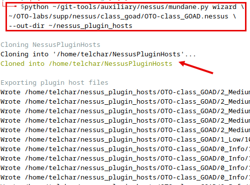{ width="70%" }
///caption
Parsing .nessus Into Plugin Files
///

What happens:

* The [helper repo](https://github.com/DefensiveOrigins/NessusPluginHosts) from [Defensive Origins](https://defensiveorigins.com/) is cloned if needed.
* Plugin host files are created under `~/nessus_plugin_hosts/…`.
<!-- * Because `--review` is set, the interactive reviewer launches automatically when export finishes. -->

The script will tell you when it is done, reiterate back to you where it put the newly created files, and even give you an idea of what your next command should be.

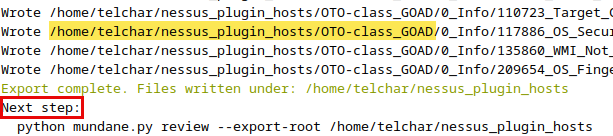{ width="70%" }
///caption
Next Step
///

Note the directory `/home/telchar/nessus_plugin_hosts/OTO-class_GOAD`. Quickly list that directory's contents with the command below.

```bash
ll ~/nessus_plugin_hosts/OTO-class_GOAD
```

How many severity folders (Critical/High/Medium/Low/Info) are present under your chosen scan?

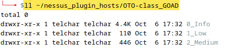{ width="70%" }
///caption
Listing Contents
///

No High or Critical issues found, right? Remember, this is an **INTENTIONALLY** vulnerable target environment we're looking at. So why don't we see more impactful findings off the bat?

???+ note "Remember for later..."
    After export completes, note the scan's name shown ("OTO-class_GOAD"). Write that down—you’ll use it later with `summary` command.

---

### Step 2 — Interactive Review with `review`

If you didn’t pass the `--review` flage while using the `wizard` sub-command, you can start the interactive reviewer anytime using:

```bash
python ~/git-tools/auxiliary/nessus/mundane.py review \
  --export-root ~/nessus_plugin_hosts
```

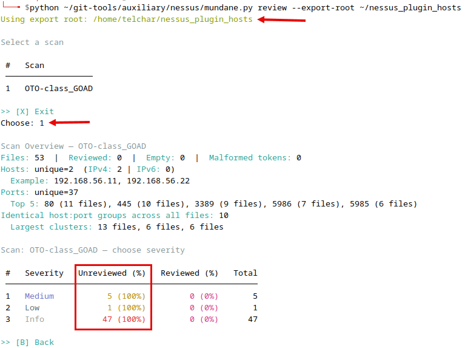{ width="70%" }
///caption
Scan Review & Summary
///

What you’ll do in the reviewer:

* Choose a **scan** (created by the wizard).
* Choose a **severity** (Critical/High/Medium/Low/Info, plus a special “Metasploit Module” virtual group if present).
* Pick a **plugin file** to review.

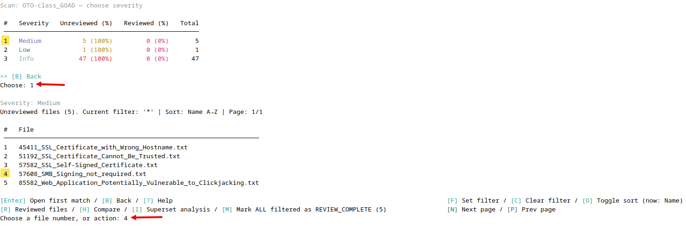{ width="70%" }
///caption
Choose Severity & File
///

When previewing a file:

* **Raw** view shows the file as-is (same host could be repeated on multiple lines w/ one port per line).
* **Grouped** view shows `host:port1,port2,…` (great for copy/paste into report).
* **Hosts-only** shows just the hosts (no ports).

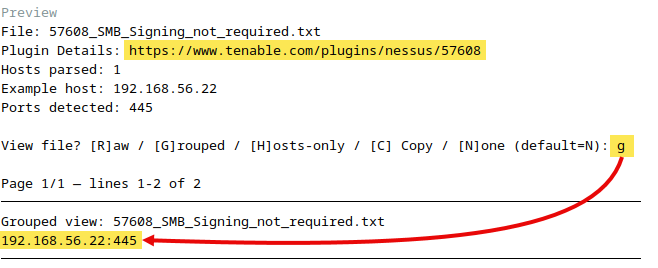{ width="70%" }
///caption
Finding File Details
///

**Exercise:**

* Enter the **Medium** severity folder. Preview one file in **grouped** mode and then in **hosts-only** mode.

---

### Step 3 — Run Tools from Inside `review`

While still in the interactive reviewer flow and a plugin file is selected, choose **Run a tool now?** to see:

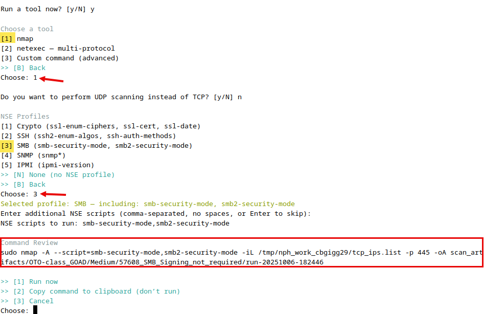{ width="70%" }
///caption
Tool Selection
///

* **Nmap**
    * TCP or UDP.
    * Optional NSE profiles: *Crypto*, *SSH*, *SMB*, *SNMP*, *IPMI*.
    * You can add extra NSE scripts by name (comma-separated, no spaces).
* **NetExec**
    * Multi-protocol (e.g., `smb`, `rdp`, `ldap`, `ftp`, `ssh`, etc.).
    * SMB run produces a “relay list” (signing-not-required targets) alongside logs.
* **Custom Command**
    * Build any command using placeholders:
        * `{TCP_IPS}` → path to a file of hosts (one per line)
        * `{UDP_IPS}` → same for UDP context
        * `{TCP_HOST_PORTS}` → path to `host:port,port,…` lines
        * `{PORTS}` → a comma-separated ports string if the file had ports
        * `{WORKDIR}` → ephemeral workspace dir containing the generated lists
        * `{OABASE}` → a base path for tool output files (organized under `~/scan_artifacts/...`)

Every command is shown in a **review menu** first so you can **Run**, **Copy**, or **Cancel**.

**Exercise:**

* Pick a file with *SMB-relevant* issues. Run **Nmap** TCP with the **SMB** NSE profile. After it completes, note where the results were written (the tool prints the artifact paths).
<!-- * Choose **Custom Command** and run a harmless test such as:
  `cat {TCP_IPS} | xargs -I{} sh -c 'echo {}'`
  Confirm you see each host echoed. -->

???+ warning "Target VM Required"
    You will need to have the `GOAD-SRV02` VM running for the above exercise to get results.

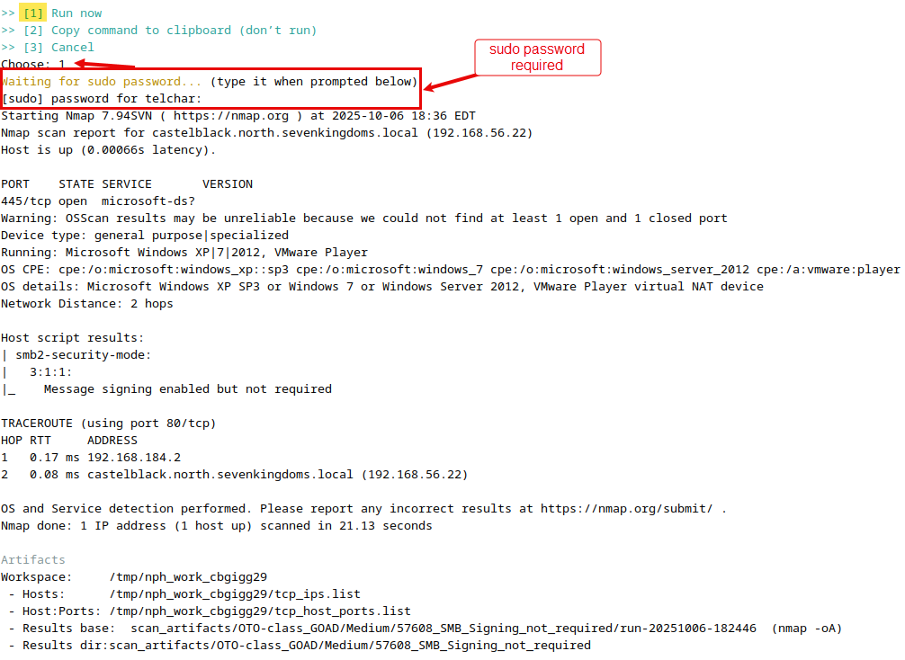{ width="70%" }
///caption
Run Tool
///

You can:

* Copy any of those views to your clipboard.
* Mark files as `REVIEW_COMPLETE` (the tool will rename them with a `REVIEW_COMPLETE-` prefix).
* Launch a **tool** (Nmap, NetExec, or a custom command) against parsed hosts, with a review/confirm step before execution.

---

### Step 4 — Wrap-Up and Session Summary

As you finish files, keep marking them **REVIEW_COMPLETE**.

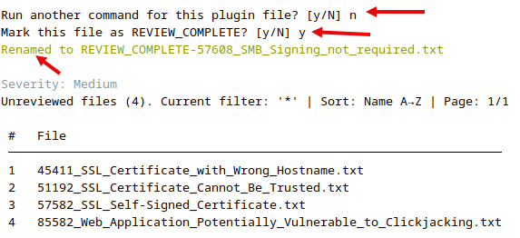{ width="70%" }
///caption
Mark File Review Complete
///

When you exit the reviewer, you’ll see a session summary showing:

* Files **reviewed** (but not renamed),
* Files **marked complete** (renamed),
* Files **skipped** (e.g., empty).

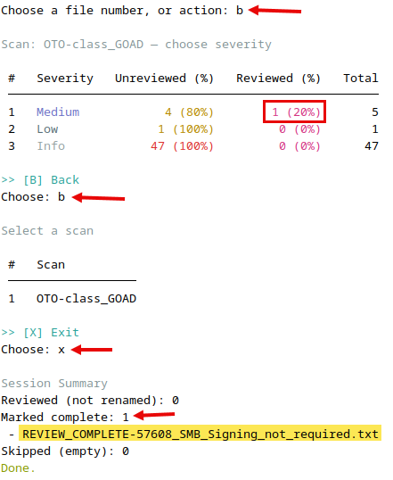{ width="70%" }
///caption
Session Summary
///

**Exercise:**

* Mark at least one file complete in **each** severity level available for your scan.
* Exit the reviewer and record: how many files were “Marked complete,” how many were “Reviewed (not renamed),” and how many were “Skipped.”

---

### Step 5 — One-Off Analysis with `view` and `summary`

You don’t always need the interactive UI—use these for quick checks.

#### A) View

```bash
python ~/git-tools/auxiliary/nessus/mundane.py view \
  ~/nessus_plugin_hosts/OTO-class_GOAD/2_Medium/85582_Web_Application_Potentially_Vulnerable_to_Clickjacking.txt \
  --grouped
```

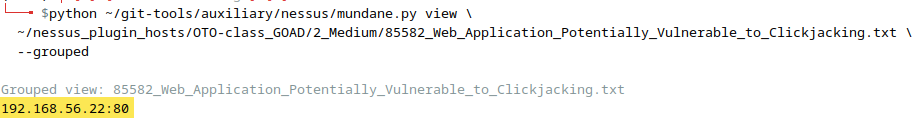{ width="70%" }
///caption
File Quick View
///

* Shows a single plugin file, grouped by host:port.

#### B) Compare
<!-- 
```bash
python ~/git-tools/auxiliary/nessus/mundane.py compare \
  ~/nessus_plugin_hosts/OTO-class_GOAD/2_Medium/85582_Web_Application_Potentially_Vulnerable_to_Clickjacking.txt
```

* Finds **identical host:port sets** across multiple plugin files to spot overlap.

#### C) Summary -->

```bash
python ~/git-tools/auxiliary/nessus/mundane.py summary \
  ~/nessus_plugin_hosts/OTO-class_GOAD
```

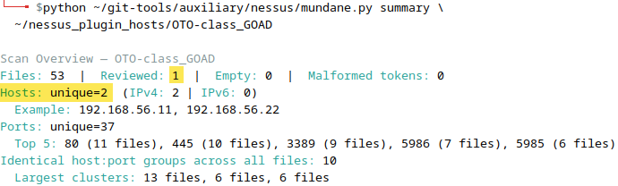{ width="70%" }
///caption
Scan Quick Summary
///

* Prints scan stats: total files, reviewed vs unreviewed, **unique hosts**, **unique ports**, top ports, and counts of identical host:port clusters.

**Exercise:**

* Run `summary` on your scan directory. Record: total files, reviewed count, unique hosts, unique ports, and top 5 ports.

---

## Key Takeaways

* `wizard` → turns the `.nessus` export into organized plugin host files in `~/nessus_plugin_hosts`.
* `review` → your main, interactive workspace for previewing, marking complete, and launching tools.
* `view` & `summary` → fast, focused analysis outside the reviewer.
* Tool integration (Nmap/NetExec/Custom) → immediate pivot from data to action with controlled, reviewable command execution.

You’re now set to move Nessus findings straight into an operator-friendly flow.