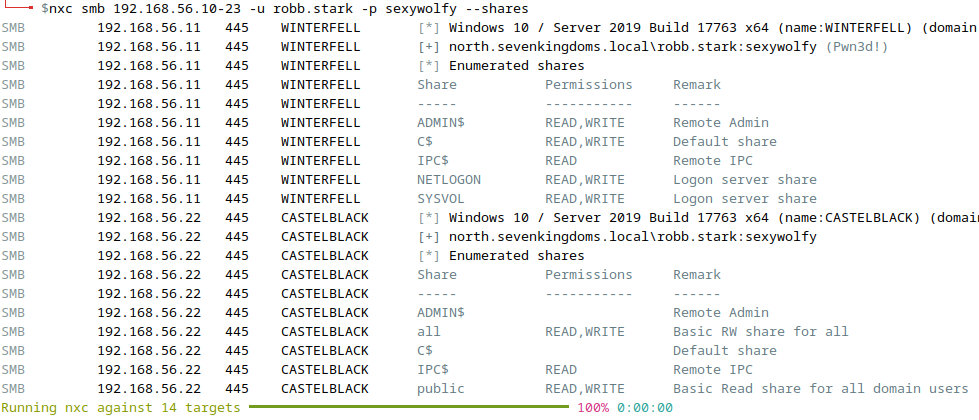
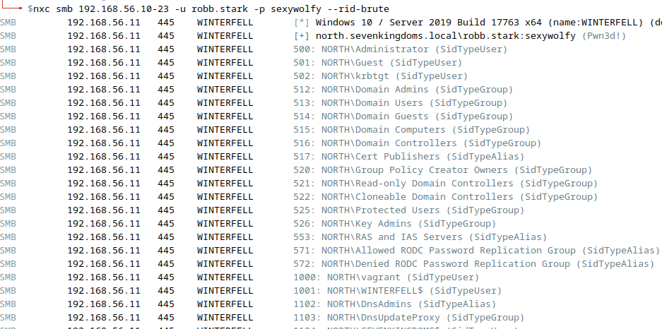
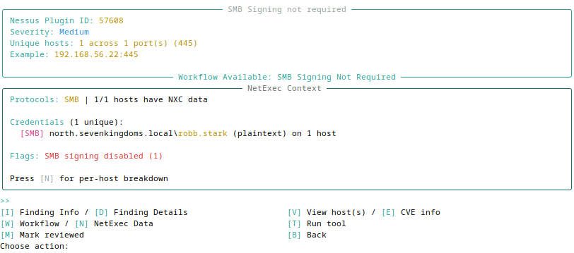
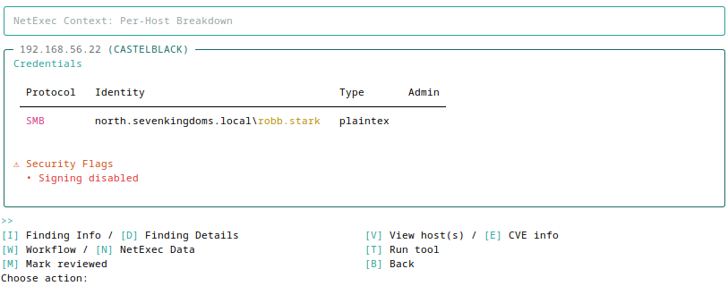

# Lab - NetExec w/ Creds

???+ warning "Prerequisites"
    You'll need the GOAD-DC02 VM running to see these results.

## Intro

Now that we have some credentials on the Domain, let's revisit NetExec and see what new possibilities await us.

## Walkthrough

Here are a few NetExec commands that can really open up doors in an environment.

### Logged On Users

Remember that `--loggedon-users` flag from the netexec lab that required a local admin's credentials to work? Give it a try now that we have some creds...

```bash
nxc smb 192.168.56.10-23 -u robb.stark -p sexywolfy --loggedon-users
```

???- note "Command Options/Arguments Explained"
    - `nxc smb 192.168.56.10-23`: NetExec targeting SMB protocol across IP range
    - `-u robb.stark -p sexywolfy`: Authenticates with domain credentials (obtained from hashcat lab)
    - `--loggedon-users`: Enumerates currently logged-on users on each target system
    - Why credentials matter: This flag requires at least local admin rights on targets to query logged-on user sessions via remote registry or WMI
    - Attack value: Identifies which high-value users (e.g., Domain Admins) are currently active on which machines, helping attackers choose lateral movement targets
    - Use case: Find where privileged users are logged in, then target those systems for credential theft (mimikatz, lsassy) or session hijacking

### Local Groups

Enumerate local groups, if a group is specified then its members are enumerated...

```bash
nxc smb 192.168.56.10-23 -u robb.stark -p sexywolfy --local-groups
```

???- note "Command Options/Arguments Explained"
    - `--local-groups`: Enumerates all local security groups on each target (e.g., Administrators, Remote Desktop Users, Backup Operators)
    - Why enumerate groups: Reveals privilege structure on each system - shows which groups exist and who has elevated access
    - Attack value: Identifies potential privilege escalation paths and lateral movement opportunities based on group memberships
    - What to look for: Non-standard groups, users in Administrators group, service accounts with excessive privileges
    - Follow-up: Can specify a specific group to enumerate its members (e.g., `--local-groups Administrators`)

{ width="70%" }
/// caption
Local Groups
///

### Network Interfaces

Enumerate network interfaces of targets...

```bash
nxc smb 192.168.56.10-23 -u robb.stark -p sexywolfy --interfaces
```

???- note "Command Options/Arguments Explained"
    - `--interfaces`: Enumerates network interfaces and IP configurations on each target system
    - Information gathered: Interface names, IP addresses, subnet masks, MAC addresses, gateway configurations
    - Attack value: Maps network topology and identifies multi-homed systems that could serve as pivot points between network segments
    - Use case: Discover systems bridging different VLANs or network segments, identify potential routing paths for lateral movement
    - Network segmentation bypass: Multi-homed hosts can be leveraged to tunnel traffic between isolated networks

{ width="70%" }
/// caption
Network Interfaces
///

???+ warning "Guest Account Access"
    The `--interfaces` flag can work with Guest-level privileges. On systems where the Guest account is enabled, even invalid credentials may successfully enumerate network interfaces. If you're seeing results for credentials you haven't verified, remember to check for `(Guest)` in your authentication output. See the [Guest Account False Positives](../hashcat/index.md#guest-account-false-positives) section in the Hashcat lab for more details on identifying and filtering Guest authentications.

### SMB Shares

Enumerate SMB shares accessible with your credentials. This reveals what network resources you can read or write to:

```bash
nxc smb 192.168.56.10-23 -u robb.stark -p sexywolfy --shares
```

???- note "Command Options/Arguments Explained"
    - `--shares`: Enumerates SMB shares on each target and shows your access level (READ, WRITE)
    - What you'll see: Share names, remarks/descriptions, and permission indicators
    - Common shares: ADMIN$, C$, IPC$, NETLOGON, SYSVOL, plus any custom shares
    - Attack value: Identifies shares you can read for sensitive data or write to for payload staging
    - Look for: Shares with WRITE access (staging), shares containing backups, scripts, or config files
    - Note: You may see shares listed but not all will be accessible - the permissions column shows your actual access

{ width="70%" }
/// caption
SMB Share Enumeration
///

Looking at the output, you can see:

- **WINTERFELL** (192.168.56.11): Standard domain controller shares including NETLOGON and SYSVOL
- **CASTELBLACK** (192.168.56.22): Has a `public` share with "Basic RW share for all domain users" - this could be interesting for staging payloads or finding sensitive files

The `public` share on CASTELBLACK is particularly noteworthy - shares explicitly created for "all domain users" often contain useful information or can be used for payload staging.

### RID Brute Force

RID (Relative Identifier) brute forcing is a technique to enumerate domain users and groups by cycling through RID values. This can discover accounts that might not appear in standard enumeration:

```bash
nxc smb 192.168.56.11 -u robb.stark -p sexywolfy --rid-brute
```

???- note "Command Options/Arguments Explained"
    - `--rid-brute`: Enumerates users and groups by brute-forcing RID values
    - How it works: Windows Security Identifiers (SIDs) end with a RID that identifies specific accounts. Well-known RIDs include 500 (Administrator), 501 (Guest), 502 (krbtgt)
    - What you'll find: Domain users, groups, computer accounts, and built-in security principals
    - Attack value: Discovers accounts that may not appear in standard enumeration, including service accounts and disabled users
    - Output format: Shows RID number, account name, and account type (SidTypeUser, SidTypeGroup, SidTypeAlias)

{ width="70%" }
/// caption
RID Brute Force Enumeration (Snippet)
///

The output reveals the domain's user and group structure:

- **Well-known accounts**: Administrator (500), Guest (501), krbtgt (502)
- **Domain groups**: Domain Admins (512), Domain Users (513), Domain Computers (515), Domain Controllers (516)
- **Security groups**: Cert Publishers, Group Policy Creator Owners, DnsAdmins, and various replication groups
- **Service accounts**: Look for accounts like `vagrant` (1000) that might be service or deployment accounts

This enumeration gives you a map of the domain's account structure, which is valuable for identifying potential targets for password spraying, Kerberoasting, or privilege escalation.

???+ tip "More to Come"
    There are additional powerful NetExec capabilities you'll unlock later when you discover accounts with elevated privileges. Stay tuned for the Pivot and Escalate lab!

## Optional: LDAP Exploration

???+ info "Optional"
    This is an **optional** part of the lab to explore on your own. LDAP authentication may not reliably work with the class VMs, but does work on other Domains within the larger GOAD environment. No guidance will be provided.

LDAP (Lightweight Directory Access Protocol) is just a way for computers to talk to a directory service like Active Directory.

* Think of a directory like a phonebook: it stores names, numbers, addresses, etc. In IT, the “directory” stores users, computers, printers, groups, and their relationships.
* LDAP is the language (protocol) used to look things up or make changes in that phonebook.

For example:

* If you log in to your work computer, your username + password might get checked against Active Directory using LDAP.
* If a printer wants to know who you are before letting you print, it can ask the directory via LDAP.

👉 In short: LDAP is like the "search-and-verify tool" that applications and systems use to look people up in a big network phonebook (Active Directory or other directory services).

As luck would have it, NetExec also supports the LDAP protocol! [Here](https://www.netexec.wiki/ldap-protocol/authentication) is the documentation of what can be done using NetExec. Read, adapt, and explore on your own!

## Viewing Credentials in Cerno

Now that you've gathered credentials with NetExec, Cerno can display them alongside your Nessus findings. Cerno reads directly from NetExec's database to enrich vulnerability context with the credentials you've discovered.

Start the interactive review:

```bash
cerno review
```

???- note "Command Options/Arguments Explained"
    - `cerno review`: Launches the interactive TUI for reviewing imported Nessus findings
    - Navigation: Use number selection to browse findings by severity level
    - Actions: Each finding shows contextual actions in the footer including `[N] NetExec Data`

When viewing a finding that affects hosts you've enumerated with NetExec, you'll see a **NetExec Context** panel showing the credentials gathered from your scans:

{ width="70%" }
/// caption
NetExec Context with Credentials
///

The panel shows:

- **Credentials**: Domain\username pairs discovered during your NetExec scans, including credential type and admin status
- **Shares**: SMB shares with read/write access indicators
- **Security Flags**: Highlights like "SMB signing disabled" that confirm vulnerabilities

Press **`[N]`** to view the per-host breakdown, which shows exactly which credentials have access to each affected host:

{ width="70%" }
/// caption
Per-Host Credential Detail
///

???+ info
    Cerno reads from `~/.nxc/workspaces/default/` by default. If you're using a different NetExec workspace, you can configure the path with `cerno config set nxc_workspace_path /path/to/workspace`.

This integration lets you see at a glance which credentials from your NetExec enumeration have access to systems affected by specific vulnerabilities—helping you prioritize which findings to exploit next.