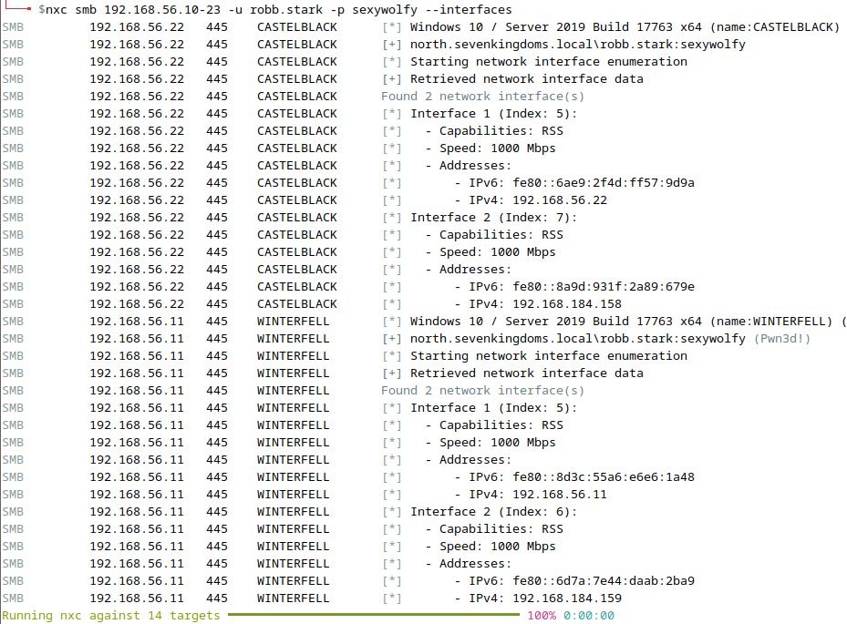

# Lab - NetExec w/ Creds

???+ warning "Prerequisites"
    You'll need the GOAD-DC02 VM running to see these results.

## Intro

Now that we have some credentials on the Domain, let's revisit NetExec and see what new possibilities await us.

## Walkthrough

Here are a few NetExec commands that can really open up doors in an environment.

### Logged On Users

Remember that `--loggedon-users` flag from the netexec lab that required a local admin's credentials to work? Give it a try now that we have some creds...

```bash
nxc smb 192.168.56.10-23 -u robb.stark -p sexywolfy --loggedon-users
```

### Local Groups

Enumerate local groups, if a group is specified then its members are enumerated...

```bash
nxc smb 192.168.56.10-23 -u robb.stark -p sexywolfy --local-groups
```

{ width="70%" }
///caption
Local Groups
///

### Network Interfaces

Enumerate network interfaces of targets...

```bash
nxc smb 192.168.56.10-23 -u robb.stark -p sexywolfy --interfaces
```

{ width="70%" }
///caption
Network Interfaces
///

### Hash Gathering

Try dumping the SAM database (Security Account Manager) to get mor hashes. Remember this requires at least local admin level access on a target system. Do so using the `--sam` flag.

```bash
nxc smb 192.168.56.10-23 -u robb.stark -p sexywolfy --sam
```

The is a file on Windows that stores local user account information for that specific machine. It holds usernames and password hashes for local accounts (not domain accounts). It also contains details like group memberships and security identifiers (SIDs).

In short, the SAM database is like a mini version of the NTDS file, but only for local accounts on one computer.

The Local Security Authority (LSA) which holds secrets in memory on a system is also a great place to get more creds. This can be accomplished with the `--lsa` flag. Its secrets are another piece of Windows’ credential storage, tied to the LSASS process.

???- warning "Elevated Privs Required"
    Requires Domain Admin or Local Admin Priviledges on target Domain Controller.

```bash
nxc smb 192.168.56.10-23 -u robb.stark -p sexywolfy --lsa
```

Finally, you can try retrieving the NTDS file. The **NTDS file** (often called `ntds.dit`) is basically the heart of **Active Directory** on a Windows domain controller.

Here’s the simple breakdown:

* Think of it as **a giant database file**.
* It stores all the important information about your network domain:

    * **User accounts** (names, passwords — in hashed/encrypted form)
    * **Groups** (who belongs where)
    * **Computers** (machines that are joined to the domain)
    * **Security info** (permissions, trust relationships, etc.)

In other words, if Active Directory is like the phonebook and security guard for a company’s network, the `ntds.dit` file is the **actual book** where all the names, numbers, and access rules are written down.

That’s why attackers, penetration testers, and defenders pay close attention to it — if someone gets hold of the NTDS file, they essentially get the **keys to the kingdom** (because it contains all the domain’s accounts and password hashes).

Once you have more hashes, you can try cracking them to get even more accounts.

```bash
nxc smb 192.168.56.10-23 -u robb.stark -p sexywolfy --ntds
```

{ width="70%" }
///caption
NTDS
///

???+ note "Comparisons"
    👉 In simple terms:

    * SAM = local usernames + password hashes
    * LSA secrets = cached credentials, service passwords, and keys that Windows uses behind the scenes
    * NTDS = domain-wide usernames + password hashes (and more)

## Optional: LDAP Exploration

???+ info "Optional"
    This is an **optional** part of the lab to explore on your own. No guidance will be provided.

LDAP (Lightweight Directory Access Protocol) is just a way for computers to talk to a directory service like Active Directory.

* Think of a directory like a phonebook: it stores names, numbers, addresses, etc. In IT, the “directory” stores users, computers, printers, groups, and their relationships.
* LDAP is the language (protocol) used to look things up or make changes in that phonebook.

For example:

* If you log in to your work computer, your username + password might get checked against Active Directory using LDAP.
* If a printer wants to know who you are before letting you print, it can ask the directory via LDAP.

👉 In short: LDAP is like the “search-and-verify tool” that applications and systems use to look people up in a big network phonebook (Active Directory or other directory services).

As luck would have it, NetExec also supports the LDAP protocol! [Here](https://www.netexec.wiki/ldap-protocol/authentication) is the documentation of what can be done using NetExec. Read, adapt, and explore on your own!