# Lab - NETEXEC

???+ warning "Prerequisites" 
    You will need at least the `GOAD-SRV02` (`192.168.56.22`) target VM and The Forge VM up and running for this Lab.

## Intro

NetExec (formerly CrackMapExec) is a toolkit that consolidates and simplifies the use of post-exploitation tools such as Mimikatz and includes modules for discovering weaknesses in databases and file shares.

The results of SMB relay often land us SAM tables and credential material. The NTLM hashes that dump on successful remote authentication through relay can be used with lots of tools, one of which is described below.

## Walkthrough

```bash
netexec --help
```

???- note "Command Options/Arguments Explained"
    - `netexec --help`: Displays NetExec's main help menu showing available protocols and global options
    - Available protocols: SMB, WinRM, LDAP, SSH, MSSQL, RDP, FTP, and more - each with specialized enumeration capabilities
    - First-run behavior: On initial execution, prompts to initialize the local database (nxcdb) for storing credentials, hosts, and findings
    - Database location: Creates `~/.nxc/workspaces/default/` to persist enumeration data across sessions
    - Why check help: NetExec has extensive functionality - reviewing help shows protocol-specific modules and authentication options
    - Next step: After reviewing global help, use protocol-specific help (e.g., `nxc smb --help`) to see detailed module options

{ width="70%" }
///caption
First time use
///

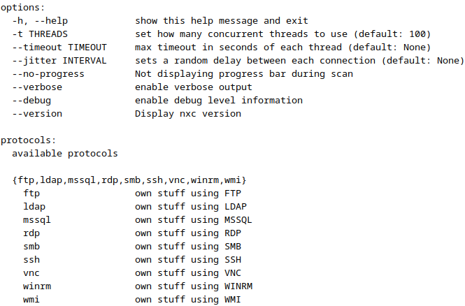{ width="70%" }
///caption
Help Dialog
///

### SMB Protocol

With the SMB (Server Message Block) protocol, and the **`--help`** flag is asking for the help or usage information about the SMB module of NetExec.

```bash
nxc smb --help
```

???- note "Command Options/Arguments Explained"
    - `nxc smb --help`: Displays SMB protocol-specific help showing enumeration modules and authentication options
    - What it shows: Available flags like `--shares`, `--sessions`, `--users`, `--groups`, `--sam`, `--lsa`, `--ntds`, credential dumping options, and execution methods
    - Why protocol-specific: Each protocol (SMB, WinRM, LDAP) has unique capabilities - SMB specializes in Windows network enumeration and credential extraction
    - Common SMB operations: Null session enumeration, authenticated user/share listing, local admin checking, credential dumping, command execution
    - Authentication modes: Supports password authentication, hash passing (pass-the-hash), Kerberos tickets, and null sessions
    - Module system: Shows available modules (spider_plus, enum_av, enum_dns, etc.) that extend core functionality

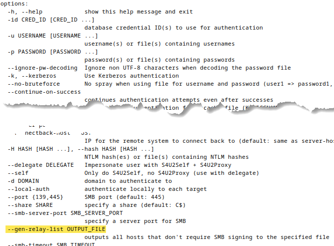{ width="70%" }
///caption
SMB module specific dialog
///

### SMB Scanning & Targeting

Let’s do some SMB scanning! Run the command below. First, with Nmap.

We can check which of our targets have SMB signing both enabled AND required by running the below nmap command.

```bash
sudo nmap -Pn -sV --script=smb2-security-mode 192.168.56.11,22
```

???- note "Command Options/Arguments Explained"
    - `sudo nmap`: Runs Nmap with elevated privileges (required for SYN scans and OS detection)
    - `-Pn`: Skips host discovery ping - treats all targets as online (useful when ICMP is blocked)
    - `-sV`: Enables version detection to identify service versions on open ports
    - `--script=smb2-security-mode`: Runs NSE script to check SMB signing configuration and authentication requirements
    - `192.168.56.11,22`: Target specification using comma-separated IP addresses (GOAD-DC02 and GOAD-SRV02)
    - Why check SMB signing: When "Message signing enabled but not required" = vulnerable to SMB relay attacks (ntlmrelayx)
    - Attack relevance: Hosts without required signing can be compromised by relaying captured NTLM authentication to gain unauthorized access
    - Alternative: NetExec also shows SMB signing status with `nxc smb --gen-relay-list` for easier parsing

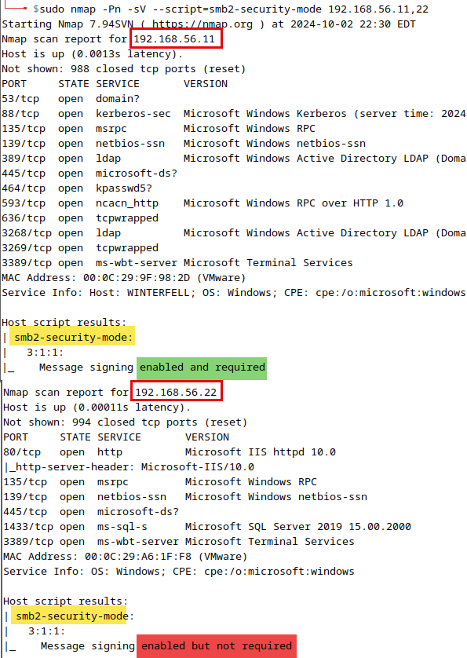{ width="70%" }
///caption
Nmap Results
///

It looks like 192.168.56.11 has SMB signing enabled AND required, but 192.168.56.22 has SMB signing enabled but NOT required. This will matter for our relay attacks later in class.

We can also use the below NetExec command to accomplish the same check that Nmap just did but with much less noise in the output.

```bash
nxc smb 192.168.56.10-23
```

???- note "Command Options/Arguments Explained"
    - **`smb`**: Specifies that the SMB module of CrackMapExec is to be used. This module focuses on actions and enumeration tasks that can be performed over the SMB protocol.
    - **`192.168.56.10-23`**: This defines the target range for the command. It tells CME to operate on a range of IP addresses starting from 192.168.56.10 through 192.168.56.23. The tool will attempt to connect to each IP address in this range and perform its SMB protocol-based operations.

{ width="70%" }
///caption
SMB Signing is not required
///

???+ note
    This lack of SMB Signing on `192.168.56.22` is what makes it possible for us to relay hashes with ntlmrelayx later on.

    There's a good BHIS blog post on this very topic [here](https://www.blackhillsinfosec.com/an-smb-relay-race-how-to-exploit-llmnr-and-smb-message-signing-for-fun-and-profit/).

Additional options and flags can be added to the command to specify credentials (if known), perform more specific enumeration tasks, or execute certain actions on the target hosts. Examples of such options include:

- **`u`** or **`-user`**: Specify a username for authentication.
- **`p`** or **`-pass`**: Specify a password or NTLM hash for authentication.
- **`-shares`**: Enumerate SMB shares.
- **`-rid-brute`**: Perform RID (Relative Identifier) brute force to enumerate users.

You may have asked yourself then “what if I have a LOT of in-scope systems”. I *need* automation to identify which systems have SMB signing required!! Well you’re in luck, NetExec can use `--gen-relay-list` to automatically build a file listing all systems that don’t have SMB signing required. 

???+ warning
    The output from the below command will be used in another Lab. So be sure to run this!

```bash
nxc smb 192.168.56.10-23 --gen-relay-list ~/smb_relay.txt
```

???- note "Command Options/Arguments Explained"
    - `--gen-relay-list`: Generates a list of hosts that don't require SMB signing. These targets are vulnerable to NTLM relay attacks because they will accept relayed authentication without verification.
    - `~/smb_relay.txt`: Output file path where the list of vulnerable hosts will be saved. This file will be used in later labs for relay attacks, so it's critical to run this command and save the output.

## More to find without needing creds…

### Users

In some cases, it’s possible to list out the users of a system via SMB. Let’s try it out with the below command.

```bash
nxc smb 192.168.56.10-23 --users
```

???- note "Command Options/Arguments Explained"
    **`--users`**: This flag is attempting to list or retrieve information about domain users on the target systems or SMB shares. If a user is specified, then only its information is queried.

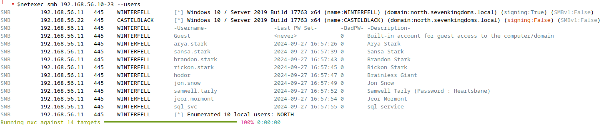{ width="70%" }
///caption
User Enumeration
///

???+ warning
    Note how all the users printed out in the above image are from `192.168.56.11` (GOAD-DC02). So, you will need that VM running to get results from this command.

You can also easily export the list of only the enumerated usernames by using the `--users-export` option.

```bash
nxc smb 192.168.56.10-23 --users-export enumerated_users.txt
```

???- note "Command Options/Arguments Explained"
    - `--users-export`: Exports enumerated usernames to a text file, with one username per line. This format is ideal for password spraying attacks or further enumeration.
    - `enumerated_users.txt`: Output file that will contain the list of discovered usernames. Having usernames in a clean list format makes it easy to feed them into other tools like Kerbrute or password sprayers.

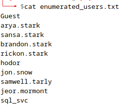{ width="70%" }
///caption
User Enum Output
///

The `--loggedon-users` flag will show any user that is currently authenticated on the target system. This, however, does require you to have credentials for a local admin level account on that system.

### Passwords

Next, let’s obtain the password policy of users on these systems?

???+ warning
    This will also require you to have `192.168.56.11` (GOAD-DC02) running to get results.

```bash
nxc smb 192.168.56.10-23 --pass-pol
```

???- note "Command Options/Arguments Explained"
    - `--pass-pol`: Retrieves the domain password policy from the target. This reveals minimum password length, complexity requirements, lockout thresholds, and password history settings.
    - Why it matters: Understanding the password policy helps you craft effective password spraying attacks without triggering account lockouts. For example, if lockout occurs after 5 attempts, you can safely try 3-4 passwords across all users.

Why do you think getting this policy would be useful?

Well, it can really save time during password cracking if we can eliminate passwords from our list that don’t meet the requirements. And efficiency matters *greatly* when you’re trying to crack password hashes.

It can also be beneficial to learn the lockout policy of a target so you can properly throttle any password attacks to not inadvertently lockout accounts during an engagement.

{ width="70%" }
///caption
Password Policy
///

The image above shows a minimum length requirement of only 5 characters, which isn’t awesome. Human beings tend to not get overly complex or lengthy with their passwords unless forced to be.

We also see that the account lockout duration is minimal. Only 5 minutes. So, if we do accidently lock an account the impact would be minimal. The threshold is set to 5 incorrect guess, which allows us a handful of attempts before hitting that lockout duration timer.

### Spraying & Guessing

Using NetExec to attempt to gain access to an account is relatively easy too!

Be mindful of the lockout threshold and observation window of your target before attempting these attacks. You can follow the info obtained from the password policy.

You can use multiple usernames or passwords by separating the names/passwords with a space. 

```bash
# Example only; do not run in lab
nxc smb 192.168.56.101 -u user1 user2 user3 -p Summer18
nxc smb 192.168.56.101 -u user1 -p password1 password2 password3
```

???+ warning
    By default nxc will exit after a successful login is found. Using the `--continue-on-success` flag, it will continue spraying even after a valid password is found. Useful for spraying a single password against a large user list.

## The Database

It would be kind of silly if all our hard work gets lost each time we run the tool. Well, lucky for us NetExec stores all it finds in a neat database for easy access!

???+ info
    NetExec automatically stores all used/dumped credentials along with other information about systems in its database which is setup on first run. This will be mostly empty at this point

Each protocol has its own database which makes things much more sane and allows for some awesome possibilities. Additionally, there are workspaces (like Metasploit), to separate different engagements/pentests.

To access the DB in the termianl simply run `nxcdb`.

```bash
nxcdb
```

???- note "Command Options/Arguments Explained"
    - `nxcdb`: Interactive database interface for NetExec. This stores all enumeration data (hosts, users, credentials, shares) from your scans in an SQLite database.
    - Why use it: The database persists across sessions, allowing you to query historical data, export results for reports, and avoid re-scanning targets. It's especially valuable for tracking credential reuse across multiple systems.

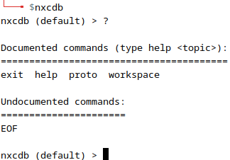{ width="70%" }
///caption
nxcdb
///

The image above shows the top-level help dialog by entering `?` into the prompt. One of the sub-commands available is `proto`. This helps you switch between the different protocol databases.

Let's take a look at the SMB database since we've gathered a little info with that protocol in this lab.

```bash
proto smb
```

???- note "Command Options/Arguments Explained"
    - `proto smb`: Switches the database context to the SMB protocol. Each protocol (SMB, WinRM, LDAP, etc.) has its own separate database tables.
    - Why switch protocols: This lets you focus on data from specific protocol scans and run protocol-specific queries without mixing results from different enumeration methods.

After entering the "smb" DB, we can submit `?` again to see what's available to us at this level.

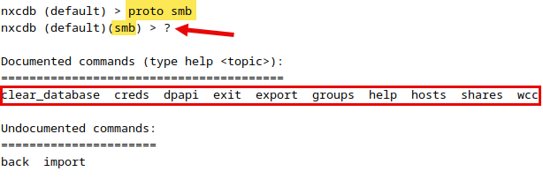{ width="70%" }
///caption
SMB Database
///

We can see from the screenshot above have 10 "documented" and 2 "undocumented" commands available. This is where we can start querying the DB. Lets keep things simple as were just getting to know this tool and list out information about the hosts we've discovered so far.

```bash
hosts
```

???- note "Command Options/Arguments Explained"
    - `hosts`: Database query command that displays all discovered hosts from SMB scans. Shows IP addresses, hostnames, domain names, OS versions, and SMB signing status.
    - Why useful: Provides a quick overview of your target environment and helps identify high-value targets (like domain controllers) or vulnerable systems (SMB signing disabled).

The image below presents a neatly formatted table view of the host information. This is just a snippet as the real output has many more columns.

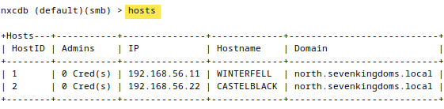{ width="70%" }
///caption
Gathered Host Info
///

Having data stored is great but when we deliver a report to a customer we can't just say "here's my VM too with all the data". So, NetExec has provided a means of exporting data into a CSV file.

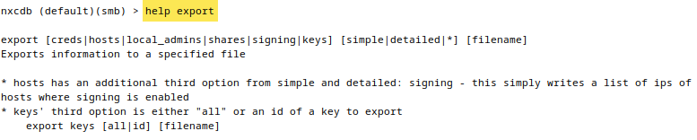{ width="70%" }
///caption
Exporting Data
///

Simply enter the below command and all your host data is now able to be delivered with your customer report's supporting data.

```bash
export hosts detailed nxc-hosts.csv
```

???- note "Command Options/Arguments Explained"
    - `export hosts`: Exports the hosts table from the database to a file
    - `detailed`: Export format that includes all available columns (vs. `simple` which includes only basic info)
    - `nxc-hosts.csv`: Output filename in CSV format, easily imported into spreadsheets or report templates
    - Why export: Professional penetration test reports require supporting evidence. CSV exports provide clean, shareable data for client deliverables without exposing your tools or methodologies.

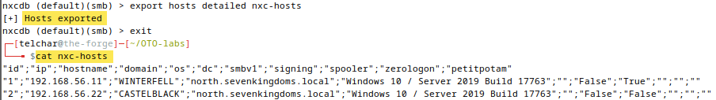{ width="70%" }
///caption
Exporting Hosts
///

## Finding Context with Cerno

Cerno reads from NetExec's database to enrich Nessus findings with reconnaissance context. When you've run NetExec commands (like the SMB scans earlier in this lab), Cerno can display the gathered data alongside your vulnerability findings.

Start the interactive review:

```bash
cerno review
```

???- note "Command Options/Arguments Explained"
    - `cerno review`: Launches the interactive TUI for reviewing imported Nessus findings
    - Navigation: Use number selection to browse findings by severity level
    - Actions: Each finding shows contextual actions in the footer including `[N] NetExec Data`

From the main menu, navigate to **Medium** severity findings (SMB Signing Not Required is rated Medium by Nessus). Select the "SMB Signing Not Required" finding.

When viewing the finding, you'll see a **NetExec Context** panel that displays data pulled directly from NetExec's database:

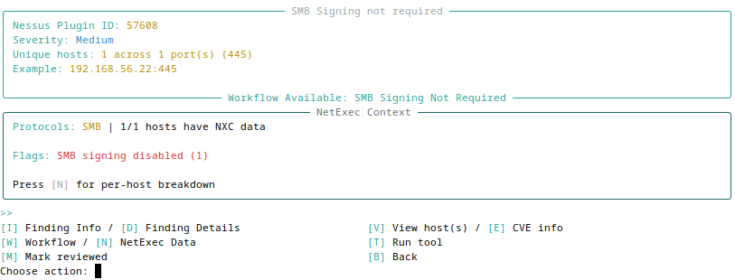{ width="70%" }
///caption
NetExec Context Panel
///

The panel shows:

- **Hosts**: Systems discovered during your NetExec scans
- **Shares**: SMB shares with read/write access indicators
- **Security Flags**: Highlights like "SMB signing disabled" that confirm the vulnerability

Press **`[N]`** to view the per-host breakdown, which shows detailed NetExec data for each affected host:

{ width="70%" }
///caption
Per-Host NetExec Detail
///

???+ info
    Cerno reads from `~/.nxc/workspaces/default/` by default. If you're using a different NetExec workspace, you can configure the path with `cerno config set nxc_workspace_path /path/to/workspace`.

This integration lets you correlate Nessus findings with your actual reconnaissance data, showing exactly which hosts have SMB signing disabled and what credentials or shares were discovered on those systems.