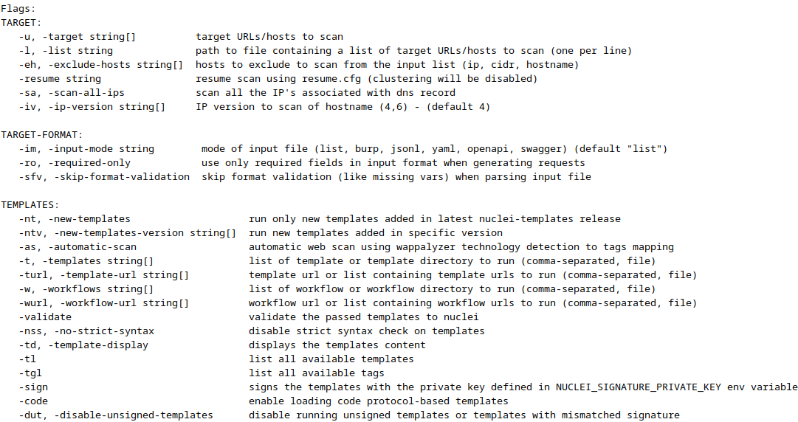
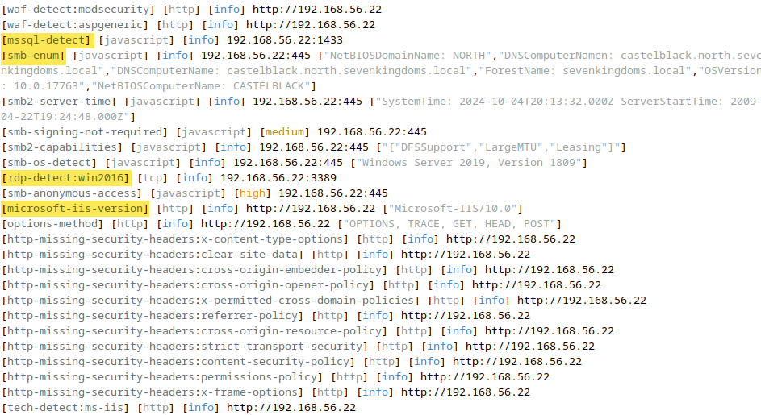

# Lab - Nuclei

???+ warning "Prerequisites"
    Start up a the OWASP Juice Shop vulnerable web application. It will be available at `http://127.0.0.1:42000`.

    ```bash
    sudo juice-shop -h
    ```

    After you’re done, make sure you shut down OWASP Juice Shop by running the below command.

    ```bash
    sudo juice-shop-stop -h
    ```

## Intro
Nuclei is used to send requests across targets based on a template, leading to zero false positives and providing fast scanning on a large number of hosts. Nuclei offers scanning for a variety of protocols, including TCP, DNS, HTTP, SSL, File, Whois, Websocket, Headless, Code etc. With powerful and flexible templating, Nuclei can be used to model all kinds of security checks.

## Walkthrough

First, let’s look at the `help` information for Nuclei.

```bash
nuclei -h
```

{ width="70%" }
///caption
Help Dialog
///

There’s a LOT in that `help` output, but first and foremost it gives us some options around targeting and templates.

### Templates

???+ note
    All the Nuclei templates should get automatically installed locally at `/home/telchar/nuclei-templates` when you run the tool for the first time. You can also explore them there if you wish. Take a look by running the below command.

    ```bash
    ll ~/nuclei-templates
    ```

First, let’s look at an example template since template are what makes Nuclei awesome. Go to [apache-solr-log4j-rce.yaml](https://github.com/ridgebackinfosec/nuclei-templates/blob/main/http/vulnerabilities/apache/apache-solr-log4j-rce.yaml) in a browser and you should see the template to detect the Log4J remote code execution vulnerability. 

This vulnerability gained some notoriety in for being particularly wide spread and critical. It was so severe that the Cybersecurity & Infrastructure Security Agency (CISA) issued guidance on it ([CISA Alert](https://www.cisa.gov/news-events/news/apache-log4j-vulnerability-guidance)).

{ width="70%" }
///caption
Template Snippet
///

As we can see from the image above, the template provides helpful references and links along with a description of the issue and CVSS scoring.

Further down in the template we see the actual HTTP request and matching rules used to fingerprint the existence of this RCE vuln on a target.

{ width="70%" }
///caption
...More Template
///

### HTTP

Now, let’s take a look at the available templates nuclei uses via the nuclei command itself.. There are thousands. So, we’re going to take a glimpse at just the HTTP ones by running the below command which pipes nuclei’s output to`grep` and filters it.

```bash
nuclei -tl | grep "http/"
```

Taking a look at the output snippet below we can see there is a good variety of checks related to HTTP. Including specific CVEs, OSINT, known vulnerabilities, and more.

{ width="70%" }
///caption
HTTP Templates (Snippet)
///

Since we have a local vulnerable web application already running on The Forge VM, let’s go ahead and run nuclei with OWASP juice shop as the target. No additional options.

```bash
nuclei -target http://127.0.0.1:42000
```

???- note "Command Options/Arguments Explained"
  - `-target http://127.0.0.1:42000`: [using -u also works for specifying a target] Specifies the **target** for scanning, which in this case is the local machine (`127.0.0.1`) on port `42000`. That’s where OWASP juice shop is running.

{ width="70%" }
///caption
Command Output
///

Already we can see that Nuclei does a fairly good job at the basics without any additional configuration. Now, if you had a large list of systems you could use the `-l` option and provide the path to a file containing a list of target URLs/hosts to scan (one per line).

Lets try one more target. This time it’ll be Portswigger’s `ginandjuice.shop` website, which is “a deliberately vulnerable web application designed for testing web vulnerability scanners”.

```bash
nuclei -target https://ginandjuice.shop/
```

This will produce more broad results as it is a proper deployed web application on the open internet.

{ width="70%" }
///caption
ginandjuice.shop
///

Since this target has encryption enabled, we see which versions of TLS is supported. We also see whois lookup details and nuclei detected this web application is hosted in AWS.

### Network

Nuclei isn’t just for HTTP and web apps. It also has a LOT of network focused templates. Let’s re-run that same template listing command but this time we’ll filter in “network” and take a look.

```bash
nuclei -tl | grep "network/"
```

{ width="70%" }
///caption
Network Templates (Snippet)
///

???+ warning
    You’ll need GOAD-SRV02 running for this next part.

Let’s see what happens if we point Nuclei at one of our GOAD target servers.

```bash
nuclei -target 192.168.56.22
```

We can see in the screenshot below that Nuclei detected MSSQL, SMB, and IIS running on the target. Also, it did additional checks when there were applicable templates after a service was detected.

{ width="70%" }
///caption
Network Scanning (Snippet)
///

Note how we didn’t tell Nuclei that we wanted to use network related templates instead of HTTP ones. It figures that out on its own.

## Create Your Own Template

Try creating a template on your own for something network related which targets our Lab VMs.

Nuclei Lab: Custom Templates for OWASP Juice Shop

**Objectives**
In this lab, you will:

1. **Create a custom Nuclei template** to detect an exposed Swagger API.

2. **Check for sensitive information leaks**.

3. **Detect a vulnerable admin panel**.

4. **Chain multiple Nuclei templates** together for a deeper scan.

### **Prerequisites**
- Make a custom template directory is set up:  
  ```sh
  mkdir -p ~/nuclei-templates/custom
  ```

### Detect the Exposed Swagger API
Create a custom Nuclei template to check if the **Swagger API** documentation is publicly accessible.

1. Create a file:  
   ```sh
   nano ~/nuclei-templates/custom/juiceshop-swagger.yaml
   ```
2. Add the following YAML content:
  ```yaml
  id: juiceshop-swagger

  info:
    name: OWASP Juice Shop Swagger API Exposure
    author: YourName
    severity: low
    description: Detects the exposed Swagger/OpenAPI docs for Juice Shop.
    tags: owasp,juice-shop,swagger,openapi

  http:
    - method: GET
      # follow possible /api-docs -> /api-docs/ redirect
      redirects: true
      max-redirects: 2

      path:
        - "{{BaseURL}}/api-docs"
        - "{{BaseURL}}/api-docs/"
        - "{{BaseURL}}/api-docs/swagger.json"

      matchers-condition: and
      matchers:
        - type: status
          status: [200]

        # Match either the UI page or the JSON spec
        - type: word
          part: body
          condition: or
          words:
            - "Swagger UI"
            - "swagger-ui"
            - '"openapi"'
            - '"swagger"'
  ```
3. Run the template:
   ```sh
   nuclei -t ~/nuclei-templates/custom/juiceshop-swagger.yaml -u http://localhost:42000
   ```

<!-- ### Detect Sensitive Information in Responses
Now, let’s create a Nuclei template to check if sensitive information, such as admin emails or API keys, is leaked.

1. Create a new file:  
   ```sh
   nano ~/nuclei-templates/custom/juiceshop-sensitive-info.yaml
   ```
2. Add the following YAML content:
   ```yaml
   id: juiceshop-sensitive-info

   info:
     name: Juice Shop Sensitive Information Exposure
     author: YourName
     severity: medium
     description: "Detects exposed API keys or admin emails in Juice Shop responses."
     tags: owasp,juice-shop,sensitive

   requests:
     - method: GET
       path:
         - "{{BaseURL}}/rest/user/whoami"

       matchers:
         - type: word
           words:
             - "@"
             - "apikey"
           condition: or
   ```
3. Run the template:
   ```sh
   nuclei -t ~/nuclei-templates/custom/juiceshop-sensitive-info.yaml -u http://localhost:42000
   ``` -->

### Detect a Vulnerable Admin Panel
Many vulnerable web apps have an accessible admin panel. Let’s check if Juice Shop has one.

1. Create a new file:  
   ```sh
   nano ~/nuclei-templates/custom/juiceshop-admin-panel.yaml
   ```
2. Add the following YAML content:
   ```yaml
   id: juiceshop-admin-panel

   info:
     name: Juice Shop Admin Panel Exposure
     author: YourName
     severity: high
     description: "Detects publicly accessible admin panel in Juice Shop."
     tags: owasp,juice-shop,admin

   requests:
     - method: GET
       path:
         - "{{BaseURL}}/#/admin"

       matchers:
         - type: status
           status:
             - 200

         - type: word
           words:
             - "Administration"
             - "Admin"
           condition: or
   ```
3. Run the template:
   ```sh
   nuclei -t ~/nuclei-templates/custom/juiceshop-admin-panel.yaml -u http://localhost:42000
   ```

### Chain Multiple Nuclei Templates Together
Instead of running templates one by one, let’s scan Juice Shop using **multiple templates** in a single execution.

1. Run all custom templates at once:
   ```sh
   nuclei -t ~/nuclei-templates/custom/ -u http://localhost:42000
   ```
2. The output should show multiple detections if vulnerabilities are present.

## Bonus Challenges

???+ info "Optional"
    <!-- - Modify the **sensitive information** template to check for **JWT tokens**. -->
    
    - Create a template to detect **insecure HTTP headers**.
    - Automate the scan by running it as a scheduled **cron job**.

## Further Learning
Watch the incomparable BB King’s [Nuclei webcast](https://www.youtube.com/watch?v=oajbdFOnVEY&t=2522s) and attempt to create your own Nuclei template for Apache’s server status.

!!! note
    If web apps are your thing, then I highly recommend [BB’s classes](https://www.antisyphontraining.com/instructor/bb-king/).