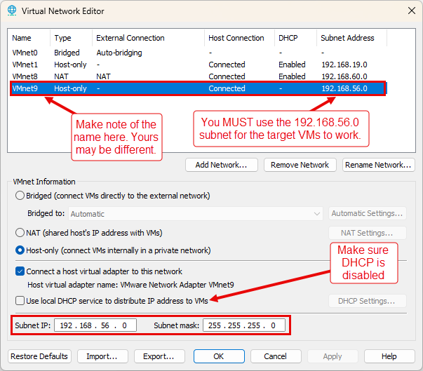
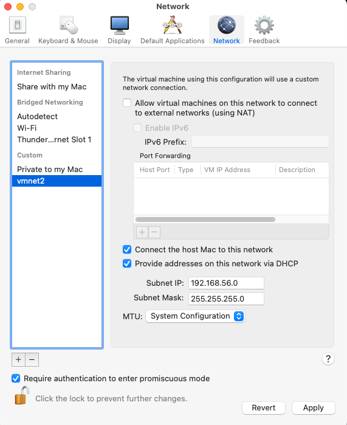
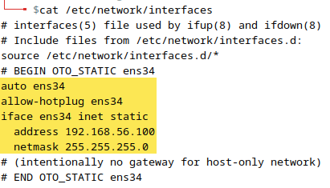
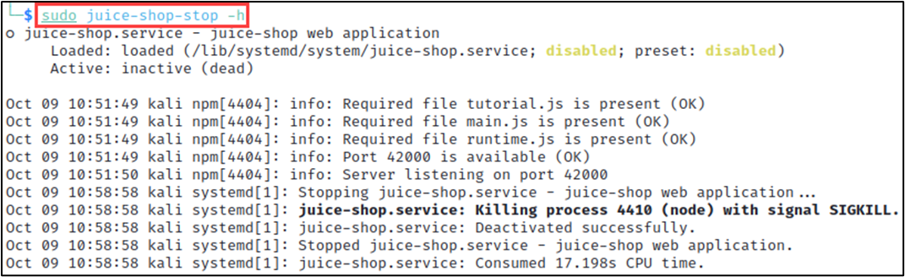

# VM Setup

???+ warning "Prerequisites"
    These VMs are BIG! The initial zip file is ~**27GB**. You will need ~**85-100GB** of free disk space once everything is imported into VMware and setup is complete.

    You will NOT need to be running all the VMs at one time during the class. So, don't unless you have plenty of resources on your host machine.

**Complete the below checklist:**

- [X]  VM Overview
- [x]  Network Configuration
    - [x]  Setup a custom (Host-only) virtual network in VMware
    - [x]  Add the above custom network to each VM’s config
- [x]  Static IP Address Assignment
- [x]  Verify Lab Environment

---

## VM Overview

### “The Forge” VM

The Forge VM is a customized Debian-based ParrotOS Linux system. This will be the primary VM you operate from and will be used as the “attacker’s” machine.

???+ note "Credentials"
    Username `telchar` and password `ridgeback`.

???+ warning
    ***Never expose The Forge to an untrusted network, always use NAT or Host-only mode!***

### “GOAD” VMs

The diagram below depicts two GOAD VMs (GOAD-DC02, and GOAD-SRV02). We will be targeting these for our class.

???+ note "Credentials"
    You shouldn’t *need* to login to these, but the username in `vagrant` and password is `vagrant` if you are curious or need to troubleshoot a machine.

    Game of Active Directory (GOAD) is a pentest Active Directory LAB project. The purpose of this lab is to give pentesters a vulnerable Active directory environment ready to use to practice usual attack techniques.

???+ warning
    *This lab is extremely vulnerable, do not reuse recipe to build your [Production] environment and do not deploy this environment on internet without isolation (this is a recommendation, use it as your own risk).*

    *This lab use free windows VM only (180 days). After that timeframe enter a license on each server or rebuild all the lab (may be it's time for an update ;))
    ~* [https://github.com/Orange-Cyberdefense/GOAD](https://github.com/Orange-Cyberdefense/GOAD)

{ width="70%" }
///caption
GOAD Environment
///

## Network Configuration

All virtual machines should be pre-configured with at least one network interface in Network Address Translation (NAT) mode. This is required for the VMs to access the internet. After downloading and importing the VMs, students should verify each VM is indeed in NAT mode. This can be done using the steps below.

You will **ALSO** need to create a new custom network for the environment to work. The steps for this are below.

### Create Custom Virtual Network Configuration

???+ warning
    This is **REQUIRED** for the target VMs to work properly. DO NOT SKIP THIS!

1. Within VMware Workstation/Fusion/Player click Edit → Virtual Network Editor →
    
    ???+ warning
        Make sure you don’t already have a VMware network config on your host machine that is setup for the 192.168.56.x subnet. If you do, this might cause collision issues.
    
    Create a new “Host-only” type virtual network that matches the image below.
    
    { width="70%" }
    ///caption
    Host Only Network
    ///
    
    ???+ warning
        "Host-only Networking" is called "Private to my Mac” in VMware Fusion.
    
2. Save this configuration and note the name. In the image above this would be “VMnet9”.

### VM Network Assignment

Once the VMs are imported, click “VM” → “Settings” in VMware for each of the below listed VMs

- the-forge
- GOAD-DC02
- GOAD-SRV02

Click “Add”.

{ width="70%" }
///caption
Add Virtual Hardware
///

Select “Network Adapter” and click “Finish”.

{ width="70%" }
///caption
Add Network Adapter
///

You should now have a new “Network Adapter 2” (or similar) for the VM. Select it and choose the “Custom: Specific virtual network” radio button. From there, use the dropdown to select the name of the Host-only virtual network you created in a previous step.

{ width="70%" }
///caption
Select Network
///

???+ warning
    Remember to go back and do this with EACH of the VMs listed at the top of this section.

???+ warning
    KEEP the original “Network Adapter” that’s set to NAT.

    So, in the end you should have two network interfaces per VM. One in NAT mode and one in Custom (Host-only) mode.

This is how it looks in Fusion…

{ width="70%" }
///caption
Fusion Add Network
///

{ width="70%" }
/// caption
Fusion GUI
///

## Static IP Address Assignment

Since we've added a new network interface and that network doesn't have DHCP enabled, we need to manually set a static IP for The Forge VM.

1. Log into The Forge VM using the creds mentioned above.
2. Open a terminal.
3. Run the below commands to run a script that automates the static IP address assignment.
    
    ```bash
    cd ~/OTO-labs
    chmod +x set-static-ip.sh
    sudo ./set-static-ip.sh
    cd ~
    ```

    { width="70%" }
    /// caption
    Script Execution Example
    ///
 
    ???+ warning
        Your network interface name may differ from the screen shots.
    
    The `/etc/network/interfaces` file should look something like this after the script executes.
    
    { width="70%" }
    /// caption
    Updated Interface Config File
    ///

    !!! warning
        The gateway is NOT specified by design due to the way VMware virtual networks handle traffic.
   
## Verify Lab Environment

Once all of the steps above have been completed...

1. Turn on the VMs
2. Log in to The Forge
3. Run the commands below to verify everything has been configured correctly.

???+ note
    You don’t *have* to turn on *both* GOAD VMs at once if your host machine has lower resources. You can start/stop them as necessary.

```bash
cd ~/OTO-labs
chmod +x verify-lab-env.sh
./verify-lab-env.sh
cd ~
```

If everything is setup correctly, you should see `0% packet loss` following each ping command.

{ width="70%" }
/// caption
Lab Environment Verification Passed!
///

## Extras

### OWASP Juice Shop

The Forge VM will have the `juice-shop` APT package to deploy a local instance of the Open Worldwide Application Security Project (OWASP) Juice Shop for you to play with before, during, or after the class.

> “OWASP Juice Shop is probably the most modern and sophisticated insecure web application! It can be used in security trainings, awareness demos, CTFs and as a guinea pig for security tools! Juice Shop encompasses vulnerabilities from the entire OWASP Top Ten along with many other security flaws found in real-world applications!

> The application contains a vast number of hacking challenges of varying difficulty where the user is supposed to exploit the underlying vulnerabilities. The hacking progress is tracked on a score board. Finding this score board is actually one of the (easy) challenges!”
~OWASP

???+ warning
    The command below will start the local instance of OWASP Juice Shop on `http://127.0.0.1:42000`. 

    It will state that, in the terminal output, that it will open a browser for you. This is a LIE. It is broken in ParrotOS currently. So, you’ll need to open a browser manually and navigate to the above address. 😢

```bash
sudo juice-shop -h
```

{ width="70%" }
/// caption
Starting Juice Shop
///

You can now access the vulnerable web app by loading [http://127.0.0.1:42000](http://127.0.0.1:42000) in your VM’s browser.

The command below will stop the local instance of OWASP Juice Shop.

```bash
sudo juice-shop-stop -h
```

{ width="70%" }
/// caption
Stopping Juice Shop
///

### Additional GOAD Targets

The full GOAD target environment is comprised of 5 systems. This class only utilizes 2 of those target systems.

There are 3 additional “bonus” VMs (2 Domain Controllers and 1 Server) available for you to download. These target VMs (coupled with your class VMs) will complete the full GOAD environment should you want a larger target practice range.

You can download the extra 3 pre-built and configured target systems from [this link](https://oto.sfo2.cdn.digitaloceanspaces.com/live/extra_vms.zip). The VM setup steps are the same as your class VMs.

???+ note
    ***There are no specific class Lab walkthroughs covering these extra VMs. They are meant for you to explore/attack on your own if you wish. These are not required for the class but are offered to help extend what you have learned here.***