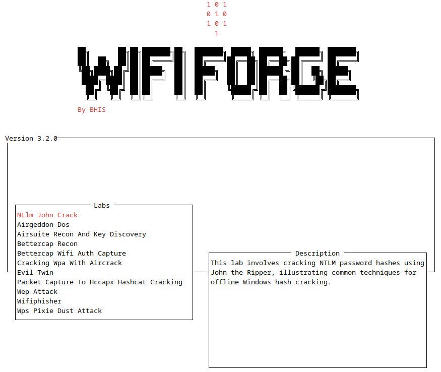

# OPTIONAL Lab - WiFi-Forge

???- warning "Active Development Warning"
    WiFi-Forge is under **active development** (AKA - this Lab may have issues) by the good folks at Black Hills Information Security. They are seeking feedback on the tool and welcome the submission of any issues on the [main GitHub page](https://github.com/blackhillsinfosec/Wifi-Forge/issues).

    A forked version can be found at [https://github.com/ridgebackinfosec/Wifi-Forge](https://github.com/ridgebackinfosec/Wifi-Forge) which should work with this Lab.

???- warning "Disk Space Requirements"
    Wifi-Forge can take up a lot of space on a VM and can create unpredicatable consequences between dependencies. It is recommended that you either create a new VM from The Forge base image or snapshot your class VM ***before*** installing Wifi-Forge.

## Overview

[Wifi-Forge](https://github.com/ridgebackinfosec/Wifi-Forge) is a Wi-Fi security training tool developed by [Black Hills InfoSec](https://www.blackhillsinfosec.com/) that provides a safe and legal environment for learning Wi-Fi hacking techniques. Based on the open source mininet-wifi framework, Wifi-Forge automatically sets up the networks and tools needed to run a variety of Wi-Fi exploitation labs, removing the need for the overhead and hardware normally required to perform these attacks.

## Installation & Setup

Follow the installation steps [here](https://wififorge.github.io/Installation#docker-installation-recommended) before working on this Lab. It is recommended that you use the Docker installation option.

## Lab Walkthroughs

All WiFi-Forge Lab walkthroughs are documented [here](https://wififorge.github.io/Lab-Walkthroughs/Lab-00---Getting-Started). 

{ width="70%" }
/// caption
WiFi-Forge Menu
///